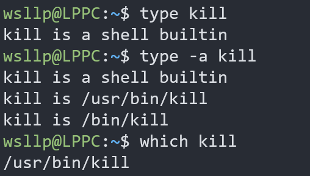
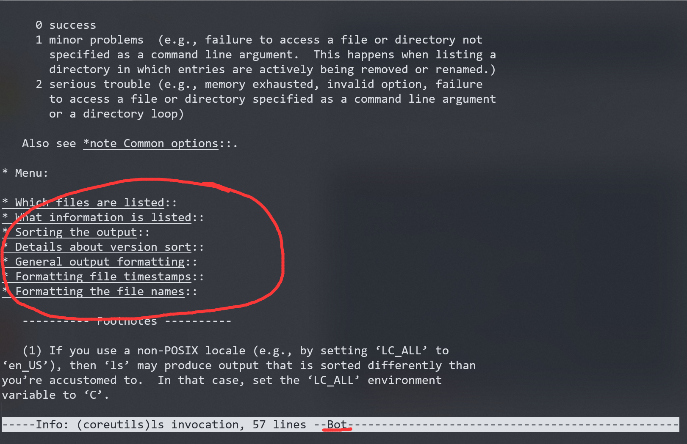
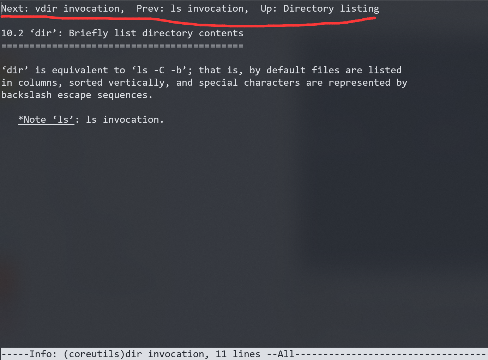

# Command  Line Interface 命令行

# 1. shell操作

### 1.1 光标移动

###### 1.1.1 字符级移动

* 左右键
* Ctrl + b/f
  * back  向左移动
  * forward 向右移动

###### 1.1.2 单词级移动

* Alt + b/f
  * back  向左移动一个单词
  * forward 向右移动一个单词

###### 1.1.3 行级移动

* Ctrl + a/e
  * ahead  移动到行首
  * end  移动到行尾

### 1.2 编辑

###### 1.2.1 删除

* 行级
  * Ctrl + k
    * 删除光标到行尾
  * Ctrl + u
    * 删除光标到行首
* Ctrl a/e + Ctrl u/k       or   Ctrl k + Ctrl u
    * 删除整行  
* 单词级

  * Ctrl + w
    * 删除光标左面一个单词
  * Alt + d
    * 删除光标右面一个单词
* 字符级

  * Ctrl + h
    * 删除光标左面一个字符
  * Ctrl + d
    * 删除光标右面一个字符(当没有字符时，执行为注销当前账户或者退出终端)
* Ctrl + _
  * 撤销删除操作
* Ctrl + y
  * 粘贴之前删除的内容到光标后(只能粘贴行级或者单词级别的删除内容)
* Ctrl + t(transfer)
  * 交换光标左右两个字符的位置
    * 本质是指交换光标所在字符和之前的字符。对于块状光标而言，它就在字符处。对于条状光标，本质就是把本应该显示在字符上的光标显示在字符前面。它实际所在的位置就是光标之后紧邻的那个字符，和块状光标的逻辑是一样的。

###### 1.2.2 复制粘贴

* 原生Linux terminal
* 双击复制，或按住左键选择复制
  * 中键粘贴
    * Ctrl CV为啥不行，因为这个是由windows定义的，然而shell的历史早于windows。
* Windows Terminal 管理的WSL，或者直接的WSL
  * Ctrl C/V 或者鼠标操作，自己具体问题具体看吧

### 1.3 Bang(!) 命令

*  注
  * bang  爆炸，巨响，叹号
* !! /!-1
  * 执行上一条命令
* !-n
  * 执行上第n条命令。
* !ls
  * 执行最近的以字符串ls开头的命令(当然这里是举例，ls可以是任意字符组合)
    * 比如上一条命令是ping 1.1.1.1   那么!p 就会执行这条命令
* !ls:p
  * 打印出最近的以字符串ls开头的命令，不执行
* ^ab^cd
  * 把上一条命令的ab替换为cd并执行，如果有多个匹配，只替换第一个
  * eg
    * 上一条命令 ls -a
    * ^-a^-l  那么相当于执行 ls -l
* ^ab
  * 删除上一条命令的ab，然后执行。本质相当于把上一条命令的ab替换为空，执行。同理多个匹配只替换第一个。

### 1.4 控制命令

* Ctrl + l(小写的L)
  * 清屏相当于Clear命令
* Ctrl + o
  * 执行当前命令，然后显示上一条命令。相当于Enter + ↑
* Ctrl + s
  * 阻止屏幕输出，按键后，输入命令按enter，同样执行，但是输入的命令不显示，结果也不显示。
* Ctrl + q
  * 允许屏幕输出
* Ctrl + c
  * 终止命令
* Ctrl + z
  * 挂起命令

### 1.5 命令历史

* ###### ↑ ↓

  * 显示上/下一条历史命令

* Ctrl + p   / Ctrl + n     (previous  先前的  next)

  * 显示上/下一条历史命令

* Ctrl + r

  * 搜索历史命令
  * ESC   / TAB   / Ctrl + {
    * 将搜索结果显示，但是不执行
  * ENTER
    * 显示搜索结果并执行

* Ctrl + g

  * 退出搜索命令模式

# 2.  shell命令

## 2.0 shell命令概要

##### 引言

* 绝大多数的命令形式
  * command    -options  arguments
    * command
      * 命令名
    * -options
      * 命令接受的参数，用来控制命令的行为
      * 一般短参数(short option)由一个短横线开头，可以组合，例如ls -a -l  等价于ls -al
      * 一般单词参数(long option)由两个短横线开头
      * 可以没有、省略(意味着定义了默认行为)、单个或多个
    * arguments
      * 命令作用的对象
      * 可以没有、省略(意味着有默认作用对象)、单个或多个。

* 这里只介绍**常用命令**的**常用用法**
  * 详细用法参见**man + 命令**
  * 更详细用法打开man+命令，拉到最后见SEE ALSO，查询官网或者使用info命令
  

## 2.1 日期、时间

###### cal (calendar)

* 打印本月日历

###### date

* 打印当前日期

## 2.2 存储相关

###### df (disk free)

* 硬盘使用情况

###### free

* 内存使用情况

## 2.3 文件系统相关

### 2.3.1 目录树

###### ls (list)

* **NAME**

  * ls - list directory contents

* **SYNOPSIS**

  * ls [OPTION]... [FILE]...
    * OPTION指通过不同的参数得到不同的输出格式
    * FILE指要list的目录
    * OPTION可以不指定或者多个，FILE也可以不指定或者多个
      * ls -al  /usr  /home

* **Common ls Options**(需要补充说明的见下DESCRIPTION，简单的就只在表格中)

  * | Option            | Description                                     |
    | ----------------- | ----------------------------------------------- |
    | -a, --all         | do not ignore entries starting with .           |
    | -l                | use a long listing format  输出详细信息         |
    | -h,-humanreadable | with -l and -s, print sizes like 1K 234M 2G etc |
    | -d, --directory   | ist directories themselves, not their contents  |
    | -t                | sort by modification time, newest first         |
    | -S                | sort by file size, largest first                |
    | -r, --reverse     | reverse order while sorting(默认是字母升序)     |
    | -F, --classify    | append indicator (one of */=>@\|)to entries     |
    | -R, --recursive   | list subdirectories recursively                 |
    | -i, --inode       | print the index number of  each file            |

* **DESCRIPTION**

  * List  information about the FILEs (the current directory by default).  Sort entries alphabetically if none of -cftuvSUX nor --sort is specified.
  * -l
    * 输出详细信息
      * 典型输出
        * -rwxr-xr-x 1 root root      1544 Feb  4  2020 cryptdisks_start
      * 依次代表
        * file type  上面-代表regular files ，l代表连接文件，详见man
        * file mode bits   文件12位权限信息，省略前3位
        * number of hard links  硬链接数
        * owner name
        * group name(owner 所在组的组名)
        * size(默认单位是B)
        * timestamp(date and time of the file's last modification)
        * file name
  * -h, --human-readable
    * 适当调整size单位，使更可读
  * -d, --directory
    * 列出本身，配合-l列出本身的详细信息
  * -r, --reverse
    * reverse order while sorting(默认是字母升序)
  * -F, --classify
    * append indicator (one of */=>@|) to entries (不用颜色区分文件了，直接符号区分)
      *  （空，及文件名后面什么也没跟）
        * regular files  普通文件
      * *
        * regular files that are executable
      * /
        * directories
      * @
        * symbolic links 符号链接，软连接
      * | 
        * FIFOs    管道文件
      * =
        * sockets  套接字文件
      * \>
        * door 文件（Solaris上的特殊文件)

###### pwd (print working director)

  * **NAME**
    *  pwd - print name of current/working directory
  * **SYNOPSIS**(概要)
    *  pwd [OPTION]...
  * **DESCRIPTION**
    *  Print the full filename of the current working directory.

###### cd (change directory)

* **NAME**		

  * cd - change the current working directory to a specified location

* **Common cd Options**

  * | Option        | Description               |
    | ------------- | ------------------------- |
    | cd -          | 切到上一个工作目录        |
    | cd ~          | 切到当前登录用户家目录    |
    | cd ~user_name | 切到user_name用户的家目录 |
    | cd ..         | 切到当前工作目录的父目录  |

###### file

* **NAME**
  * file — determine file type   查明文件类型，给出文件简单信息描述
* **SYNOPSIS**
  * file [-bcdEhiklLNnprsSvzZ0] [--apple] [--extension] [--mime-encoding] [--mime-type] [-e testname] [-F separator] [-f namefile] [-m magicfiles] [-P name=value] <u>file</u> ...
  * file -C [-m magicfiles]
  * file [--help]
* **Common** **Option**<
  * file <u>file</u> ...
    * file  test.sh  a.out

### 2.3.2 文件处理

#### 2.3.2.1 文件增、删、移动、复制粘贴、重命名

##### 1.增

###### mkdir(make directory)

* **NAME**
  * mkdir - make directories
* **SYNOPSIS**
  *  mkdir [<u>OPTION</u>]... <u>DIRECTORY</u>...
* **DESCRIPTION**
  * Create the DIRECTORY(ies), if they do not already exist.

###### touch

* **NAME**
  * touch - change file timestamps
* **SYNOPSIS**
  * touch [<u>OPTION</u>]... <u>FILE</u>...
* **DESCRIPTION**
  * Update the access and modification times of each FILE to the current time.
  *  A FILE argument **that does not exist is created empty,** unless -c or -h is supplied.利用这一点，就可以创建新文件

###### cp

* cp file1 file.backup
  * 创建file1副本
* cp dir1 dir.backup
  * 同上理

##### 2.删

###### rm(remove)

* **NAME**

  * rm - remove files or directories

* **SYNOPSIS**

  * rm [<u>OPTION</u>]... [<u>FILE</u>]...

* **DESCRIPTION**

  * This  manual  page  documents the GNU version of rm.  rm removes each specified file.  By default, it does not remove directories.

* **Common Options**

  * | Option            | Meaning                                                      |
    | ----------------- | ------------------------------------------------------------ |
    | -i, --interactive | Before deleting an existing file, prompt the user for confirmation. If this option is not specified, rm will silently delete files. |
    | -r, -- recursive  | Recursively delete directories. This means that if a directory being deleted has subdirectories, delete them too. **To delete a directory, this option must be specified.** |
    | -f, --force       | Ignore nonexistent files and do not prompt. This overrides the --interactive option. |
    | -v, --verbose     | Display informative messages as the deletion is performed.   |

##### 3. 复制粘贴

###### cp(copy)

* **NAME**
  * cp - copy files and directories
* **SYNOPSIS**
  * cp [<u>OPTION</u>]... <u>SOURCE</u>... <u>DIRECTORY</u>
  * cp [<u>OPTION</u>]... <u>FILE</u> <u>FILE</u>
  * 这两条与man不太一样，我整理了一下
* **DESCRIPTION**
  * Copy SOURCE to DEST, or multiple SOURCE(s) to DIRECTORY
  * 第一条最常用情况
    * 目的地DEST是一个目录，有且只有一个
    * 源source可以是一个或多个文件，一个或多个目录，或者有目录有文件
    * 行为是将这些源复制到目的地目录中
  * 第二条特殊
    * 目的地Dest是一个文件，有且只有一个
    * 源source只能是一个文件，有且只有一个。
    * **行为是dest文件内容被源文件替换**
  * 小技巧
    * 当源只有一个且是目录时，如果给出的dest不存在，那么创建dest，内容同源。相当于在当前工作目录复制一份源，且命名为dest的名字。
    * 同理，当源只有一个且是文件时，如果dest不在，复制一份，相当于复制并命名。
* **Common Options**

| Option              | Meaning                                                      |
| ------------------- | ------------------------------------------------------------ |
| -a, --archive       | Copy the files and directories and all of their attributes, including ownerships and permissions. Normally, copies take on the default attributes of the user performing the copy.默认复制并不会带上所有属性，仅仅复制内容和少量属性，所以可能存在副本和源访问权限，拥有者不同的情况 |
| -i, --interactive   | Before overwriting an existing file, prompt the user for confirmation. If this option is not specified, cp will silently overwrite files. 如果存在同名，提示是否覆盖 |
| **-r, --recursive** | Recursively copy directories and their contents. This option (or the -a option) is required when copying directories.复制目录必须有这个参数 |
| -u, --update        | When copying files from one directory to another, only copy files that either don't exist, or are newer than the existing corresponding files, in the destination directory.  不存在或更新才复制 |
| -v, --verbose       | Display informative messages as the copy is performed        |

##### 4. 移动(剪切粘贴)、重命名

###### mv(move)

* **NAME**

  *  mv - move (rename) files

* **SYNOPSIS**

  * cp [<u>OPTION</u>]... <u>SOURCE</u>... <u>DIRECTORY</u>
  * cp [<u>OPTION</u>]... <u>FILE</u> <u>FILE</u>
  * 这两条与man不太一样，我整理了一下

* **DESCRIPTION**

  * Rename SOURCE to DEST, or move SOURCE(s) to DIRECTORY.
  * 用法几乎与cp一样，区别是前者是复制粘贴，后者是剪切粘贴。
  * 第一条、第二条同cp，区别是mv会删除源文件。
  * 小技巧同cp，如果说cp是复制一个副本，mv就是重命名。

* **Common Options**

  * | Option            | Meaning                                                      |
    | :---------------- | ------------------------------------------------------------ |
    | -i, --interactive | Before **overwriting** an existing file, **prompt the user** confirmation.if this option is not specified, mv command will silently overwrite  files. |
    | -u --update       | When moving files from one directory to another, only move files that either **don't exist, or are newer** than the existing corresponding files in the destination directory. |
    | -v --verbose      | Display informative messages as the move is performed.       |

  * interactive  互动的，人机交互的

#### 2.3.2.2 文件读写

##### 1. 纯文本RW

###### cat

* **NAME**
  * cat - concatenate files and print on the standard output
    * 如果指明多个文件，那么连接多个文件并输出到标准输出
* **SYNOPSIS**
  * cat [OPTION]... [<u>FILE</u>]...
* **DESCRIPTION**
  * Concatenate FILE(s) to standard output.
  * With no FILE, or when FILE is -, read standard input.
  * 将文本内容全部一次性输出到标准输出，如果内容超过一页，想看上面的需要借助鼠标滚到上面
* **Common Option**
  * -n, --number
    * 给输出的内容加行号

###### head

* **NAME**
  *  head - output the first part of files
* **SYNOPSIS**
  * head [OPTION]... [<u>FILE</u>]...
* **DESCRIPTION**
  * Print  the  first 10 lines of each FILE to standard output.  With more than one FILE, precede each with a header giving the file name.
  * With no FILE, or when FILE is -, read standard input.
* **Common Options**
  * -n [-]<u>NUM</u>,  --lines=[-]<u>NUM</u>
    * 省略-，表示输出前NUM行，不省略表示输出1~n-NUM行，n为文件总行数
      * head -n 10 = **head -n10** = **head -10**  = head --lines=10 输出前10行
      * **head -n-2** = head -n -2 = head --lines=-2  输出前8行(假设总共有10行)

###### tail

* **NAME**
  *  tail - output the last part of files
* **SYNOPSIS**
  * tail [OPTION]... [<u>FILE</u>]...
* **DESCRIPTION**
  * Print the last 10 lines of each FILE to standard output.  With more than one FILE, precede each with a header giving the file name.
  * With no FILE, or when FILE is -, read standard input.
* **Common Options**
  * -n [+]<u>NUM</u>,  --lines=[+]<u>NUM</u>
    * 省略+，表示输出后NUM行，不省略表示输出Num~n行，n为文件总行数
      * 用法同head

###### more

* **NAME**
  * file perusal filter for crt viewing  适用于crt显示的文件阅读过滤器
* **SYNOPSIS**
  *  more [options] <u>file</u>...
* **DESCRIPTION**
  *  more  is  a filter for paging through text **one screenful at a time**.  This version is especially primitive.  Users should realize that less(1) provides more(1) emulation  plus  extensive enhancements.
  * more falls into the class of programs called “pagers,” programs that allow the easy viewing of long text documents in a page by page manner.——More属于”页面调度器”类程序，这些程序允许以逐页方式轻松浏览长文本文档
* **Common Option**
  * more <u>file</u>...
  * 使用more打开文件之后按h，就知道怎么翻页，滚动，搜索了。。

###### less

* **NAME**
  * less - opposite of more  直译就是more的反义词，其实这里借助了一个名句——“less is more",隐含了less就是增强版more的意思
* **SYNOPSIS**
  * 见Man
* **DESCRIPTION**
  * Less  is a program similar to more (1), but it has many more features.  Less does not have to read the entire input file before starting, so with large  input  files  it  starts  up faster than text editors like vi (1).  
  * 同more，less也属于pagers程序，一页一页看文本。
* **Common** **Option**
  * less <u>file</u>...
  * 使用less打开文件之后按h，就知道怎么翻页，滚动，搜索了。。

###### 总结

* cat, head, tail 
  * 简单的读文本程序
    * 简单的将所有文本内容输出到控制台，如果是多余一页的文本，需要终端支持鼠标，然后滚回去看，不支持任何搜索，定位功能。当用于不支持鼠标的终端时，只能看到最后一页的内容，看不到之前的。
* more、less
  * 较强大的读文本程序
    * 支持按页浏览文本、支持翻页、搜索、定位、滚动等各种利于长文本文件阅读的操作。
    * 例如man程序就是调用less阅读的超长文本
* vi、vim
  * 强大的编辑器，支持文本读写

#### 2.3.2.3 创建文件链接

###### ln(link)

* **NAME**
  * ln - make links between files
* **SYNOPSIS**
  * ln [<u>OPTION</u>]...  <u>TARGET</u> <u>LINK_NAME</u>
  * 自己魔改的，就简单记住这一点就行了
* **DESCRIPTION**
  * 硬链接
    * 不加参数，给TARGET创建名为LINK NAME的硬链接
    * TARGET只能是文件，而且必须与LINK NAME共处同一个文件系统。
  * 软连接
    * 加-s 参数，给TARGET创建名为LINK NAME的软链接
    * TARGENT可以是文件或目录，允许与LINK  NAME处在不同文件系统。
* **Common Option**
  * -s, --symbolic  make symbolic links instead of hard links
    * ln -s <u>TARGET</u>  <u>LINK</u> <u>NAME</u>
    * 切记的是，假设链接文件创建在路径A，那么给出的TARGET文件的形式一定要能**在A路径中访问**。
    * eg
      * 假设存在  ~/fun ~/dir/   要在dir目录下创建一个fun文件的软链接，正确的做法是(假设当前pwd是~)
        * ln -s  ../fun dir/fun_sym   或  ln -s ~/fun dir/fun_sym
          * 因为要创建的fun_sym在 ~/dir下，所以target一定要能在dir下访问到，所以使用相对路径../fun 或者绝对路径~/fun
          * 错误示范  ln -s fun dir/fun_sym  ,也会创建fun_sym，不过会提示fun_sym已损坏，找不到目标文件(也就是指向的原文件                            )

## 2.4 结束终端会话

* ###### exit

  * 如果是普通用户exit，则退出终端，如果是root用户，则推出root用户回到普通用户

## 2.5 元命令

> 我自己起的名字，这些命令的特点是作用对象一般都是命令

### 2.5.1 命令简略信息

###### type

* **NAME**

  * type -    displays the kind of command 显示shell命令的类型(可执行程序，shell内建命令，shell函数，别名)

* **SYNOPSIS**

  * type [-afptP] <u>NAME</u> ...

* **DESCRIPTION**

  * The type command is a **shell builtin** that displays the kind of command the shell will execute
  * NAME:    Command name to be interpreted.

* **Common Options**

  * -a  

    > display all locations containing an executable named NAME;
    > includes aliases, builtins, and functions, if and only if  the `-p' option is not also used

    * 理论上讲每个命令只有一种类型，但是存在这么一种情况，重名，比如内建命令和可执行程序命令重名。典型的如kill，内建命令中定义了kill命令，系统自带的也有kill可执行程序。具体输入kill执行的是哪一个我就不知道了。如图下。
    * 

###### which

* **NAME**

  *  which - locate a command

* **SYNOPSIS**

  * which [-a] <u>filename</u> ...

* **DESCRIPTION**

  > which returns the pathnames of the files (or links) **which would be executed in the current environment**, had its arguments been given as **commands** in a strictly POSIX-conformant shell.  (在严格遵循POSIX的shell中，当which的实参是命令时，它会返回当前环境中将被执行的命令的路径。)
  >
  > It does this by searching the PATH  for executable files matching the names of the arguments. (它通过在PATH环境变量中搜索与实参名字匹配的可执行文件来做到这一点)
  >
  > It does not canonicalize path names.(它不会规格化路径名)

  * which只对可执行程序命令有效，不接受内建命令，和别名。
    * 很好理解，因为原理就是搜索PATH环境变量找到匹配实参的可执行程序。显然内建命令是shell自带的，不在PATH中，别名是自定义的也不在。

###### whatis

* **NAME**
  * whatis - display one-line manual page descriptions
* **SYNOPSIS**
  * whatis [<u>OPTION</u>]  <u>COMMOND</u>...
* **DESCRIPTION**
  * 显示匹配到的page的NAME部分。即显示关于命令的一行简短信息。
  * 同which，只支持可执行程序，不接受内建命令。因为本质是搜索参考手册，而参考手册没有内建命令的page。

### 2.5.2 命令帮助

###### help(内建命令的帮助文档)

* **NAME**

  * help -  Display information about **builtin commands.**

* **SYNOPSIS**

  * help [-dms] [pattern ...]

* **DESCRIPTION**

  > Displays brief summaries of builtin commands.  If PATTERN is specified, gives detailed help on all commands matching PATTERN, otherwise the list of help topics is printed.

  * PATTERN : Pattern specifying a help topic
    * 这里是实参是pattern而不是具体的内建命令名，是因为这里可以是任何模式，只要有内建的命令匹配就会显示其帮助。
  * eg
    * help type
      * 显示type的帮助
    * help t*
      * 显示所有以t开头的内建命令的帮助
    * help
      * 显示所有内建命令

###### --help(部分命令支持--help选项)

* 没啥可说的，许多命令，或者说可执行程序，比如scoop, git等自带帮助。

###### man(参考手册接口)

> 参考手册中没有shell内建命令的page(参考文档)

* **NAME**

  * man - an interface to the system reference manuals
  * 一个系统参考手册接口

* **SYNOPSIS**

  * man [<u>man</u> <u>options</u>] [[<u>section</u>] <u>page</u> ...] ...

* **DESCRIPTION**

  * > Most executable programs intended for command line use provide **a formal piece of documentation called a manual or man page**. A special paging program called man is used to view them.
    >
    > (intend 计划、打算，想要，这里 intended for  译为用来，目的在于)

    * 这里解释了上面为啥是<u>page</u>而不是commond。许多程序提供了许多的使用文档，当文档数量比较少时，我们可以手动检索。但是随着UNIX系统不断发展，越来越多的可执行程序、shell命令、系统调用、库调用等到后来的甚至特殊文件，游戏等等提供了海量的手册文档(manual or man page)。

    * 在手动检索十分低效，于是开发了man程序，其核心功能就是帮助我们快速找到我们需要的手册。

      

    ***

  

  * > man  is  the system's **manual pager**.  Each page argument given to man is normally the name of a program, utility or function.  The manual page associated with each of these arguments is then found and displayed.  A  section, if  provided,  will  direct man to look only in that section of the manual.  The default action is to search in  all of the available sections following a pre-defined order (see DEFAULTS), and to show  only  the  first  page found, even if page exists in several sections.

    * man组织庞大的文档库的方法是分类。首先定义**一个说明手册为一个page**，比如cp的说明文档是一个page，名字就叫CP(1)。这个名字用来检索cp的手册。**为了简便起见，一般实体的page名和实体名字一样。**

    * 显然这样文档库存在着大量的page，为了便于管理，依照这些page对应的实体将这些page在分成7大类(section)，官方叫法是7个section，每个section包含若干page，每个section有自己对应的编号。上述CP(1), 1表明cp的手册(page)属于section1.

    * 因此man的工作流程就是

      * 我想浏览某个实体的参考手册，比如cp，我输入man cp
      * man接收到实体名参数
      * 然后根据这个名字，如果不指定Sections搜索顺序的话，默认从section1到section7搜索同名的page，如果命中，就停止搜索，然后调用less程序呈现给用户。(只命中第一个同名page，即使后面还有同名page，也只返回第一个，除非用户指定搜索顺序或者指定只在特定section中搜寻page)

      

    ***

  

* **Sections类型**

  > 实体对应Page名后面括号里的数字就表示实体的类型，具体代表的类型如下表

  * | number | type                                                         |
  | ------ | ------------------------------------------------------------ |
    | 1      | Executable programs or shell commands                        |
    | 2      | System calls (funcitons provided by the kernel)              |
    | 3      | Library calls (functions within program libraries)           |
    | 4      | Special files (usuallly found in /dev)                       |
    | 5      | File formats and conventions, e.g. /etc/passwd               |
    | 6      | Games                                                        |
    | 7      | Miscellaneous (including macro packages and conventions), e.g. man(7), groff(7) |
    | 8      | System administration commands (usually only for root)       |
    | 9      | Kernel routines [Non standard]                               |

    

  * e.g.(一般page名都是实体同名大写加section类型)

    * LS(1)

    * IPTABLES(8)

    * NETSTAT(8)

      

* **Page常见结构**

  > 单个实体对应的用户手册(Page)也是很长很长的一个文档，所以man一般将其组织成以下几个部分。
  
    * 常见部分

      * NAME
      * SYNOPSIS
      * CONFIGURATION （configure v. 配置，configuration n.配置 config abbr.)
      * DESCRIPTION
      * OPTIONS
      * EXIT STATUS
      * RETUREN VALUE
      * ERRORS
      * ENVIRONMENT
      * FILES
      * VERSIONS
      * CONFORMING TO(遵循(法律、规则))
      * NOTES
      * BUGS
      * EXAMPLE
      * AUTHORS
      * SEE ALSO
      * 。。。
      
  
  
  
    * SYOPSIS 部分详解
    
      * bold text        type exactly as shown
        * 正常黑体文本，原样输入，不能省略
      * *italic* *text*       replace with appropriate argument.
        * 斜体文本，替换为合适的实际参数。也就是说斜体文本给出的其实是形参，使用时要输入实际参数。
        * 为了普适性，一些终端不能输出斜体，所以用**下划线或者颜色表示斜体**
      * [-abc]              any or all arguments within []  are optional.
        * 方括号里面的任意一个或者多个或所有参数都是可选的，换言之，可以任意组合0个或多个方括号内的参数(前提是方括号内是若干短参数，一般长参数一个括号内一个)
      * -a | -b             options delimited by | cannot be used together
        * 竖线前后的参数互斥，不可同时使用
          * 如果-a, -b 不可同时省略，又不可同时出现，一般表示为{ -a | -b}
          * 若果-a,-b 可同时省略，不可同时出现，一般表示为[ -a | -b]
      * ***argument* ...**     argument is repeatable.
        * 不可省略斜体参数(需要替换为实参)后面跟三个点，表示可重复,即可输入多个
      * [*expression*] ...      entire expression within []  is repeatable
        * 可省略的方框内的斜体表达式后面跟三个点，表示可重复
  
  
  
  * SYNOPSIS 部分举例
    * ls
      * ls [<u>OPTION</u>]... [<u>FILE</u>]...
        * ls 黑体文本表示不可省略
        * 两个方框表示参数可以没有，文件也可以不指定
        * <u>OPTION</u>表示需要替换为实际的参数，后面三个点表示 参数可以有多个
          * 例如  ls -a -l -f   (相当于三个OPTION，分别替换为-a,-l,-f) 简写为ls -alf
        * <u>FILE</u>表示需要替换为实际的参数，即实际的文件名，三个点表示可以列出多个文件(目录)
    * file
      * file [-bcdEhiklLNnprsSvzZ0] [--apple] [--extension] [--mime-encoding] [--mime-type] [-e <u>testname</u>] [-F <u>separator</u>] [-f <u>namefile</u>] [-m <u>magicfiles</u>] [-P <u>name=value</u>] <u>file</u> ...
        * 方框表示都可以省略，
        * <u>file</u>表示不可以省略且需要替换为实际的文件名，后面三个点表示可以列出多个文件的简略信息。
        * -bcdEhiklLNnprsSvzZ0，列出了所有的短参数，可以任意组合。如果短参数太多，就会用 [<u>OPTION</u>] ... 来代表
        * --apple  表示可以省略，如果使用的话原封不动的输入。
        * -e <u>testname</u>  如果省略的或都省略，如果要是用，-e原封输入，testname替换为实际参数
    * netstat
      * netstat {--statistics|-s} [--tcp|-t] [--udp|-u] [--udplite|-U] [--sctp|-S] [--raw|-w]

###### apropos(参考手册关键字搜索)
* **NAME**

  * apropos - search the manual page names and descriptions

* **SYNOPSIS**

  * apropos [<u>OPTIONS</u>]...   <u>keyword</u>

* **DESCRIPTION**

  > Each manual page has a short description available within it.  apropos  searches  the  descriptions for instances of keyword.

  * 简单来说，apropos根据搜索关键字，然后在手册内所有的page的简短描述中硬搜，显示所有匹配结果，所谓简短描述，就是page的NAME和DESCRIPTION部分。
  * apropos [ˌæprəˈpoʊ]   a.适当的，恰当的。
    * appropriate  a.适当的，合适的，恰当的

###### info(另一种更详细的参考手册接口)

* **NAME**
  
  * info - read Info documents
  
* **SYNOPSIS**
  
  * info [<u>OPTIONS</u>] ... [<u>MENU-ITEM</u>]...
  
* **DESCRIPTION**

  * info手册也是一种参考手册，而且比man更详细，它涉及的文档更多，更全面。其组织方式不同于man的page形式(一个实体对应一个page，**这个实体的所有内容都在这个page内**，整个man文档就由这些许许多多的page页文档组成),info文档的组织形式如下：

    * info组织文档的方式十分类似网页的超链接，将文档分成一个一个的Node节点，**每个Node节点都是一个文档**，包含一个单一的信息，然后通过超链接的形式在不同的Node节点之间切换，跟网页一样，每个Node根据逻辑需要包含别的Node的超链接，通过这个链接即可切换到别的Node节点。

  ***

  

* **info组织node的形式**

    * 骨干树(结构化，使文档结构清晰)

      * 类似文件系统的目录树，info通过超链接的形式按照node文档的内容将所有node组织成一颗树。

        * eg, 如果现在有一些关于动物的说明文档，那么我们可能在文件系统中这么存放它们，同时搭配一些目录来实现结构化。

          * 

            
        
      * Info组织的树结构跟这个基本一模一样，类比文件树的目录和文件的概念，Info将Node分成两种，一种是目录Node，其内容一般包括这个目录的一些信息描述和最重要的指向所有子节点的超链接；一种是文件Node，其内容就是基本的文档描述，文件node都是树的叶子节点，目录node都是页的内部节点。这样就实现了info的骨干树。

      * 以Info 文档中的ls举例，从根节点一直到ls文档结束，其树形结构如图(这是我自己新建文档模拟的，树形结构和真正的info ls文档是一样的)

        * 
        * 整个info文档的根节点是dir这个Node，然后如图一路coreutils,Directory listing, ls_invocation。ls invocation 这个目录节点概述了一些ls特点，然后包含了6个子节点，这6个节点文档从不同方面描述了ls的所有特性。

      ***

      * 有了这个概念，我们就可以来看实际的info程序界面了。搜索info ls 界面如下。

        * 

        * 

          > 其结果直接定位到了ls invocation 这个目录节点，第一张图是这个Node的第一页，第二张图是这个Node的第二页。Node本质就是一个文档吗。可以看到，这个ls invocation概括性的描述了ls，然后给出了其所有子节点的超链接，这些子节点是对ls更具体的描述。

        * 首先第一张图注意的几点

          * 上面的Next

            * 指出该节点的下一个兄弟节点是那个。顺序根据这些节点在父节点超链接菜单中出现的顺序，从上到下。例如打开它们的父节点Direction listing,截图如下，可以看到，ls invocation 是第一个，他的下一个兄弟正是Next信息中的dir invocation.
            * 

            

          * 同理还有Prev

            * ls invocation 这个节点没有上一个兄弟，所以不列出，如果有上个兄弟的话，由Prev指出，比如ls invocation的下一个兄弟dir invocation如图既有Next，也有Prev，同理同级的最后一个兄弟没有Prev。

            * 

              

          * 和Next，Prev同一行的还有Up，表明该节点的父节点。

            * 这个本来没什么歧义，但是不知道是bug还是什么，info的up字段本来应该表父节点的确切名字，比如 ls invocation就标 Directory listing, Directory listing 就标 coreutils。非常清晰，可是有时候有的节点就是不这么标，而是标个Top代表其父节点，就很抽象。

        ***

        

        * 第二张图注意几点
          * Menu
            * 没什么说的，列出所有子节点超链接
          * 最下方的(coreutils)ls invocation
            * (coreutils)
              * 括号里面的内容表明该节点属于那个大类，大类就只有根节点dir下面那几个子节点，coreutil、ed。。。
            * ls invocation
              * **这个部分说明当前Node是那个Node**
          * ls invocation 右边的部分
            * 这部分是表明当前Node阅读进度
              * 行数表示当前Node共有多少行
              * Top表示本页是当前node的第一页
              * Bot表示本页是当前node的最后一页。
              * All表示当前node就这一页。
              * 百分比表示当前node的阅读进度。
      
      ***
      
      
      
    * 灵活性
    
      * 背景
        * 如果info只有上面的骨干树的话，那么跟普通的文件树毫无区别。特点就是访问路径是有顺序的。比如访问ls，需要从dir根节点一级一级下来，如果看完ls想看与ls Node有一定联系的另一个node，需要一级一级向上找到共同祖先然后再一级一级向下直到目标。比较死板。
      * 新特性
        * 于是info利用超链接的特性，如果node 中涉及到或者参考其他node，那么直接加一条指向其他node的超链接即可，这样可以快速直达那个node.
      * 区别
        * 注意这些增加灵活性的超链接只是增加灵活性而已，不参与骨干树。该Node有指向另一个Node的链接，不代表该Node是另一个Node的父节点。辨别诀窍一般是看Node的Menu部分，出现在这里的链接指向的节点都是该节点的子节点，出现在其他部分的链接则只是为了方便引用而已。唯一的例外是根节点dir，为了便于info搜索，基本dir menu菜单里有指向所有常用node的超链接。
    
* **info常用按键**

    > man 利用less显示文档，而info利用info自身显示文档

    * 浏览
        * Home，End
            * 快速定位到该node的首、尾
        * ↑↓  ，PageDown(空格也行)，PageUp
            * 下上一行，下上翻一页。
            * 注意，这个设计挺脑残的，上下一行，也罢，上下翻页也罢，它们不会终止于该node节点的首、尾。而是会自动跳到其他节点继续浏览，跳的规则如下(以往下翻页(forward)举例，往上或者说back同理):
                * 翻页此时达到了该node的最后一页，继续向下翻页
                    * 如果该节点有子节点，那么进入第一个子节点，
                    * 如果该节点没有子节点，进入该节点的下一个兄弟节点。
                    * 如果都没有，则终止。
        * n, p
            * n 跳到下一个兄弟节点，p跳到上一个兄弟节点。以第一行显示的Next，Prev为准。
        * u
            * 跳到父节点，以第一行显示的Up为准。
        * H
            * 显示快捷键