# Command  Line Interface 命令行

> 不同的shell，操作和命令可能略微不同，但是大体一致，比如bash和zsh就略有不同，zsh没有提供help内建命令

# 1. shell操作及特性

### 1.0 光标

* 块状光标正好位于对应的字符位置上面。
* 竖线状光标右边紧邻的字符位置是光标对应的字符位置。
* 以下的有关alt的快捷操作可能在有GUI的terminal中有别的定义，如果是在virtual console中(linux 中按 ctrl alt F1~F7出来的大黑框)，那么一般有效。

### 1.1 光标移动

###### 1.1.1 字符级移动

* 左右键
* Ctrl + b/f
  * back  向左移动
  * forward 向右移动

###### 1.1.2 单词级移动

* Alt + b/f
  * back  向左移动一个单词
  * forward 向右移动一个单词

###### 1.1.3 行级移动

* Ctrl + a/e
  * ahead  移动到行首
  * end  移动到行尾

### 1.2 编辑

###### 1.2.1 删除

* 行级
  * Ctrl + k
    * 剪切光标到行尾
  * Ctrl + u
    * 剪切光标到行首
* Ctrl a/e + Ctrl u/k       or   Ctrl k + Ctrl u
    * 剪切整行  
* 单词级

  * Alt + Backspace  / Ctrl + w
    * 剪切光标左面一个单词
  * Alt + d
    * 剪切光标右面一个单词
* 字符级

  * Ctrl + h
    * 删除光标位置前面的一个字符
  * Ctrl + d
    * 删除光标位置字符(当没有字符时，执行为注销当前账户或者退出终端)
* Ctrl + y
  * 粘贴之前剪切的内容到光标后
    * shell中用kill, yank 指代我们平常说的 cut， paste(剪切粘贴)
    * shell将Ctrl k/u, Alt d/Backspace 剪切的内容保存在kill-ring 缓冲区中。
* Ctrl + t(transfer)
  * 交换光标左右两个字符的位置
    * 本质是指交换光标所在字符和之前的字符。对于块状光标而言，它就在字符处。对于条状光标，本质就是把本应该显示在字符上的光标显示在字符前面。它实际所在的位置就是光标之后紧邻的那个字符，和块状光标的逻辑是一样的。
* Alt + t
  * 交换光标左右两个单词的位置


###### 1.2.2 复制粘贴

* 原生Linux terminal
* 双击复制，或按住左键选择复制
  * 中键粘贴
    * Ctrl CV为啥不行，因为这个是由windows定义的，然而shell的历史早于windows。
* Windows Terminal 管理的WSL，或者直接的WSL
  * Ctrl C/V 或者鼠标操作，自己具体问题具体看吧

### 1.3 Bang(!) 命令

*  注
  * bang  爆炸，巨响，叹号
* !! /!-1
  * 执行上一条命令
* !-n
  * 执行上第n条命令。
*  !n
  *  执行历史命令列表中编号为n的命令
  *  输入history可以看到所有已存储的命令历史，这里的编号就是命令历史里面每条命令的前面的编号。

*  !<u>string</u>
  * 执行最近的以该字符串开头的命令(当然这里是举例，string可以是任意字符组合)
    * 比如上一条命令是ping 1.1.1.1   那么!p 就会执行这条命令
*  !ls:p
  * 打印出最近的以字符串ls开头的命令，不执行
*  !？<u>string</u>
  *  执行最近的包含该字符串的命令

*  ^<u>string1</u>^<u>string2</u>
  * 把上一条命令的string1替换为string2并执行，如果有多个匹配，只替换第一个
  * eg
    * 上一条命令 ls -a
    * ^-a^-l  那么相当于执行 ls -l
*  <u>^string</u>
  * 删除上一条命令的string，然后执行。本质相当于把上一条命令的string替换为空，执行。同理多个匹配只替换第一个。

### 1.4 控制命令

* Ctrl + l(小写的L)
  * 清屏相当于Clear命令
* Ctrl + o
  * 执行当前命令，然后显示上一条命令。相当于Enter + ↑
* Ctrl + s
  * 阻止屏幕输出，按键后，输入命令按enter，同样执行，但是输入的命令不显示，结果也不显示。
* Ctrl + q
  * 允许屏幕输出
* Ctrl + c
  * 终止命令
* Ctrl + z
  * 挂起命令

### 1.5 命令历史

* bash命令默认保存在  ~/.bash_history , zsh命令历史默认保存在~/.zsh_history
* history 
  * 显示保存的所有历史命令

* ###### ↑ ↓

  * 显示上/下一条历史命令

* Ctrl + p   / Ctrl + n     (previous  先前的  next)

  * 显示上/下一条历史命令

* Ctrl + r                         (reverse 反)

  * 反向搜索历史命令(bash显示reverse-i-search; zsh显示bck-i-search即back search)
    * 从最新的一条历史命令往旧的历史命令方向搜索。
  * Ctrl + r
    * 下一个搜索结果
      * 例如进入搜索历史命令模式，输入ls，可能有多个结果，但是一次只显示一个，继续按ctrl r 可以显示下一个搜索结果
  * ESC   / TAB   / Ctrl + {
    * 将搜索结果显示，但是不执行
  * ENTER
    * 显示搜索结果并执行

* Ctrl + g

  * 退出搜索命令模式

### 1.6 shell会话历史(shell session history)

* > In addition to the command history feature in bash, most Linux distributions include a program called script that can be used to record an entire shell session and store it in a file. The basic syntax of the command is: **script [<u>file</u>]**

  * script程序记录当前会话从输入script开始到会话结束的所有交互内容到一个文件。

### 1.6 自动补全(Auto Completion)

* tab补全，补全规则取决于具体shell
  * 比如在家目录， bash 中 输入 do 按tab补全不了大写的Downloads, zsh中就可以。

### 1.7 一次执行多个命令

##### 1.7.1 依次执行所有命令

* ；、&
  * 命令中间用分号或与号隔开，则依次执行所有命令

##### 1.7.2 与非命令

* &&
  * 命令中间用&&隔开，如果命令执行成功，则执行下一条命令，否则停止执行。
    * 类似C++语言中的与判断短路机制。
* ||
  * 同理，如果命令执行失败，则执行下一条命令，否则停止执行。

##### 1.7.3 管道线(pipeline)

* |
  * 命令中间用竖线（\|）分开，前面命令的标准输出将作为后面命令的标准输入。


# 2.  shell命令

## 2.0 shell命令概要

##### 引言

* 绝大多数的命令形式
  * command    -options  arguments
    * command
      * 命令名
    * -options
      * 命令接受的参数，用来控制命令的行为
      * 一般短参数(short option)由一个短横线开头，可以组合，例如ls -a -l  等价于ls -al
      * 一般单词参数(long option)由两个短横线开头
      * 可以没有、省略(意味着定义了默认行为)、单个或多个
    * arguments
      * 命令作用的对象
      * 可以没有、省略(意味着有默认作用对象)、单个或多个。

* 这里只介绍**常用命令**的**常用用法**
  * 详细用法参见**man + 命令**
  * 更详细用法打开man+命令，拉到最后见SEE ALSO，查询官网或者使用info命令
  

## 2.1 日期、时间

###### cal (calendar)

* 打印本月日历

###### date

* 打印当前日期

## 2.2 存储介质相关

#### 2.2.1 使用情况相关

###### df (disk free)

* 硬盘使用情况

###### free

* 内存使用情况

#### 2.2.2 挂载相关

> 想访问存储设备，必须将其挂载到Linux文件树中。最好挂载到空目录，当然挂载到非空目录也行，这样也不会丢失目录原来的数据，但是会隐藏不可见，直到卸载掉该设备

###### mount

* **NAME**

  * mount - mount a filesystem

* **SYNOPSIS**

  * mount -t <u>type</u> <u>device</u> <u>dir</u>

* **DESCRIPTION**

  > This tells the kernel to attach the filesystem found on <u>device</u> (which is of type <u>type</u>) at the directory <u>dir</u>.  The option  -t <u>type</u> is optional.  The mount command is usually able to detect a filesystem.  The root permissions are necessary to mount a filesystem by default.  See section "Non-superuser mounts" below for more details.  The previous  contents  (if  any)  and  owner  and  mode of <u>dir</u> become invisible, and as long as this filesystem remains mounted, the pathname <u>dir</u> refers to the root of the filesystem on <u>device</u>.

  * mount /dev/sdb  /mnt/Sandisk

###### umount

* umount /dev/sdb

#### 2.2.3 分区和文件系统相关

###### fdisk

> 分区管理工具，类似Windows下的磁盘管理工具或者说diskgenius

* fdisk  <u>device</u>

  * 进入交互界面，可以实现各种分区管理功能。

  * sudo fdisk /dev/nvme0n1
    * 然后输入p(print)
      * 就可以显示固态硬盘1的各种分区信息。

###### mkfs(make file system)

> 格式化分区创建新的文件系统

* sudo mkfs  -t ext4 /dev/nvme0n1p2
  * 格式化固态的第二个分区并创建ext4文件系统

###### fsck(file system check)

> 文件系统完整型检查，修复受损的文件系统

* sudo fsck /dev/nvme0n1p2
  * 检查固态0分区2上的文件系统完整性

###### dd

> 以数据块的方式copy文件。(硬盘底层的数据传输就是利用数据块的形式)

## 2.3 文件系统相关

### 2.3.1 目录树

###### ls (list)

* **NAME**

  * ls - list directory contents

* **SYNOPSIS**

  * ls [<u>OPTION</u>]... [<u>FILE</u>]...
    * OPTION指通过不同的参数得到不同的输出格式
    * FILE指要list的目录或文件
    * OPTION可以不指定或者多个，FILE也可以不指定或者多个
      * ls -al  /usr  /home

* **Common ls Options**(需要补充说明的见下DESCRIPTION，简单的就只在表格中)

  * | Option            | Description                                     |
    | ----------------- | ----------------------------------------------- |
    | -a, --all         | do not ignore entries starting with .           |
    | -l                | use a long listing format  输出详细信息         |
    | -h,-humanreadable | with -l and -s, print sizes like 1K 234M 2G etc |
    | -d, --directory   | list directories themselves, not their contents |
    | -t                | sort by modification time, newest first         |
    | -S                | sort by file size, largest first                |
    | -r, --reverse     | reverse order while sorting(默认是字母升序)     |
    | -F, --classify    | append indicator (one of */=>@\|)to entries     |
    | -R, --recursive   | list subdirectories recursively                 |
    | -i, --inode       | print the index number of  each file            |

* **DESCRIPTION**

  * List  information about the FILEs (the current directory by default).  Sort entries alphabetically if none of -cftuvSUX nor --sort is specified.
  * -l
    * 输出详细信息
      * 典型输出
        * -rwxr-xr-x 1 root root      1544 Feb  4  2020 cryptdisks_start
      * 依次代表
        * file type  上面-代表regular files ，l代表连接文件，详见man
        * file mode bits   文件12位权限信息，省略前3位
        * number of hard links  硬链接数
        * owner name
        * group name(owner 所在组的组名)
        * size(默认单位是B)
        * timestamp(date and time of the file's last modification)
        * file name
  * -h, --human-readable
    * 适当调整size单位，使更可读
  * -d, --directory
    * 列出本身，配合-l列出本身的详细信息
  * -r, --reverse
    * reverse order while sorting(默认是字母升序)
  * -F, --classify
    * append indicator (one of */=>@|) to entries (不用颜色区分文件了，直接符号区分)
      *  （空，及文件名后面什么也没跟）
        * regular files  普通文件
      * *
        * regular files that are executable
      * /
        * directories
      * @
        * symbolic links 符号链接，软连接
      * | 
        * FIFOs    管道文件
      * =
        * sockets  套接字文件
      * \>
        * door 文件（Solaris上的特殊文件)

###### stat(status)

* **NAME**
  * stat - display file or file system status
* **SYNOPSIS**
  * stat [<u>OPTION</u>]... <u>FILE</u>...
* **DESCRIPTION**
  * 强大版的ls命令，可以列出Linux所维护的一切关于文件或目录的属性

###### du(disk usage)

* **NAME**

  * du - estimate file space usage

    > estimate  [ˈestɪmət , ˈestɪmeɪt]  估计，估价

* **SYNOPSIS**

  * du [<u>OPTION</u>]... [<u>FILE</u>]...

* **DESCRIPTION**

  > Summarize disk usage of the set of FILEs, recursively for directories.

  * 默认会递归显示目录和子目录大小,只显示目录，不包括目录下文件

* **Common Option**

  * | Option | Description                  |
    | ------ | ---------------------------- |
    | -a     | 递归显示目录大小，包括文件。 |
    | -h     | human-readable               |
    | -s     | 只显示总大小，不递归显示     |

    

###### pwd (print working director)

  * **NAME**
    *  pwd - print name of current/working directory
  * **SYNOPSIS**(概要)
    *  pwd [OPTION]...
  * **DESCRIPTION**
    *  Print the full filename of the current working directory.


###### cd (change directory)

* **NAME**		

  * cd - change the current working directory to a specified location

* **Common cd Options**

  * | Option        | Description               |
    | ------------- | ------------------------- |
    | cd -          | 切到上一个工作目录        |
    | cd ~          | 切到当前登录用户家目录    |
    | cd ~user_name | 切到user_name用户的家目录 |
    | cd ..         | 切到当前工作目录的父目录  |

###### file

* **NAME**
  * file — determine file type   查明文件类型，给出文件简单信息描述
* **SYNOPSIS**
  * file [-bcdEhiklLNnprsSvzZ0] [--apple] [--extension] [--mime-encoding] [--mime-type] [-e testname] [-F separator] [-f namefile] [-m magicfiles] [-P name=value] <u>file</u> ...
  * file -C [-m magicfiles]
  * file [--help]
* **Common** **Option**<
  * file <u>file</u> ...
    * file  test.sh  a.out

### 2.3.2 文件处理

#### 2.3.2.1 文件增、删、移动、复制粘贴、重命名

##### 1.增

###### mkdir(make directory)

* **NAME**
  * mkdir - make directories
  
* **SYNOPSIS**
  *  mkdir [<u>OPTION</u>]... <u>DIRECTORY</u>...
  
* **DESCRIPTION**
  * Create the DIRECTORY(ies), if they do not already exist.
  
* **Common Options**

  * -p, --parents

    > no error if existing, make parent directories as needed

    * 默认状态下不能递归创建目录。例如当前目录没有fuck。
      * 那么 mkdir  fuck/test  报错。此时可以利用-p选项，递归创建fuck，和fuck/test


###### touch

* **NAME**
  * touch - change file timestamps
* **SYNOPSIS**
  * touch [<u>OPTION</u>]... <u>FILE</u>...
* **DESCRIPTION**
  * Update the access and modification times of each FILE to the current time.
  *  A FILE argument **that does not exist is created empty,** unless -c or -h is supplied.利用这一点，就可以创建新文件

###### cp

* cp file1 file.backup
  * 创建file1副本
* cp dir1 dir.backup
  * 同上理

##### 2.删

###### rm(remove)

* **NAME**

  * rm - remove files or directories

* **SYNOPSIS**

  * rm [<u>OPTION</u>]... [<u>FILE</u>]...

* **DESCRIPTION**

  * This  manual  page  documents the GNU version of rm.  rm removes each specified file.  By default, it does not remove directories.

* **Common Options**

  * | Option            | Meaning                                                      |
    | ----------------- | ------------------------------------------------------------ |
    | -i, --interactive | Before deleting an existing file, prompt the user for confirmation. If this option is not specified, rm will silently delete files. |
    | -r, -- recursive  | Recursively delete directories. This means that if a directory being deleted has subdirectories, delete them too. **To delete a directory, this option must be specified.** |
    | -f, --force       | Ignore nonexistent files and do not prompt. This overrides the --interactive option. |
    | -v, --verbose     | Display informative messages as the deletion is performed.   |

##### 3. 复制粘贴

###### cp(copy)

* **NAME**
  * cp - copy files and directories
* **SYNOPSIS**
  * cp [<u>OPTION</u>]... <u>SOURCE</u>... <u>DIRECTORY</u>
  * cp [<u>OPTION</u>]... <u>FILE</u> <u>FILE</u>
  * 这两条与man不太一样，我整理了一下
* **DESCRIPTION**
  * Copy SOURCE to DEST, or multiple SOURCE(s) to DIRECTORY
  * 第一条最常用情况
    * 目的地DEST是一个目录名，有且只有一个
    * 源source可以是一个或多个文件，一个或多个目录，或者有目录有文件
    * 行为是将这些源复制到目的地目录中
  * 第二条特殊
    * 目的地Dest是一个文件名，有且只有一个
    * 源source只能是一个文件名，有且只有一个。
    * 行为是在当前目录复制一份源文件，并命名，如果该目录下存在同名文件，则直接覆盖。
  * 小技巧
    * 当源只有一个且是目录时，如果给出的dest不存在，那么创建dest，内容同源。相当于在当前工作目录复制一份源，且命名为dest的名字。
    * 同理，当源只有一个且是文件时，如果dest不在，复制一份，相当于复制并命名。
* **Common Options**

| Option              | Meaning                                                      |
| ------------------- | ------------------------------------------------------------ |
| -a, --archive       | Copy the files and directories and all of their attributes, including ownerships and permissions. Normally, copies take on the default attributes of the user performing the copy.默认复制并不会带上所有属性，仅仅复制内容和少量属性，所以可能存在副本和源访问权限，拥有者不同的情况 |
| -i, --interactive   | Before overwriting an existing file, prompt the user for confirmation. If this option is not specified, cp will silently overwrite files. 如果存在同名，提示是否覆盖 |
| **-r, --recursive** | Recursively copy directories and their contents. This option (or the -a option) is required when copying directories.复制目录必须有这个参数 |
| -u, --update        | When copying files from one directory to another, only copy files that either don't exist, or are newer than the existing corresponding files, in the destination directory.  不存在或更新才复制 |
| -v, --verbose       | Display informative messages as the copy is performed        |

##### 4. 移动(剪切粘贴)、重命名

###### mv(move)

* **NAME**

  *  mv - move (rename) files

* **SYNOPSIS**

  * cp [<u>OPTION</u>]... <u>SOURCE</u>... <u>DIRECTORY</u>
  * cp [<u>OPTION</u>]... <u>FILE</u> <u>FILE</u>
  * 这两条与man不太一样，我整理了一下

* **DESCRIPTION**

  * Rename SOURCE to DEST, or move SOURCE(s) to DIRECTORY.
  * 用法几乎与cp一样，区别是前者是复制粘贴，后者是剪切粘贴。
  * 第一条、第二条同cp，区别是mv会删除源文件。
  * 小技巧同cp，如果说cp是复制一个副本，mv就是重命名。

* **Common Options**

  * | Option            | Meaning                                                      |
    | :---------------- | ------------------------------------------------------------ |
    | -i, --interactive | Before **overwriting** an existing file, **prompt the user** confirmation.if this option is not specified, mv command will silently overwrite  files. |
    | -u --update       | When moving files from one directory to another, only move files that either **don't exist, or are newer** than the existing corresponding files in the destination directory. |
    | -v --verbose      | Display informative messages as the move is performed.       |

  * interactive  互动的，人机交互的

#### 2.3.2.2 文本处理

> 这里的文本可以是文本文件中的文本、stdin键盘输入的文本、管道重定向stdin的上游命令的stdout的文本。

###### cat

* **NAME**
  * cat - concatenate files and print on the standard output
    * 如果指明多个文件，那么**连接**多个文件并输出到标准输出
    * cat的关键是连接多个文件，查看简单单个文件只是它的一个小方面
  
* **SYNOPSIS**
  * cat [OPTION]... [<u>FILE</u>]...
  
* **DESCRIPTION**
  * Concatenate FILE(s) to standard output.
  * With no FILE, or when FILE is -, read standard input.
  * 将文本内容全部一次性输出到标准输出，如果内容超过一页，想看上面的需要借助鼠标滚到上面
  * cat接受的文件参数可以是普通文本文件也可以是stdin，从而也可以是通过管道来的别的程序的标准输出。
  
* **Common Option**

  * | Options        | Descriptiong                                                 |
    | -------------- | ------------------------------------------------------------ |
    | -n,--number    | 给输出的内容加行号                                           |
    | -A, --show-all | 显示所有不可见字符。注意空格是可见字符，可以看到空白。TAB是不可见字符，因为无法区别这是TAB还是空格。 |

    * 不可见字符的表示方法
      * ^I    (大写i) 
        * 字面意思表示Control I  ,巧了一般编辑中ctrl i就是TAB，所以用^I指代TAB
      * $
        * 表示\\n(LF)
      * ^M
        * 表示\\r(CR)

* **TRICK**(trick 小技巧)

  * cat  >  test.txt
    * 不带参数的cat从stdin接受输入，然后输出到stdout，这里重定向stdout。就可以创建简单的文件的同时输入内容，比vim test.txt 简单许多。
    * 输入命令后，键入内容，然后Ctrl+d表示EOF，之后内容就写入test.txt中了。


###### head

* **NAME**
  *  head - output the first part of files
* **SYNOPSIS**
  * head [OPTION]... [<u>FILE</u>]...
* **DESCRIPTION**
  * Print  the  first 10 lines of each FILE to standard output.  With more than one FILE, precede each with a header giving the file name.
  * With no FILE, or when FILE is -, read standard input.
  * 同cat，head接受的文件参数可以是普通文本文件也可以是stdin，从而也可以是通过管道来的别的程序的标准输出。
* **Common Options**
  * -n [-]<u>NUM</u>,  --lines=[-]<u>NUM</u>
    * 省略-，表示输出前NUM行，不省略表示输出1~n-NUM行，n为文件总行数
      * head -n 10 = **head -n10** = **head -10**  = head --lines=10 输出前10行
      * **head -n-2** = head -n -2 = head --lines=-2  输出前8行(假设总共有10行)

###### tail

* **NAME**
  *  tail - output the last part of files
* **SYNOPSIS**
  * tail [OPTION]... [<u>FILE</u>]...
* **DESCRIPTION**
  * Print the last 10 lines of each FILE to standard output.  With more than one FILE, precede each with a header giving the file name.
  * With no FILE, or when FILE is -, read standard input.
  * 同cat，tail接受的文件参数可以是普通文本文件也可以是stdin，从而也可以是通过管道来的别的程序的标准输出。
* **Common Options**
  * -n [+]<u>NUM</u>,  --lines=[+]<u>NUM</u>
    * 省略+，表示输出后NUM行，不省略表示输出Num~n行，n为文件总行数
      * 用法同head
  * -f
    * 我草好用的一比，实时显示文件信息，文件有改动，可以随时显示，直到Ctrl+c终止。非常适合用来看随时变化的日志文件。以前老是傻傻的一次一次输cat，这次直接 tail -f 实时跟踪文件变化。
      * tail -f xray/log/access.log

###### sort

* **NAME**

  * sort - sort **lines** of text files

* **SYNOPSIS**

  * sort [<u>OPTION</u>]... [<u>FILE</u>]...

* **DESCRIPTION**

  >  Write sorted concatenation of all FILE(s) to standard output.
  >
  >  With no FILE, or when FILE is -, read standard input.

  * 跟cat一样，可以接受多个文件，cat是将它们依次连接然后全部输出到屏幕
  * 而sort则是按照所有文件每一行第一个域排序。(默认是字典排序)
    * 可以理解为按行排序输出的cat
  * sort的一堆参数的作用就是两个方面
    * 指定排序那个域，甚至能指定排序那个域中的那个字符
    * 指定排序方式(字典序、数值排序、升序降序。。。)
  * 同cat，sort接受的文件参数可以是普通文本文件也可以是stdin，从而也可以是通过管道来的别的程序的标准输出。

* **Common Option**

    * | Options            | Description                                                  |
      | ------------------ | ------------------------------------------------------------ |
      | -r, --reverse      | 反向排序                                                     |
      | -n, --numeric-sort | 默认将数字看做字符串然后字典排序。加了这个选项按照数值大小升序排序。eg,前者排序结果 1004,12,143 后者排序12,143,1004 |
      | -u                 | 输出去重后的结果，相当于把uniq功能集成进来了                 |
      | -k                 | 默认按照行首字符排序，-k可以指定按照哪个域排序。默认域有空白符隔开 |
      | -t                 | 定义域分隔字符，默认域由空格或制表符分隔。                   |
    
  * sort域机制详解
  
    * 所谓每行，可以包含许多信息，每个信息称为一个域。图形化界面下，看似每个文件名只有一个文件名参数，其实包含大小，访问时间等参数。GUI往往提供按照文件名排序或者按照大小排序等多种手段。每个域称为一个排序key，这个域的信息可以排序，比如文件名是一个key，大小是一个key。
  
    * 还有个典型例子就是数据库，比如学生成绩信息数据库，每个词条可以包括学生姓名，学号，总学分，总成绩，各科目成绩，这些每个都是一个域，且都可以作为排序key。
  
      * 查看界面往往提供了排序查看功能，比如按照总学分降序显示，总成绩升序显示等等。
      * 还可以按照key优先级排序查看，例如按总成绩降序显示，如果总成绩相同，那么按照总学分降序排序。
  
    * sort提供了以上所有功能和一些更强大的功能，但是比较复杂，毕竟不是GUI点点点，接下来只介绍最简单的按照某个key排序。
  
      * 某文件所有行为这个形式 Tom    28，名字+成绩，那么sort用空白符号分隔域，所以在sort看来这是两个域，用1代表第一个域，2代表第二个域。
  
        * sort -k 2  file
          * 表示按照字典排序排第二个域
        * sort -k  2 -n file
          * 表示按照数值大小升序排第二个域
  
      * /etc/passwd每一行都用冒号做分隔符号分隔域
  
        ```shell
        test:x:1001:1001:caonima,book,110,120,caonima:/home/test:/bin/bash
        ```
  
        * sort -t ':' -k 7 /etc/passwd
          * 按照字典序排第七个域，指定域分隔符为冒号。
  
* **TRICK**

  * 排序文件内容(指改变文件内容使其有序而不是输出顺序内容到屏幕)
    * ~~sort file > file~~?
      * 看起来非常对，将排序内容重定向到源文件，貌似排序文件成功。
      * **错**，重定向stdout时，先执行右半部分，再执行左半部分。例如此例就是先打开file，然后发现是\> ,而不是\\>>, 所以是覆盖行为，所以会首先清空file，然后执行sort，最后结果就是清空了file。而如果是\>\>, 那么执行右半部分，因为是追加内容，所以只是打开file不清空。那么执行结果就是将排序内容追加在file后面。
    * sort file -o file
      * 利用sort的-o参数，将输出内容重定向到源文件。

###### uniq(unique)

* **NAME**
  * uniq - report or omit repeated lines
  
* **SYNOPSIS**
  * uniq [<u>OPTION</u>]... [<u>INPUT</u> [<u>OUTPUT</u>]]
  
* **DESCRIPTION**
  * Filter adjacent matching lines from INPUT (or standard input), writing to OUTPUT(or standard output).
  * 接受输入，然后去重后输出。
    * 只能去重输出已经排序了的文件，排序了的文件重复的一定挨在一起，换一种说法就是只能去重重复行挨在一起的文件。
  * INPUT
    * 输入文件(INPUT)可以是0个或者1个。
    * 0个表示接受stdin输入，也就是键盘输入或者管道输入。
  * OUTPUT
    * OUTPUT文件可以是0个或一个，并且INPUT文件省略时，OUTPUT文件一定得省略，INPUT文件不省略时，OUTPUT文件可省可不省。
    * 为啥相比cat、sort等多了OUTPUT文件
      * cat、sort想要把输出结果写到文件中，要么得重定向stdout要不得加参数。而uniq原生支持，只需替换OUTPUT参数为要修改的文件即可。
  
* **Common Option**

  * | Option          | Description                    |
    | --------------- | ------------------------------ |
    | -c              | 输出每行，且输出每行出现的次数 |
    | -d , --repeated | 输出重复项是那些。             |

###### cut

* **NAME**

  * cut - remove sections from each line of files	

* **SYNOPSIS**

  * cut <u>OPTION</u>... [<u>FILE</u>]...

* **DESCRIPTION**

  > **Print selected parts of lines from each FILE to standard output.**
  >
  > With no FILE, or when FILE is -, read standard input.

  * 很简单，就是选择文件中你想输出的部分输出到屏幕。一般是纵向角度。
  * 也跟sort一样，区分域，这样就可以只输出某一个域的信息，区别是默认域分隔符是TAB而不是空白。
  * 常用于处理十分规整的文本文件。

* **Common Option**

  * | Option          | Description                                            |
    | --------------- | ------------------------------------------------------ |
    | -c <u>RANGE</u> | 以字符为单位，抽取RANGE指示的那些列。(TAB算作一个字符) |
    | -f <u>RANGE</u> | 以域为单位，抽取RANGE指示的那些域                      |
    | -d  delim_char  | 指定分隔符                                             |

  * RANGE常见形式

    * n-m
      * 表示第n~m列或第n~m域
    * n-
      * n到最后一列或域
    * -n
      * 第一列或域到第n列或域
    * n
      * 第n列或域
    * n,m
      * 第n或m(列或域)

  * eg(文件每行都是如下形式空白是TAB)

    * LiPeng   201630710571   100 3.7
      * cut -c  3-5
        * 列出3~5列的内容，这一行的话就列出Pen
      * cut -f 2
        * 列出第二个域，这行列出201630710571
      * cut -d ':'   -f 2 /etc/passwd
        * 列出该文件的第二个域

###### paste

* **NAME**

  * paste - merge lines of files

* **SYNOPSIS**

  * paste [<u>OPTION</u>]... [<u>FILE</u>]...

* **DESCRIPTION**

  > Write  lines  consisting  of the sequentially corresponding lines from each FILE, separated by TABs, to standard output.
  >
  > With no FILE, or when FILE is -, read standard input.

  * 简而言之，任意纵向抽取多个文件的域或列然后组合输出。

###### join

* **NAME**

  * join - join lines of two files on a common field

* **SYNOPSIS**

  * join [<u>OPTION</u>]... <u>FILE1</u> <u>FILE2</u>

* **DESCRIPTION**

  > For  each  pair of input lines with identical join fields, write a line to standard output.  The default join field is the first, delimited by blanks.
  >
  > When FILE1 or FILE2 (not both) is -, read standard input.

  * 简而言之，类似数据库中的join操作，就是两个表有同一个域(key)，然后就可以连接这两个表输出。
  * 只不过join这里是两个文件

###### comm(common)

* **NAME**

  *  comm - compare two sorted files line by line

* **SYNOPSIS**

  * comm [<u>OPTION</u>]... <u>FILE1</u> <u>FILE2</u>

* **DESCRIPTION**

  > Compare sorted files FILE1 and FILE2 line by line.
  >
  > When FILE1 or FILE2 (not both) is -, read standard input.
  >
  > With  no options, produce three-column output.  Column one contains lines unique to FILE1, column two contains lines unique to FILE2, and column  three  contains lines **common to both files.**
  >
  > common a. 普通的， 共有的
  >
  > comm命令命名就来自于common，在这里是共有的意思。

  * 很简单，比较两个排序文件，然后3列输出，分别是文件1独有，文件2独有，二者共有(common)的行。

* **Common Option**

  * -n

    > -1     suppress column 1 (lines unique to FILE1)
    >
    > -2     suppress column 2 (lines unique to FILE2)
    >
    > -3     suppress column 3 (lines that appear in both files)
    >
    > suppress [səˈpres]  v.镇压，抑制，封锁

    * n是几，代表不输出那些列

###### diff

> 强大的文本比较工具，比comm强太多了

* **NAME**

  * GNU diff - compare files line by line

* **SYNOPSIS**

  * diff [<u>OPTION</u>]... <u>FILES</u>

* **DESCRIPTION**

  > Compare FILES line by line
  >
  > FILES  are  'FILE1  FILE2'  or  'DIR1  DIR2'  or  'DIR  FILE' or 'FILE DIR'.
  >
  > If  a FILE is '-', read standard input.

  * 最多支持两个文件或目录之间的比较
    * 常用与比较文件，比较目录的话会列出每个目录独有的文件。

* **Common Option**

  * a,b两个测试文件如下，左面是a文件，右边是b文件。

    * 
    * 区别有三处，第一块，b比a删除了apple, 第二块b比a增加了cnm，第三块b修改了THE，增加了difference

  * diff a  b

    * 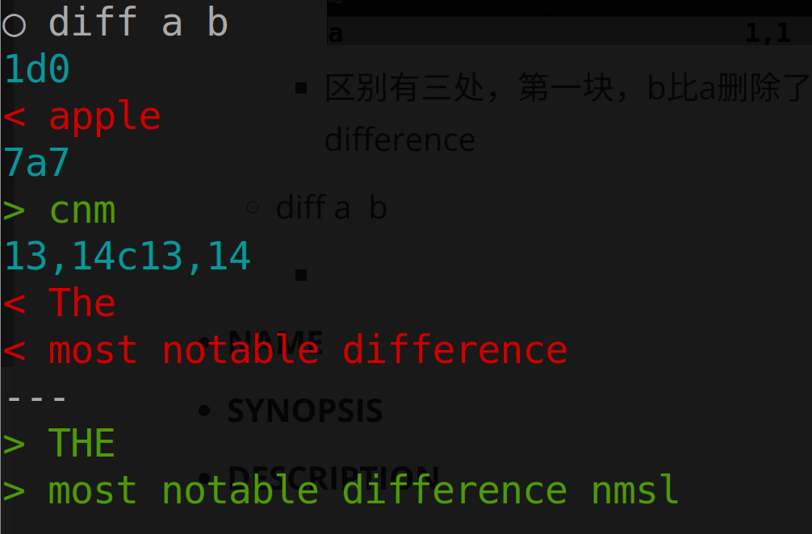
      * 默认状态是向后兼容老的POSIXdiff，**核心思想就是描述了a经过怎样的变化就能变成b。**
      * 默认形式就是每一处变化由 “range operation range”和实际变化内容两处组成，前者表示那个位置那种变化，后者表示变化内容。这张图距离,  1d0就是前者，< apple 就是后者。
      * range  operation range ,第一个范围表示第一个文件，第二个范围表示第二个文件，operation有三种形式d(delete), a(add), c(change),表示增删改。知道了这个就一目了然了。
      * 1d0
        * 第一个文件第一行删除apple
      * 7a7
        * 第一个文件第七行 cnm增加到第二个文件第7行
      * 13,14c13,14
        * 第一个文件13~14行由上面的形式变为下面的形式成为第二个文件的13~14行。

  * diff -c  a b

    > -c  表示context format 上下文格式，就是不仅只展示变化的行，还包括了一定的上下行。

    * 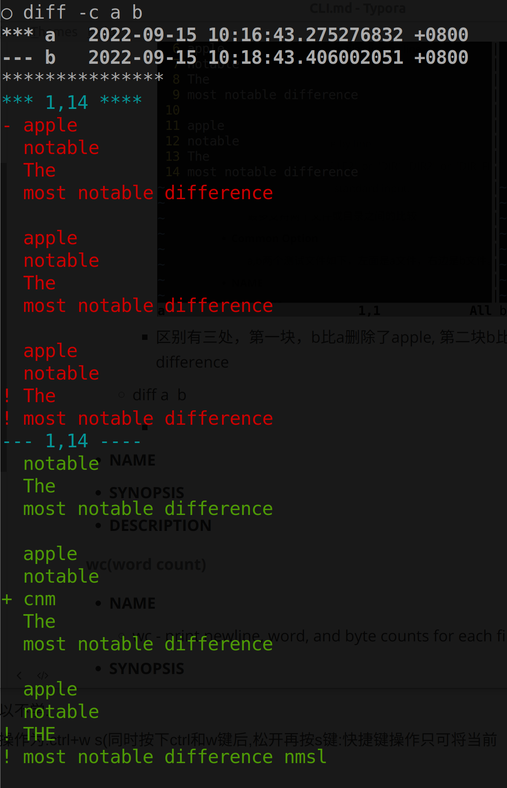
    * \*\*\* a 表示文件a  因此 \*\*\* 1,14 \*\*\*\*表示文件a的1~14行, --- b, --- 1,14 ----同理
    * 行前面
      * \-表示相对另一个文件少了该行
      * \+表示相对另一个文件多了该行
      * \!表示相对另一个文件该行不一样

  * diff -u  a b

    > unified format 更简洁的context format形式，不重复显示共有行

    * 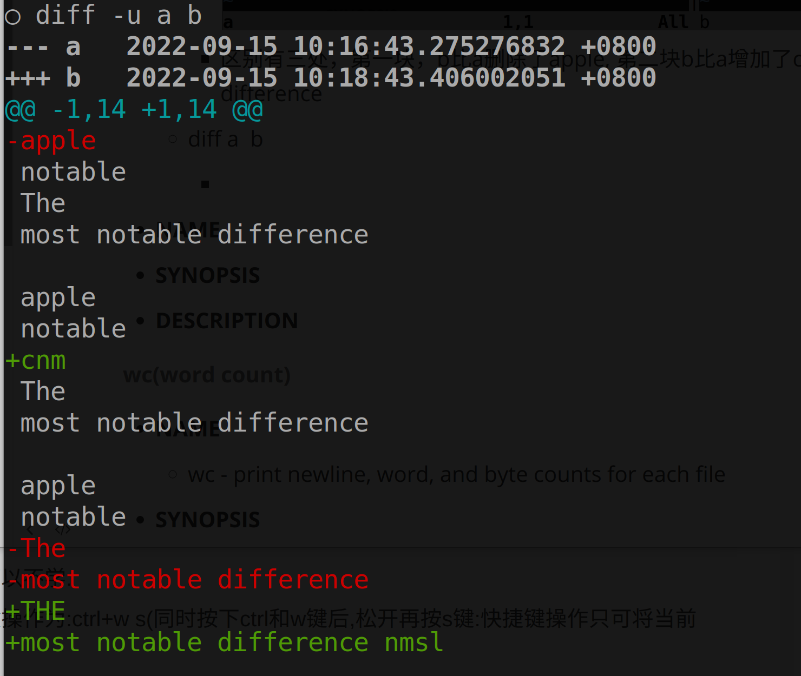
    * --- a表示a文件， +++ b表示b文件
    * @@ -1,14 +1,14 @@表示上下文的范围， -1，14表示a文件的1~14行，+1,14表示b文件的1~14行
    * diff -u的思想跟diff没参数一样，列出的变化是b-a也就是a文件经过这些变化就可以变成b文件。即列出的变化是b文件相对于a文件的变化。
      * 减号表示删掉该行
      * 加号表示加上该行
    * 冷知识，git diff就是利用diff命令的这种模式显示变化
      * 

###### patch

> 补丁

* 补丁程序，常常与diff配合用于更新文件，首先利用diff生成差异文件，描述了old_version和new_version之间的差异，然后调用patch程序利用差异文件写Old_verion使其和new_version一样。
* 我估计git就用了这个技术。。

###### tr

* **NAME**

  * tr - translate or delete characters

    > translate v. 翻译；使转变，变为(翻译的本质就是转换，更本质就是映射)

* **SYNOPSIS**

  * tr [OPTION]... <u>SET1</u> [<u>SET2</u>]

* **DESCRIPTION**

  >  Translate,  squeeze,  and/or delete characters from standard input, writing to
  >  standard output.
  >
  > squeeze [skwiːz]  v. 挤

  * 就是字符级别的查找替换，就是把SET1指代的字符集统统替换为SET2指代的字符集。
  * 注意是接受stdin的输入的文本然后替换输出到stdout

* **Common Option**

  * cat  file | tr  [:upper:]  [:lower]  > fileLower
    * fileLower文件内容相当于file中全部大写变小写。
  * cat windowsFile | tr -d ' \\r'  > unixFile
    * unixFile相当于去掉所有回车符号的windowsFIle。
  * echo "aaaabbbbccccc" | tr -s ab
    * 结果为abccccc，-s squeeze, 删除相邻重复字符。

###### sed(stream edit)

* **NAME**

  * sed - stream editor for filtering and transforming text

* **SYNOPSIS**

  * sed [<u>OPTION</u>]... {<u>script-only-if-no-other-script</u>} [<u>input-file</u>]...

* **DESCRIPTION**

  > Sed  is a stream editor.  A stream editor is used to perform basic text transformations on an input stream (a file or input from  a  pipeline).   While  in some  ways similar to an editor which permits scripted edits (such as ed), sed works by making only one pass over the input(s), and is consequently more  efficient.   But it is sed's ability to filter text in a pipeline which particularly distinguishes it from other types of editors.
  >
  > permit v.允许，许可
  >
  > distinguish [dɪˈstɪŋɡwɪʃ] v. 区别，区分

  * 流编辑器

    >  sed没那么神秘，就是一个流编辑器。可以接受文件输入，或者stdin,或者管道来的stdin.

    * 普通的编辑器第一步就是要打开文件，然后进行各种编辑，要打开的核心目的就是引入光标，我们移动光标就定位到了文件要编辑的位置，然后编辑动作(增删改等)。
    * sed没有打开动作，直接命令行执行，所以借助{<u>script-only-if-no-other-script</u>}这个部分指明编辑的位置以及动作。

  * sed与cat等文本处理命令

    > 其实cat, head, tail, sort,uniq,cut, paster,join,comm,diff,tr,tee等可以说都是所谓流编辑器，接受stdin或管道来的stdin或者文件的输入，然后经过"编辑"然后输出到stdout。

    * 它们与sed的区别是它们往往只能实现单一的“编辑”功能，比如cat就只能原样输出，sort就只能排序输出，cut可以选择任意块输出。。。
    * 而sed相当于集大成者，成为了真正意义上的编辑器，可以实现一切真正编辑器具有的编辑功能。

  * sed与vim

    * 都是编辑器，vim必须打开文件编辑，而sed直接流编辑，好处是可以利用管道这个无敌的特性，坏处是要输入复杂的参数来指定编辑范围与编辑操作。

    * 例如实现修改file中所有apple为cnm然后另存为文件filecnm

      * 首先要 vim file打开文件，然后:%s/apple/cnm/g, 然后:w filecnm， 然后撤销替换，然后退出。好几条命令。

      * sed只需一条命令:    sed  's/apple/cnm/'  file > filecnm ,优雅，优雅，太优雅了。

* {**<u>script-only-if-no-other-script</u>}部分详解**

    > 上面说道，其实这部分很简单，只要是告诉sed编辑范围和编辑操作。英文称这个编辑范围为address或address-range，也比较准确，就是要编辑的位置和位置范围吗。为了简便起见，以下称这个区域为操作区。
    >
    > **然后sed在编辑范围内执行编辑操作**

    * 编辑范围(跟vim查找替换那个范围差不多)

      * | Address | Description                                                  |
        | ------- | ------------------------------------------------------------ |
        | NONE    | 省略表示所有行                                               |
        | n       | 第n行                                                        |
        | $       | 最后一行                                                     |
        | n,m     | n~m行。(接下来的n,m都可以是具体数字，也可以是$代表最后一行)  |
        | n~i     | n+ik行。1~3, 表示第1，4，7，10，13，16。。。行               |
        | n,+k    | n~n+k行                                                      |
        | /regex/ | 包含指定正则表达式pattern的那些行                            |
        | addr!   | 除了这个地址范围之外的所有行.。addr可以是以上所有范围。n!表示除了第n行之外的所有行. n,m!表示除了n~m行以外的所有行。/regex/!除了匹配pattern之外的所有行。 |
      
    * 编辑操作

      * | Command               | Description                                                  |
        | --------------------- | ------------------------------------------------------------ |
        | =                     | 输出行号                                                     |
        | a                     | 行后追加文本                                                 |
        | d                     | 删除                                                         |
        | i                     | 行前插入文本                                                 |
        | p                     | 打印行。sed默认情况下会打印所有行，然后对地址范围内行执行相应操作。如果是打印操作，'1,3p'本来想打印1~3行，实际上会先打印1~3行之后打印所有行。-n参数阻止sed默认打印所有行。sed -n '1,3p'就可以只打印1~3行了。 |
        | q                     | 退出sed，不在处理更多的行。                                  |
        | s/regexp/replacement/ | 跟vim中用法几乎一样。如果后面不加g，那么只替换匹配行中的第一个匹配，如果s/reg/replacement/g，每行中所有匹配都替换。 |
        | y/set1/set2           | 类似tr，将set1指定的字符集转为set2指定的字符集。区别于tr的是sed要求set1,set2长度相同。 |
      
    * 上述只是命令行部分，如果想实现更复杂的操作，就要指定更复杂的编辑范围和编辑操作，可以写成一个脚本，然后 sed -f  script执行。

* **Common Option**

    * | Option | Description                             |
        | ------ | --------------------------------------- |
        | -f     | 操作区由脚本替代                        |
        | -i     | 文本修改后不输出到stdou，直接写会原文件 |
        |        |                                         |

        

* **Common Usage**

    * sed -n '1,3p'  file

        * 输出1~3行

    * sed -n '/apple/p' file

        * 输出匹配apple的所有行。

    * ```shell
        sed 's/\([0-9]\{2\}\)\/\([0-9]\{2\}\)\/\([0-9]\{4\}\)$/\3-\1-\2/' distros.txt
        ```

        * 把 MM/DD/YYYY形式的02/11/2008转为YYYY-MM-DD形式的2008-02-11
        * 因为sed只支持BRE，所以(),{},都需要转义。/也需要转义，因为替换的格式s///斜线有特殊意义。
        * 跟vim那个查找替换基本一样，$表示行末，()表示成组，然后后面可以用\\1,\\2,\\3来引用前面的三个组。
        
    * sed 's/apple/cnm/ ; s/nmsl/nbsl/' file

        * 操作去可以同时执行多条命令，以分号隔开。

###### aspell

* **NAME**
    * aspell - interactive spell checker
* **SYNOPSIS**
    * aspell [<u>options</u>] \<<u>command</u>>
* **DESCRIPTION**
    * 互动式拼写检查工具，很强大。
* **Common Usage**
    * aspell check file
        * 检查file中的拼写错误。

###### wc(word count)

* **NAME**

  * wc - print newline, word, and byte counts for each file

* **SYNOPSIS**

  * wc [<u>OPTION</u>]... [<u>FILE</u>]...

* **DESCRIPTION**

  > Print  newline,  word,  and  byte counts for each FILE, and a total line if more than one FILE is specified.  A word is a non-zero-length sequence of  characters delimited by white space.(一个单词是由空白(空格，tab等)隔开的字符序列)
  >
  > With no FILE, or when FILE is -, read standard input.

  * 默认不带参数情况下依次显示行数、单词数、字节数

* **Common Option**

  * | Option      | Description  |
    | ----------- | ------------ |
    | -l, --lines | 只显示行数   |
    | -w, --words | 只显示单词数 |
    | -c, --bytes | 只显示字节数 |


###### grep(global regular expression print)

* **NAME**

  * grep - print **lines** that match patterns

* **SYNOPSIS**

  * grep [<u>OPTION</u>...] <u>PATTERNS</u> [<u>FILE</u>...]

* **DESCRIPTION**

  > grep  searches  for  PATTERNS  in  each  FILE.  PATTERNS is one or more patterns separated by newline characters, and  grep  **prints  each  line**  that  matches  a pattern.   Typically  PATTERNS  **should  be  quoted**  when grep is used in a shell command.
  >
  > A FILE of “-” stands for  standard  input.   If  no  FILE  is  given,  recursive searches  examine the working directory, and nonrecursive searches read standard input.
  
  * 接受stdin或者文件的文本，然后输出匹配给定模式(PATTERNS)的文本行。
  * PATTERN可以是字符串或者正则表达式。默认只支持BRE(basic regular expression)
  * 如果给出的pattern不会由shell进行展开，例如grep  x test.txt, 可以不加引号，如果给出的pattern使用正则表达式包含可能会引发shell展开的符号，那么一定要加引号，**最好单引号**，因为单引号内的所有内容shell都不会展开，如果是双引号则例如美元符号shell依然会展开。
    * grep 'x*' test.txt 
      * 加了单引号，shell把 x\* 作为一个参数传递给grep
      * 如果不加，假设该目录下有文件 xxx, xccc.  那么shell会将命令展开为grep xxx xccc test.txt， 完全脱离本意。
  
* **Conmmon Option**

  * | Options                     | Description                                                  |
    | --------------------------- | ------------------------------------------------------------ |
    | none                        | 默认状态下输出包含模式的所有行，如果是多个文件，输出文件名加该文件中的匹配行 |
    | -E,--extended-regexp        | 增加对ERE(扩展的正则表达式)的支持。默认只支持BRE。           |
    | -i,--ignore-case            | 匹配时忽略大小写                                             |
    | -v, --invert-match          | Invert the sense of matching, to select non-matching lines.就是输出不匹配的那些行 |
    | -c, --count                 | 只输出匹配的行的个数                                         |
    | -l,  --files-with-matches   | 多个文件时，只输出包含匹配行的文件名，不输出具体的匹配行     |
    | -L, --files-without-matches | 多个文件时，只输出不包含匹配行的文件名                       |
    | -n, --line-number           | 输出匹配行在文件中的行数                                     |
    | -h                          | 多个文件时，只输出匹配行，不输出文件名                       |


###### tee

* **NAME**

  * tee - read from standard input and write to standard output and files

* **SYNOPSIS**

  * tee [<u>OPTION</u>]... [<u>FILE</u>]...

* **DESCRIPTION**

  > Copy standard input to each FILE, and also to standard output.

  * Tee命令是专门为管道设计的命令，当我们想获取管道中间某个阶段的输出时，就可以利用这里命令。
    * 
    * 什么是Tee，上述就是现实中的Tee，就是用于管道的三通管道接口，正式名称是Pipe Fitting Tee.
    * 而对于命令tee的作用而言，这个名字起的实在是恰到好处，在管道中使用时，它接受上游命令的标准输入，然后将其输出到标准输出供下游命令使用，同时将内容输出到文件，相当于上图下面那个口。
    * 妙啊，这么一类比，tee相当于三通管道接口，管道中的 \|竖杠就相当于双通管道接口，把两个命令的输出，输入接口连在一起，强无敌。

* **Common Option**

  * ls -a /usr/bin | sort | uniq | tee file1 | grep 'x*'
    * 利用tee命令，将中间阶段即uniq之后的文本处理结果写入到file1.

###### 格式化输出

###### nl(number line)

* **NAME**

  * nl - number lines of files

* **SYNOPSIS**

  * nl [<u>OPTION</u>]... [FILE]...

* **DESCRIPTION**

  > Write each FILE to standard output, with line numbers added.
  >
  >  With no FILE, or when FILE is -, read standard input.

  * 总之就是花式给文本加行数显示然后输出到stdout。

###### fold

> fold [foʊld] v.折叠

* **NAME**

  * fold - wrap each input line to fit in specified width

* **SYNOPSIS**

  * fold [<u>OPTION</u>]... [<u>FILE</u>]...

* **DESCRIPTION**

  > Wrap input lines in each FILE, writing to standard output.
  >
  > With no FILE, or when FILE is -, read standard input.

  * 限制文本行宽，然后输出到stdout.
  * 超过指定行宽的，自动加换行符切换到下一行。

* **Common Option**

  * | Option          | Descript                                                     |
    | --------------- | ------------------------------------------------------------ |
    | -w <u>WIDTH</u> | 限宽为几个字符，默认80个字符                                 |
    | -s，--space     | 不加这个参数,严格限宽，末尾单词可能会被拆分到下一行，加了这个参数，如果遇到空格后面单词会被限宽拆分，那么就会让这个单词整体进入下一行。总之增加的 -s 选项将让 fold 分解到最后可用的空白 字符，即会考虑单词边界。 |

* **Common Usage**

  * echo  wrap input lines in each  |   fold -s  -w 8 
    * 最多8个字符一行，考虑单词边界然后输出。

###### fmt(format)

* **NAME**

  * fmt - simple optimal text formatter

* **SYNOPSIS**

  * fmt [-<u>WIDTH</u>] [<u>OPTION</u>]... [FILE]...

* **DESCRIPTION**

  > Reformat  each  paragraph in the FILE(s), writing to standard output.  The option -WIDTH is an abbreviated form of --width=DIGITS.
  >
  > With no FILE, or when FILE is -, read standard input.

  * 可以说是一个简易排版工具，所谓排版就是格式化文本吧。

###### pr

* **NAME**

  * pr - convert text files for printing

* **SYNOPSIS**

  * pr [<u>OPTION</u>]... [<u>FILE</u>]...

* **DESCRIPTION**

  > Paginate or columnate FILE(s) for printing.
  >
  >  With no FILE, or when FILE is -, read standard input.

  * 给文本分页(paginate v.)或加页眉页脚(header,footer).
  * 简而言之，简单排版工具，或者说格式化文件工具。

###### groff

* 继承自roff，强大的命令行文件排版工具，不过现在谁还用这个啊，都是GUI文件处理工具，输入文本同时排版，高效的一比。

###### printf(print formatted)

> 为C语言设计，广泛用于其他语言，同样用于shell，在shell中是内建命令
>
> format [ˈfɔːrmæt]  v. 格式化，安排...的版式

* **NAME**

  * printf - format and print data

* **SYNOPSIS**

  * printf <u>FORMAT</u> [<u>ARGUMENT</u>]...
  * printf <u>OPTION</u>

* **DESCRIPTION**

  > Print ARGUMENT(s) according to FORMAT, or execute according to OPTION

  * printf不接受stdin

  * 常用于脚本来格式化表格数据(tabular d)

  * <u>FORMAT</u>中包含三类内容

    * 原义文本(literal)

      * 原样输出

    * 转义字符(escape character)

      * 输出对应控制字符。例如 \\n，对应换行符。

    * 格式化规范(format specification )

      * 表示如何格式化输出ARGUMENT部分的参数.

      * FORMAT部分有一个规范，ARGUMENT部分就得有一个参数供格式化，总之一一对应。

      * 为啥叫格式化规范，而不叫格式化字符，因为%d只是完整格式化规范的一部分，一个组件。
        * 完整的规范形式：%\[flags\]\[width\]\[\.precision\]conversion_specification
        * 此处conversion_sepcification转化规范就指具体的 d,f, o, s 。。。如下。

      * | Component | Description                                       |
        | :-------- | :------------------------------------------------ |
        | %d        | decimal integer. 将数字格式化为带符号十进制数字。 |
        | %f        | floating point number.格式化为浮点数输出。        |
        | %o        | 将整数格式化为八进制输出                          |
        | %s        | 格式化输出字符串                                  |
        | %x        | 将整数格式化为十六进制输出(a-f用小写)             |
        | %X        | 同%x，a-f用大写                                   |
        | %%        | 输出%本身                                         |

      * | Component  | Description                                                  |
        | :--------- | :----------------------------------------------------------- |
        | flags      | 有5种不同的标志:<br /># :使用“备用格式”输出。这取决于数据类型。对于o（八进制数）转换，输出以0为前缀.对于x和X（十六进制数）转换，输出分别以0x或0X为前缀.<br/>0:(零) 用零填充输出。这意味着该字段将填充前导零，比如“000380”.<br/>- :(短横线) 左对齐输出。默认情况下，printf右对齐输出。<br />‘ ’ :(空格) 在正数前空一格。<br />+ : (加号) 在正数前添加加号。默认情况下，printf 只在负数前添加符号。 |
        | width      | 指定最小字段宽度的数。                                       |
        | .precision | 对于浮点数，指定小数点后的精度位数。对于字符串转换，指定要输出的字符数 |

  * **格式转换例子**

    * | Argument | Format    | Result     | Notes                                                        |
      | :------- | :-------- | :--------- | :----------------------------------------------------------- |
      | 380      | "%d"      | 380        | 简单格式化整数。                                             |
      | 380      | "%#x"     | 0x17c      | 使用“替代格式”标志将整数格式化为十六进制数。                 |
      | 380      | "%05d"    | 00380      | 用前导零（padding）格式化整数，且最小字段宽度为五个字符。    |
      | 380      | "%05.5f"  | 380.00000  | 使用前导零和五位小数位精度格式化数字为浮点数。由于指定的最小字段宽度（5）小于格式化后数字的实际宽度，因此前导零这一命令实际上没有起到作用。 |
      | 380      | "%010.5f" | 0380.00000 | 将最小字段宽度增加到10，前导零现在变得可见。                 |
      | 380      | "%+d"     | +380       | 使用+标志标记正数。                                          |
      | 380      | "%-d"     | 380        | 使用-标志左对齐                                              |

###### lpr,lp,a2ps,lpstat,lpq,lprm,cancel

* 打印相关

###### more

* **NAME**
  * file perusal filter for crt viewing  适用于crt显示的文件阅读过滤器
* **SYNOPSIS**
  *  more [options] <u>file</u>...
* **DESCRIPTION**
  *  more  is  a filter for paging through text **one screenful at a time**.  This version is especially primitive.  Users should realize that less(1) provides more(1) emulation  plus  extensive enhancements.
  * more falls into the class of programs called “pagers,” programs that allow the easy viewing of long text documents in a page by page manner.——More属于”页面调度器”类程序，这些程序允许以逐页方式轻松浏览长文本文档
* **Common Option**
  * more <u>file</u>...
  * 使用more打开文件之后按h，就知道怎么翻页，滚动，搜索了。。

###### less

* **NAME**
  * less - opposite of more  直译就是more的反义词，其实这里借助了一个名句——“less is more",隐含了less就是增强版more的意思
* **SYNOPSIS**
  * 见Man
* **DESCRIPTION**
  * Less  is a program similar to more (1), but it has many more features.  Less does not have to read the entire input file before starting, so with large  input  files  it  starts  up faster than text editors like vi (1).  
  * 同more，less也属于pagers程序，一页一页看文本。
* **Common** **Option**
  * less <u>file</u>...
  * 使用less打开文件之后按h，就知道怎么翻页，滚动，搜索了。。
    * f/space        (forward)
      * 下一页
    * b                   (backward)
      * 上一页
    * =
      * 显示当前阅读进度
    * /
      * 搜索，n下一个匹配，N上一个匹配,支持正则表达式，跟vim搜索一样

###### 总结

* cat, head, tail, sort, uniq, wc , grep, tee
  * 不分页(not page)**读**文本程序
    * 输入
      * 文件文本
      * stdin(默认键盘)文本
      * 管道(本质是stdin)上游程序的stdout的文本
    * 输出
      * 将处理过的文本内容输出stdout，即屏幕上，如果是多余一页的文本，需要终端支持鼠标，然后滚回去看，不支持任何搜索，定位功能。当用于不支持鼠标的终端时，只能看到最后一页的内容，看不到之前的。
    * 用英文来讲就是cat,head tail 。。。 -------display files without paging, more less ------display files with paging
* more、less
  * 分页(paging)读文本程序
    * 支持按页浏览文本、支持翻页、搜索、定位、滚动等各种利于长文本文件阅读的操作。
    * 例如man程序就是调用less阅读的超长文本
* 注
  * **上述所有命令在不重定向，不加特定参数的情况下仅仅是读取文本内容，然后输出到屏幕而已，不会修改原始文本内容。**
* vi、vim
  * 强大的编辑器，支持文本读写

###### echo

* **NAME**
  * echo - display a line of text
* **SYNOPSIS**
  * echo [<u>SHORT-OPTION</u>]... [<u>STRING</u>]...
* **DESCRIPTION**
  * echo的功能很简单，就是输出echo后面的所有内容(echo的参数除外)到stdout。

###### dos2unix、unix2dos

* 互转Windows和Unix风格的文件，就是转换\\n\\r和\\n.

#### 2.3.2.3 创建文件链接

###### ln(link)

* **NAME**
  * ln - make links between files
* **SYNOPSIS**
  * ln [<u>OPTION</u>]...  <u>TARGET</u> <u>LINK_NAME</u>
  * 自己魔改的，就简单记住这一点就行了
* **DESCRIPTION**
  * 硬链接
    * 不加参数，给TARGET创建名为LINK NAME的硬链接
    * TARGET只能是文件，而且必须与LINK NAME共处同一个文件系统。
  * 软连接
    * 加-s 参数，给TARGET创建名为LINK NAME的软链接
    * TARGENT可以是文件或目录，允许与LINK  NAME处在不同文件系统。
* **Common Option**
  * -s, --symbolic  make symbolic links instead of hard links
    * ln -s <u>TARGET</u>  <u>LINK</u> <u>NAME</u>
    * 切记的是，假设链接文件创建在路径A，那么给出的TARGET文件的形式一定要能**在A路径中访问**。
    * eg
      * 假设存在  ~/fun ~/dir/   要在dir目录下创建一个fun文件的软链接，正确的做法是(假设当前pwd是~)
        * ln -s  ../fun dir/fun_sym   或  ln -s ~/fun dir/fun_sym
          * 因为要创建的fun_sym在 ~/dir下，所以target一定要能在dir下访问到，所以使用相对路径../fun 或者绝对路径~/fun
          * 错误示范  ln -s fun dir/fun_sym  ,也会创建fun_sym，不过会提示fun_sym已损坏，找不到目标文件(也就是指向的原文件)

#### 2.3.3.4 文件权限管理

###### id

* **NAME**

  * d - print real and effective user and group IDs

* **SYNOPSIS**

  * id [<u>OPTION</u>]... [<u>USER</u>]

* **DESCRIPTION**

  > Print  user  and  group  information for the specified USER, or (when USER omitted) for the current user.

  * 主要的信息就是用户id，用户名，用户所在组的id，组名(用户所在组可能有多个)


###### chmod(change mode)

* **NAME**

  * chmod - change file mode bits

* **SYNOPSIS**

  * octal notation
    * chmod [<u>OPTION</u>]... <u>OCTAL-MODE</u> <u>FILE</u>...
  * symbolic notation
    * chmod [<u>OPTION</u>]... <u>MODE</u>[,<u>MODE</u>]... <u>FILE</u>...

* **DESCRIPTION**

  * OCTAL-MODE

    * 代表3位八进制数字，直接指定文件的mode

  * MODE

    > <u>MODE</u>参数分为三个部分

    * who

      > who the change will affect 更改文件权限影响的是那个使用文件的对象。

      * u，g，o，a
        * u(user)代表owner；g(group)代表group；o(others)代表others；a(all)代表owner，group，others三者，如果省略，那么默认是a。

    * which

      > which operation will be performed  加权限还是减权限还是指定权限

      * +，-，=
        * 加上某权限；减去某权限；等于某权限

    * what

      > what permission will be set.  加减或等于的权限对象

      * r 、w、x
        * 读写执行

  * eg

    * 文件test权限为rw-rw-r--
      * chmod 777  test
        * 权限变为rwxrwxrwx(下面的例子省略汉字，直接写变化后的权限)
      * chmod 421 test
        * r-x-w---x
      * chmod u+x test
        * rwxrw-r--
      * chmod u-w test
        * r--rw-r--
      * chmod +x test
        * rwxrwxr-x
      * chmod o-rw test
        * rw-rw----
      * chmod go=rw test
        * rw-rw-rw-
      * chmod uo=rx test
        * r-xrw-r-x(特别注意等号，等号就是完全相等，不管原来用户什么权限，利用等号可以直接指定对应用户的权限，比加减权限更简单一些，例如本例就指定user,others权限为rx，group不受影响。)
      * chmod u+x,go=rw test
        * rwxrw-rw-

###### chown(change owner)

* **NAME**

  * chown - change file owner and group

* **SNOPSIS**

  * chown [<u>OPTION</u>]... \[<u>OWNER</u>][:[<u>GROUP</u>]] <u>FILE</u>...

* **DESCRIPTION**

  > This  manual  page  documents the GNU version of chown.  **chown changes the user and/or group ownership of each given file.**  If only an owner (a user name or numeric user ID)  is  given, that user is made the owner of each given file, and the files' group is not changed.  If the owner is followed by a colon and a group name (or numeric group ID), with no spaces between them,  the  group  ownership  of the files is changed as well.  If a colon but no group name follows the user name, that user is made the owner of the files and the group of  the  files
  > is  changed  to that user's login group.  If the colon and group are given, but the owner is omitted, only the group of the files is changed; in this case, chown performs the same function  as  chgrp.   If  only a colon is given, or if the entire operand is empty, neither the owner nor the group is changed.

  * colon [ˈkoʊlən]  冒号        semicolon [ˈsemikoʊlən] 分号
  * chown 需要root权限

###### umask

* **NAME**

  * umask - Display or set file mode mask.

* **SYNOPSIS**

  * umask [-p] [-S] [<u>mode</u>]

* **DESCRIPTION**

  > Sets the user file-creation mask to MODE.  If MODE is omitted, prints the current value of the mask.

  * 简而言之，shell规定了新建文件或目录的默认mode，最终新建的文件的mode取决于默认mode减去mask。mode我们无法修改，但是mask我们可以修改，所以我们也能部分控制新建文件的mode。
  * umask设置的mask仅适用于shell的当前会话。
  * eg
    * 以我的Ubuntu为例， 我发现文件默认mode是0666，目录默认mode是0777，第一位特殊权限不管他。而mask是0002， 所以新建文件的mode都是0664即rw-rw-r--, 新建目录的mode都是0775，即rwxrwxr-x。我们自己修改mode，如下：
      * 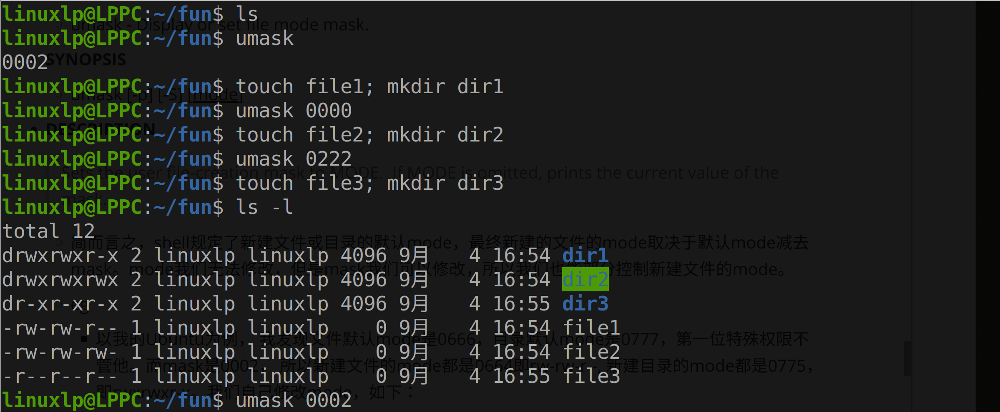

### 2.3.3 搜索文件

###### locate

> 默认没装，需要 apt install mlocate ，我也不知道为啥叫mlocate,知道了，因为locate太老了，现在都用mlocate，但是为了兼容locate，包名叫mlocate，并且运行locate实际运行的是mlocate

* **NAME**

  * locate - find files by name

* **SYNOPSIS**

  * locate [<u>OPTION</u>]... <u>PATTERN</u>...

* **DESCRIPTION**

  > locate  **reads  one  or  more databases** prepared by updatedb(8) and writes file names matching at least one of the PATTERNs to standard output, one per line.
  >
  > If --regex is not specified, PATTERNs can contain globbing characters.  **If any PATTERN contains no globbing characters, locate behaves as if the pattern were  \*PATTERN\*.**（as if 好像）
  >
  > By default, locate does not check whether files found in database still  exist (but it does require all parent directories to exist if the database was built with --require-visibility no).  locate can never report  files  created  after the most recent update of the relevant database.

  * 搜索Linux维护的相关数据库里面匹配模式的文件或目录。
    * 该数据库一般一天刷新一次，所以搜索结果不是实时的，搜索出来的文件可能不存在，刚创建的文件也可能搜不到。
    * updatedb手动刷新一次数据库，这样搜索出来的就是最新的了。
  * 默认状态下支持统配符，只要文件完整路径名包含模式即可。
  * locate --regex <u>PATTERN</u> 支持正则表达式，类似grep，只要文件完整路径名包含该模式即可。

###### find

* **NAME**

  * find - search for files in a directory hierarchy

* **SYNOPSIS**

  * find [<u>options</u>]... [<u>starting-point</u>...] [<u>expression</u>]

* **DESCRIPTION**

  > This manual page documents the GNU version of find.  GNU find searches the directory tree rooted at each given starting-point by evaluating the  given  expression from left to right, according to the rules of precedence (see section OPERATORS), until the outcome is known (the left hand side is  false  for  and operations,  true for or), at which point find moves on to the next file name. If no starting-point is specified, `.' is assumed.
  >
  > evaluate 求指，评估
  >
  > outcome 结果
  >
  > proceed [proʊˈsiːd] vi. 继续，接着做，行进，前进
  >
  > precede [prɪˈsiːd] v. 先于，在。。之前发生， 走在...前面
  >
  > precedence [ˈpresɪdəns] n. 优先，优先权
  >
  > prior [ˈpraɪər] a. 先前的，较早的，优先的
  >
  > priority  [praɪˈɔːrəti] n. 优先，优先权
  
  * Options
  
    * 仅有的几个参数是关于软链接的，所以一般的用途没啥参数
  
  * starting-point
  
    * Linux文件就是一颗文件树，所以在某个目录搜索，本质就是在那个目录节点搜索，所以起名开始点，很6.
    * 省略那么默认开始点为当前目录。
  
  * expression
  
    > The part of the command line after the list of starting points  is  the  expression.   This  is a kind of query specification **describing how we match files and what we do with the files** that were matched.
  
    * **find不仅仅是查找文件而已，它非常强大，可以根据不同的筛选条件查找文件并且可以对匹配到的文件做后续处理。**这一切都由expression部分控制，正如命令描述部分所言，find命令的本质就是遍历以开始点为根的一个子树，然后对每个树节点evaluating the given expression.
    * expression部分很复杂，详见man，以下举例几种常见的用法。注意find的参数部分参数都是以双横线开头，而expression部分的参数都是单横线开头并且位于starting-point 之后。
    
    > An expression is composed of a sequence of things: Tests, Actions, Global options, Positional options, Operators. 这几部分参数可以组合使用也可以单独使用。下面列出几种常见的表达式参数
  
* **Common Expression**

  * Tests(测试条件)

    > find命令对开始点为根的文件子树的每一个节点执行指定的测试条件，如果值为真，那么就表示匹配该文件或目录供后续处理。

    * 省略的话会递归列出开始点为根树的所有节点。

    * -type d/f/b/c/l...

      > (directory, regular file, block special device file, character special device file, symbolic link...)
  
      * 仅匹配目录或常规文件或。。。
      * find ~ -type d
        * 列出所有目录
  
    * -name  <u>pattern</u>
  
      > -name 大小写敏感， -iname大小写不敏感(ignore case)
  
      * 递归查找目录下所有名字为pattern的文件，支持通配符，要求完全匹配。
  
        * find / -name Linux
          * 查找根目录下名为Linux的文件，需要注意的是find是完全匹配，只匹配那些文件名为Linux的文件。而locate 则是只要文件完整路径名包含模式就算匹配。
        * find / -name \*Linux
        * find / -name \*Linux\*
        * find / -name ?Linux
  
    * -regxp  <u>pattern</u>
  
      * 递归查找，支持正则表达式，注意find查找是从开始点开始的完整路径，而且要求这个完整路径精确匹配正则表达式，而不是像grep只需行包含这个正则表达式匹配的模式就行了。
      * eg，假设当前目录下有个bin文件
        * find .  -regex   'bin+'
          * 查找失败，因为find真正扫描的是完整路径\./bin ，而不是bin，所以不匹配bin+
        * find  . -regex  '.*bin+'
          * 这样就可以了。
      * 因为find要求精确匹配完整路径，然而我们只考虑单纯文件名，我们可以这样 '.\*pattern'在我们真正想匹配的模式前加上.\*,就可以忽略前面的所有路径了。
    
    * -size  [+-]<u>n</u>[cwbkMG]
    
      * 递归查找目录下所有符合大小条件的文件
      * \+ 大于 \-小于， 省略，等于。
      * c(bytes) w(two bytes words) k(KiB) M(MiB) G(GiB) 
        * find /var  -name nmsl -type f -size +10M  
          *  查找/var中大小大于10M的名为nmsl的常规文件
  
  
  
  
    * -atime <u>n</u>
  
      > n单位是天， access time
  
      * 根据文件的最近访问时间找
        * find -name *.jpg  -atime -7    找当前目录下最近7天内访问的jpg文件
  
  * Operator
  
    > 说白了就是与或非测试条件，使测试条件更复杂，对每个目录树节点执行测试表达式时同样会短路求值。
  
    * | Operator  | Description    |
      | --------- | -------------- |
      | -and , -a | 与             |
      | -or,  -o  | 或             |
      | -not , !  | 非             |
      | ()        | 改变执行优先级 |
  
      > parenthesis n. 圆括号 parentheses  n. pl. (复数) 圆括号
      >
      > bracket 括号
      >
      > brace 花括号
  
    * eg
  
      * 默认状态下就是-and
        * find /  -name nmsl -type -f
          * == find / -name nmsl -and -type -f
          * 查找名字是nmsl的常规文件
      * -or 或, ()
        * find / -name nmsl     -or      \\(-size +1M -and -type -f \\)
          * 查找名字是nmsl的文件或目录和大于1M的常规文件。
          * 括号在shell中有特殊含义，所以需要转义符
      * -not
        * find /   -not -name  nmsl
          * 查找名字不是nmsl的所有文件
  
  * Actions
  
    > 对匹配的所有文件做什么事情
    >
    > 系统预定义了一些操作，同时支持用户自定义自己的操作
  
    * 常用系统预定义Actions
  
      * | 操作    | 描述                                                         |
        | :------ | :----------------------------------------------------------- |
        | -delete | 删除当前匹配的文件。                                         |
        | -ls     | 对匹配的文件执行等同的 ls -dils 命令。并将结果发送到标准输出。 |
        | -print  | 把匹配文件的全路径名输送到标准输出。如果没有指定其它操作，这是 默认操作。 |
        | -quit   | 一旦找到一个匹配，退出。                                     |
  
        * find /  -name 'nmsl*' -type f  -delete
          * 删除根目录下所有以nmsl开头的常规文件
  
      * actions 和 tests之间顺序不同，最后结果会不同。并且它们之间也可以通过Operator连接形成复杂的逻辑表达式。
  
        * find / -delete -name 'nmsl*' -type f  会删除所有文件
  
    * user-defined actions
  
      * 利用\-exec,详见man
  

### 2.3.4 归档压缩同步文件

> 打包(归档)和压缩是两件事，只不过一般的压缩软件同时具有打包和压缩功能。
>
> 压缩会在源文件基础上加一些额外信息来描述压缩。所以如果源文件十分小，可能会出现压缩后比压缩前还大的问题。
>
> 所以不要压缩已经压缩了的文件，gzip  cnm.jpg， 因为压缩文件已经去掉冗余信息了，再压缩还会加入一些描述压缩的额外开销且并不能去除更多的冗余信息，所以反而越压缩越大。

###### gzip

* **NAME**

  * gzip, gunzip, zcat - compress or expand files

* **SYNOPSIS**

  * gzip [<u>OPTIONS</u>] <u>FILE</u>...

* **DESCRIPTION**

  > Gzip  reduces the size of the named files using Lempel-Ziv coding (LZ77).  Whenever possible, each file is replaced by one with the extension .gz, while keeping the same ownership modes, access and modification times.  (The default extension  is z for MSDOS, OS/2 FAT, Windows NT FAT and Atari.)  If no files are specified, or if a file name is "-", the standard input is compressed to the standard output.  Gzip will only attempt to compress regular files.  In particular,  it  will  ignore symbolic links
  >
  > Compressed files can be restored to their original form using **gzip -d** or **gunzip** or **zcat**.  If the original  name  saved  in the compressed file is not suitable for its file system, a new name is constructed from the original one to make it legal.

  * gzip只有压缩功能，没有打包功能。只能压缩文件，不能压缩目录

  * 压缩并用压缩后文件替换源文件。默认后缀(suffix/postfix) \.gz
  * gzip -d或gunzip解压。 
  * 压缩 ： compress  解压缩：expand(扩展)， uncompress, decompress
  * zcat file可以不解压情况下看压缩文件内容。

###### bzip2

* **NAME**
  * bzip2, bunzip2 - a block-sorting file compressor, v1.0.8
  * bzcat - decompresses files to stdout
  * bzip2recover - recovers data from damaged bzip2 files
* **SYNOPSIS**
  * bzip2 [<u>OPTIONS</u>] <u>FILE</u>...
* **DESCRIPTION**
  * bzip2只有压缩功能，没有打包功能。只能压缩文件，不能压缩目录
  * bzip2利用新的压缩算法，比gzip更快，压缩等级更高
  * 默认压缩后缀为.bz2(也可以识别.bz的压缩包)
  * bunzip解压文件
  * bzcat不解压情况下看内容

###### tar(tape archive)

* **NAME**

  * tar - an archiving utility

* **SYNOPSIS**

  * Traditional usage
    * tar {A|c|d|r|t|u|x}[GnSkUWOmpsMBiajJzZhPlRvwo] [<u>ARG</u>...]
  * UNIX-style suage
    * tar -A [<u>OPTIONS</u>] <u>ARCHIVE</u> <u>ARCHIVE</u>
    * tar -c [-f <u>ARCHIVE</u>] [<u>OPTIONS</u>] [<u>FILE</u>...]
    * tar -d [-f <u>ARCHIVE</u>] [<u>OPTIONS</u>] [<u>FILE</u>...]
    * tar -t [-f <u>ARCHIVE</u>] [<u>OPTIONS</u>] [<u>MEMBER</u>...]
    * tar -r [-f <u>ARCHIVE</u>] [<u>OPTIONS</u>] [<u>FILE</u>...]
    * tar -u [-f <u>ARCHIVE</u>] [<u>OPTIONS</u>] [<u>FILE</u>...]
    * tar -x [-f <u>ARCHIVE</u>] [<u>OPTIONS</u>] [<u>MEMBER</u>...]

* **DESCRIPTION**

  > GNU **tar** is an archiving program designed to store multiple files in a single file (an **archive**), and to manipulate such archives.   The  archive  can  be either a regular file or a device (e.g. a tape drive, hence the name of the program, which stands for **t**ape archiver), which can be located either on the local or on a remote machine.

  * 传统的tar只能打包解包，现在的tar可以同时打包压缩和解压缩解包。

  * 打包目的是方便压缩，方便备份，方便网络传输(例如打包后就可以利用scp,sftp等传输目录了)

  * tar归档后的文件也可以叫做包(tarball)

  * 首先解释以下上述复杂的SYNOPSIS，很好理解，两个方面

    * 风格

      * 类似ps命令，tar也有三种使用风格，BSD风格就是短参数不加横线，UNIX风格就是短参数加一个横线。还有一个GNU风格没列出来就是长参数加两个横线。

    * 第一个参数

      * 类似netstat命令，第一个参数指定了tar工作在一个具体的功能分类。以下列出常用的:

        * | 模式 | 说明                         |
          | :--- | :--------------------------- |
          | c    | create.创建归档文件。(打包)  |
          | x    | extract.抽取归档文件。(解包) |
          | r    | 追加文件或目录到归档文件     |
          | t    | 列出归档文件的内容。         |

  * 接下来解释一些参数的意义 

    * ARCHIVE 包名
    * FILE    要打包的文件或目录
    * MEMBER包中特定的文件或目录
      * tar -x [-f <u>ARCHIVE</u>] [<u>OPTIONS</u>] [<u>MEMBER</u>...] 如果指定了MEMBER参数，表示指解包中特定的成员文件或目录而不是解整个包。

* **Common Usage**
  * 打包，解包
    * tar cf  <u>ARCHIVE</u>  <u>FILE</u>
      * 打包文件
      * tar cf ~/test.tar     test
        * 将当前目录下test目录打包为test.tar并放在家目录下。
    * tar tf <u>ARCHIVE</u>
      * 浏览归档文件，如果想看详细信息  tar tvf 
    * tar xf <u>ARCHIVE</u>
      * 解包归档文件到当前目录
    * tar rf <u>ARCHIVE</u> <u>FILE</u>
      * 常用于已经有打包文件了，但是发现有些文件漏打包了，那么可以把这些文件追加打包到已存在的包中。
  * 打包加压缩，解压缩加解包
    * tar czf   <u>compressedFIle</u> <u>FILE</u>
      * 打包后调用gzip压缩
      * 压缩包一般命名为tar.gz 或者tgz
      * tar czf   test.tar.gz    test
        * 打包test并压缩为test.tar.gz
    * tar cjf  <u>compressedFile</u> <u>FILE</u>
      * 同上，这次调用bzip2压缩。
      * 压缩包一般命名为tar.bz2或者tbz2

###### zip

* **NAME**
  * zip - package and compress (archive) files
* **SYNOPSIS**
* **DESCRIPTION**
  * 打包并压缩文件，常用于Windows，所以主要用于跨平台，LInux还是用gzip, bzip2多。
* **Common Usage**
  * zip [-r]  <u>compressedFile</u> <u>FILE</u>
    * 打包并压缩文件或目录，如果是目录需要-r参数
    * 压缩包一般命名为.zip
  * unzip  <u>compressedFile</u>
    * 解压缩文件
  * unzip -l <u>compressedFile</u>
    * 不解压缩情况下查看压缩文件，更详细的用-lv

###### rsync(remote synchronize)

* **NAME**

  * rsync - a fast, versatile, remote (and local) file-copying tool
    * versatile [ˈvɜːrsətl] a. 多功能的，多用途的

* **SYNOPSIS**

* **DESCRIPTION**

  > Rsync  is  a fast and extraordinarily versatile file copying tool.  It can copy locally, to/from another host over any remote shell, or to/from a remote rsync daemon.  It offers a large number of options that control every aspect of  its behavior and permit very flexible specification of the set of files to be copied.  It is famous for its delta-transfer algorithm, which reduces the amount of data sent over the network by sending only the differences between  the  source files  and  the  existing files in the destination.  **Rsync is widely used for backups and mirroring and as an improved copy command for everyday use.**

  * 常常用于增量备份或者镜像同步，可以备份到本地不同盘，或者备份到远程主机上。
  * 或者用于镜像。例如国内的镜像Ubuntu官方仓库。
  * 相对于手动备份好处在于可以自动识别内容，每次只做增量备份。

* **Common Usage**

  * 本地备份到本地
    * rsync -av --delete  /home/linuxlp   /media/Sandisk/backup
      * 把/home/linuxlp目录所有内容备份到U盘的backup文件夹下。
      * 默认状态下只增不减，例如当前目录有file1，备份到目的地也有file1，现在我们删除file1了，继续备份，目的地不会删除。--delete参数就是删除目的地有的本地没有的，使目的地和当前保持完全一致。
      * 每天或者每个月执行一下这条命令就可以了。
  * 本地备份到远程
  * 远程备份到本地

## 2.4 退出当前shell会话

* ###### exit

  * 退出当前shell，如果后台有shell，那么进入后台的shell。

## 2.5 元命令

> 我自己起的名字，这些命令的特点是作用对象一般都是命令

### 2.5.1 命令简略信息

###### type

* **NAME**

  * type -    displays the kind of command 显示shell命令的类型(可执行程序，shell内建命令，shell函数，别名)

* **SYNOPSIS**

  * type [-afptP] <u>NAME</u> ...

* **DESCRIPTION**

  * The type command is a **shell builtin** that displays the kind of command the shell will execute
  * NAME:    Command name to be interpreted.

* **Common Options**

  * -a  

    > display all locations containing an executable named NAME;
    > includes aliases, builtins, and functions, if and only if  the `-p' option is not also used

    * 理论上讲每个命令只有一种类型，但是存在这么一种情况，重名，比如内建命令和可执行程序命令重名。典型的如kill，内建命令中定义了kill命令，系统自带的也有kill可执行程序。具体输入kill执行的是哪一个我就不知道了。如图下。
    * 

###### which

* **NAME**

  *  which - locate a command

* **SYNOPSIS**

  * which [-a] <u>filename</u> ...

* **DESCRIPTION**

  > which returns the pathnames of the files (or links) **which would be executed in the current environment**, had its arguments been given as **commands** in a strictly POSIX-conformant shell.  (在严格遵循POSIX的shell中，当which的实参是命令时，它会返回当前环境中将被执行的命令的路径。)
  >
  > It does this by searching the PATH  for executable files matching the names of the arguments. (它通过在PATH环境变量中搜索与实参名字匹配的可执行文件来做到这一点)
  >
  > It does not canonicalize path names.(它不会规格化路径名)

  * which只对可执行程序命令有效，不接受内建命令，和别名。
    * 很好理解，因为原理就是搜索PATH环境变量找到匹配实参的可执行程序。显然内建命令是shell自带的，不在PATH中，别名是自定义的也不在。


###### whatis

* **NAME**
  * whatis - display one-line manual page descriptions
* **SYNOPSIS**
  * whatis [<u>OPTION</u>]  <u>COMMOND</u>...
* **DESCRIPTION**
  * 显示匹配到的page的NAME部分。即显示关于命令的一行简短信息。
  * 同which，只支持可执行程序，不接受内建命令。因为本质是搜索参考手册，而参考手册没有内建命令的page。

### 2.5.2 命令帮助

###### help(内建命令的帮助文档)

* **NAME**

  * help -  Display information about **builtin commands.**

* **SYNOPSIS**

  * help [-dms] [pattern ...]

* **DESCRIPTION**

  > Displays brief summaries of builtin commands.  If PATTERN is specified, gives detailed help on all commands matching PATTERN, otherwise the list of help topics is printed.

  * PATTERN : Pattern specifying a help topic
    * 这里是实参是pattern而不是具体的内建命令名，是因为这里可以是任何模式，只要有内建的命令匹配就会显示其帮助。
  * eg
    * help type
      * 显示type的帮助
    * help t*
      * 显示所有以t开头的内建命令的帮助
    * help
      * 显示所有内建命令

###### --help(部分命令支持--help选项)

* 没啥可说的，许多命令，或者说可执行程序，比如scoop, git等自带帮助。

###### man(参考手册接口)

> 参考手册中没有shell内建命令的page(参考文档)

* **NAME**

  * man - an interface to the system reference manuals
  * 一个系统参考手册接口

* **SYNOPSIS**

  * man [<u>man</u> <u>options</u>] [[<u>section</u>] <u>page</u> ...] ...

* **DESCRIPTION**

  * > Most executable programs intended for command line use provide **a formal piece of documentation called a manual or man page**. A special paging program called man is used to view them.
    >
    > (intend 计划、打算，想要，这里 intended for  译为用来，目的在于)

    * 这里解释了上面为啥是<u>page</u>而不是commond。许多程序提供了许多的使用文档，当文档数量比较少时，我们可以手动检索。但是随着UNIX系统不断发展，越来越多的可执行程序、shell命令、系统调用、库调用等到后来的甚至特殊文件，游戏等等提供了海量的手册文档(manual or man page)。

    * 在手动检索十分低效，于是开发了man程序，其核心功能就是帮助我们快速找到我们需要的手册。

      

    ***

  

  * > man  is  the system's **manual pager**.  Each page argument given to man is normally the name of a program, utility or function.  The manual page associated with each of these arguments is then found and displayed.  A  section, if  provided,  will  direct man to look only in that section of the manual.  The default action is to search in  all of the available sections following a pre-defined order (see DEFAULTS), and to show  only  the  first  page found, even if page exists in several sections.

    * man组织庞大的文档库的方法是分类。首先定义**一个说明手册为一个page**，比如cp的说明文档是一个page，名字就叫CP(1)。这个名字用来检索cp的手册。**为了简便起见，一般实体的page名和实体名字一样。**

    * 显然这样文档库存在着大量的page，为了便于管理，依照这些page对应的实体将这些page在分成7大类(section)，官方叫法是7个section，每个section包含若干page，每个section有自己对应的编号。上述CP(1), 1表明cp的手册(page)属于section1.

    * 因此man的工作流程就是

      * 我想浏览某个实体的参考手册，比如cp，我输入man cp
      * man接收到实体名参数
      * 然后根据这个名字，如果不指定Sections搜索顺序的话，默认从section1到section7搜索同名的page，如果命中，就停止搜索，然后调用less程序呈现给用户。(只命中第一个同名page，即使后面还有同名page，也只返回第一个，除非用户指定搜索顺序或者指定只在特定section中搜寻page)

      

    ***

  

* **Sections类型**

  > 实体对应Page名后面括号里的数字就表示实体的类型，具体代表的类型如下表

  * | number | type                                                         |
  | ------ | ------------------------------------------------------------ |
    | 1      | Executable programs or shell commands                        |
    | 2      | System calls (funcitons provided by the kernel)              |
    | 3      | Library calls (functions within program libraries)           |
    | 4      | Special files (usuallly found in /dev)                       |
    | 5      | File formats and conventions, e.g. /etc/passwd               |
    | 6      | Games                                                        |
    | 7      | Miscellaneous (including macro packages and conventions), e.g. man(7), groff(7) |
    | 8      | System administration commands (usually only for root)       |
    | 9      | Kernel routines [Non standard]                               |

    

  * e.g.(一般page名都是实体同名大写加section类型)

    * LS(1)

    * IPTABLES(8)

    * NETSTAT(8)

      

* **Page常见结构**

  > 单个实体对应的用户手册(Page)也是很长很长的一个文档，所以man一般将其组织成以下几个部分。
  
    * 常见部分

      * NAME
      * SYNOPSIS
      * CONFIGURATION （configure v. 配置，configuration n.配置 config abbr.)
      * DESCRIPTION
      * OPTIONS
      * EXIT STATUS
      * RETUREN VALUE
      * ERRORS
      * ENVIRONMENT
      * FILES
      * VERSIONS
      * CONFORMING TO(遵循(法律、规则))
      * NOTES
      * BUGS
      * EXAMPLE
      * AUTHORS
      * SEE ALSO
      * 。。。
      
  
  
  
    * SYOPSIS 部分详解
    
      * bold text        type exactly as shown
        * 正常黑体文本，原样输入，不能省略
      * *italic* *text*       replace with appropriate argument.
        * 斜体文本，替换为合适的实际参数。也就是说斜体文本给出的其实是形参，使用时要输入实际参数。
        * 为了普适性，一些终端不能输出斜体，所以用**下划线或者颜色表示斜体**
      * [-abc]              any or all arguments within []  are optional.
        * 方括号里面的任意一个或者多个或所有参数都是可选的，换言之，可以任意组合0个或多个方括号内的参数(前提是方括号内是若干短参数，一般长参数一个括号内一个)
      * -a | -b             options delimited by | cannot be used together
        * 竖线前后的参数互斥，不可同时使用
          * 如果-a, -b 不可同时省略，又不可同时出现，一般表示为{ -a | -b}
          * 若果-a,-b 可同时省略，不可同时出现，一般表示为[ -a | -b]
      * ***argument* ...**     argument is repeatable.
        * 不可省略斜体参数(需要替换为实参)后面跟三个点，表示可重复,即可输入多个
      * [*expression*] ...      entire expression within []  is repeatable
        * 可省略的方框内的斜体表达式后面跟三个点，表示可重复
  
  
  
  * SYNOPSIS 部分举例
    * ls
      * ls [<u>OPTION</u>]... [<u>FILE</u>]...
        * ls 黑体文本表示不可省略
        * 两个方框表示参数可以没有，文件也可以不指定
        * <u>OPTION</u>表示需要替换为实际的参数，后面三个点表示 参数可以有多个
          * 例如  ls -a -l -f   (相当于三个OPTION，分别替换为-a,-l,-f) 简写为ls -alf
        * <u>FILE</u>表示需要替换为实际的参数，即实际的文件名，三个点表示可以列出多个文件(目录)
    * file
      * file [-bcdEhiklLNnprsSvzZ0] [--apple] [--extension] [--mime-encoding] [--mime-type] [-e <u>testname</u>] [-F <u>separator</u>] [-f <u>namefile</u>] [-m <u>magicfiles</u>] [-P <u>name=value</u>] <u>file</u> ...
        * 方框表示都可以省略，
        * <u>file</u>表示不可以省略且需要替换为实际的文件名，后面三个点表示可以列出多个文件的简略信息。
        * -bcdEhiklLNnprsSvzZ0，列出了所有的短参数，可以任意组合。如果短参数太多，就会用 [<u>OPTION</u>] ... 来代表
        * --apple  表示可以省略，如果使用的话原封不动的输入。
        * -e <u>testname</u>  如果省略的或都省略，如果要是用，-e原封输入，testname替换为实际参数
    * netstat
      * netstat {--statistics|-s} [--tcp|-t] [--udp|-u] [--udplite|-U] [--sctp|-S] [--raw|-w]

###### apropos(参考手册关键字搜索)
* **NAME**

  * apropos - search the manual page names and descriptions

* **SYNOPSIS**

  * apropos [<u>OPTIONS</u>]...   <u>keyword</u>

* **DESCRIPTION**

  > Each manual page has a short description available within it.  apropos  searches  the  descriptions for instances of keyword.

  * 简单来说，apropos根据搜索关键字，然后在手册内所有的page的简短描述中硬搜，显示所有匹配结果，所谓简短描述，就是page的NAME和DESCRIPTION部分。
  * apropos [ˌæprəˈpoʊ]   a.适当的，恰当的。
    * appropriate  a.适当的，合适的，恰当的


###### info(另一种更详细的参考手册接口)

* **NAME**
  
  * info - read Info documents
  
* **SYNOPSIS**
  
  * info [<u>OPTIONS</u>] ... [<u>MENU-ITEM</u>]...
  
* **DESCRIPTION**

  * info手册也是一种参考手册，而且比man更详细，它涉及的文档更多，更全面。其组织方式不同于man的page形式(一个实体对应一个page，**这个实体的所有内容都在这个page内**，整个man文档就由这些许许多多的page页文档组成),info文档的组织形式如下：

    * info组织文档的方式十分类似网页的超链接，将文档分成一个一个的Node节点，**每个Node节点都是一个文档**，包含一个单一的信息，然后通过超链接的形式在不同的Node节点之间切换，跟网页一样，每个Node根据逻辑需要包含别的Node的超链接，通过这个链接即可切换到别的Node节点。

  ***

  

* **info组织node的形式**

    * 骨干树(结构化，使文档结构清晰)

      * 类似文件系统的目录树，info通过超链接的形式按照node文档的内容将所有node组织成一颗树。

        * eg, 如果现在有一些关于动物的说明文档，那么我们可能在文件系统中这么存放它们，同时搭配一些目录来实现结构化。

          * 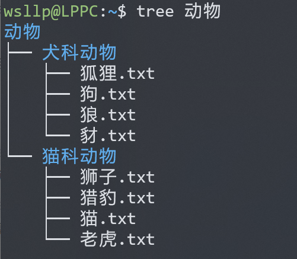

            
        
      * Info组织的树结构跟这个基本一模一样，类比文件树的目录和文件的概念，Info将Node分成两种，一种是目录Node，其内容一般包括这个目录的一些信息描述和最重要的指向所有子节点的超链接；一种是文件Node，其内容就是基本的文档描述，文件node都是树的叶子节点，目录node都是页的内部节点。这样就实现了info的骨干树。

      * 以Info 文档中的ls举例，从根节点一直到ls文档结束，其树形结构如图(这是我自己新建文档模拟的，树形结构和真正的info ls文档是一样的)

        * 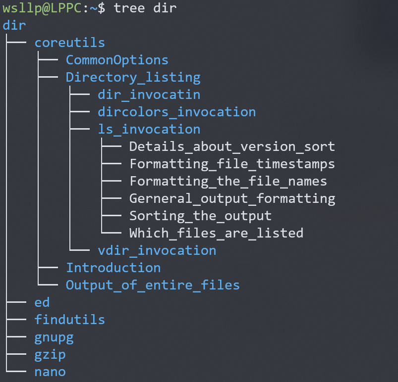
        * 整个info文档的根节点是dir这个Node，然后如图一路coreutils,Directory listing, ls_invocation。ls invocation 这个目录节点概述了一些ls特点，然后包含了6个子节点，这6个节点文档从不同方面描述了ls的所有特性。

      ***

      * 有了这个概念，我们就可以来看实际的info程序界面了。搜索info ls 界面如下。

        * 

        * 

          > 其结果直接定位到了ls invocation 这个目录节点，第一张图是这个Node的第一页，第二张图是这个Node的第二页。Node本质就是一个文档吗。可以看到，这个ls invocation概括性的描述了ls，然后给出了其所有子节点的超链接，这些子节点是对ls更具体的描述。

        * 首先第一张图注意的几点

          * 上面的Next

            * 指出该节点的下一个兄弟节点是那个。顺序根据这些节点在父节点超链接菜单中出现的顺序，从上到下。例如打开它们的父节点Direction listing,截图如下，可以看到，ls invocation 是第一个，他的下一个兄弟正是Next信息中的dir invocation.
            * 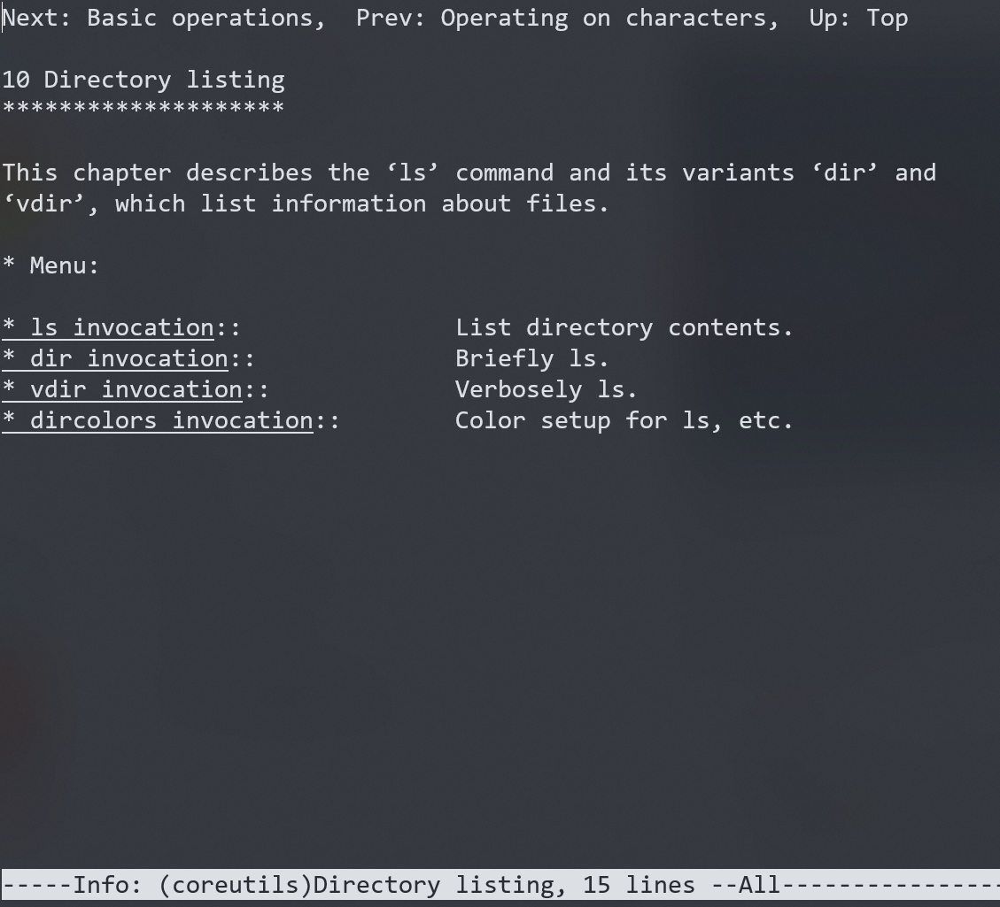

            

          * 同理还有Prev

            * ls invocation 这个节点没有上一个兄弟，所以不列出，如果有上个兄弟的话，由Prev指出，比如ls invocation的下一个兄弟dir invocation如图既有Next，也有Prev，同理同级的最后一个兄弟没有Prev。

            * 

              

          * 和Next，Prev同一行的还有Up，表明该节点的父节点。

            * 这个本来没什么歧义，但是不知道是bug还是什么，info的up字段本来应该表父节点的确切名字，比如 ls invocation就标 Directory listing, Directory listing 就标 coreutils。非常清晰，可是有时候有的节点就是不这么标，而是标个Top代表其父节点，就很抽象。

        ***

        

        * 第二张图注意几点
          * Menu
            * 没什么说的，列出所有子节点超链接
          * 最下方的(coreutils)ls invocation
            * (coreutils)
              * 括号里面的内容表明该节点属于那个大类，大类就只有根节点dir下面那几个子节点，coreutil、ed。。。
            * ls invocation
              * **这个部分说明当前Node是那个Node**
          * ls invocation 右边的部分
            * 这部分是表明当前Node阅读进度
              * 行数表示当前Node共有多少行
              * Top表示本页是当前node的第一页
              * Bot表示本页是当前node的最后一页。
              * All表示当前node就这一页。
              * 百分比表示当前node的阅读进度。
      
      ***
      
      
      
    * 灵活性
    
      * 背景
        * 如果info只有上面的骨干树的话，那么跟普通的文件树毫无区别。特点就是访问路径是有顺序的。比如访问ls，需要从dir根节点一级一级下来，如果看完ls想看与ls Node有一定联系的另一个node，需要一级一级向上找到共同祖先然后再一级一级向下直到目标。比较死板。
      * 新特性
        * 于是info利用超链接的特性，如果node 中涉及到或者参考其他node，那么直接加一条指向其他node的超链接即可，这样可以快速直达那个node.
      * 区别
        * 注意这些增加灵活性的超链接只是增加灵活性而已，不参与骨干树。该Node有指向另一个Node的链接，不代表该Node是另一个Node的父节点。辨别诀窍一般是看Node的Menu部分，出现在这里的链接指向的节点都是该节点的子节点，出现在其他部分的链接则只是为了方便引用而已。唯一的例外是根节点dir，为了便于info搜索，基本dir menu菜单里有指向所有常用node的超链接。
    
* **info常用按键**

    > man 利用less显示文档，而info利用info自身显示文档

    * 浏览
        * Home，End
            * 快速定位到该node的首、尾
        * ↑↓  ，PageDown(空格也行)，PageUp
            * 下上一行，下上翻一页。
            * 注意，这个设计挺脑残的，上下一行，也罢，上下翻页也罢，它们不会终止于该node节点的首、尾。而是会自动跳到其他节点继续浏览，跳的规则如下(以往下翻页(forward)举例，往上或者说back同理):
                * 翻页此时达到了该node的最后一页，继续向下翻页
                    * 如果该节点有子节点，那么进入第一个子节点，
                    * 如果该节点没有子节点，进入该节点的下一个兄弟节点。
                    * 如果都没有，则终止。
        * n, p
            * n 跳到下一个兄弟节点，p跳到上一个兄弟节点。以第一行显示的Next，Prev为准。
        * u
            * 跳到父节点，以第一行显示的Up为准。
        * H
            * 显示快捷键

### 2.5.3 命令别名

###### alias, unalias

* **NAME**

  * Define or **display** aliases.

* **SYNOPSIS**

  * alias [<u>NAME</u><u>=COMMOND</u>]
  * unalias <u>NAME</u>
    * 取消别名，仅适用于当前shell session

* **DESCRIPTION**

  * 不带参数的话，alias列出当前会话(shell session)中所有可用的别名
  * 带参数
    * NAME 别名的名字
    * **等号左右不可以有空格**
    * 如果命令没有空格，那么可以不用引号，例如  alias foo=ls
    * **如果命令有空格，那么必须用单引号，所以不管有没有，推荐用单引号**，例如：
      * alias foo='ls -al'
      * alias foo='cd /usr;  ls; cd ~'
  * alias 加入的别名**仅适用于当前shell session**，当退出后重新打开一个terminal，别名失效。

## 2.6 IO重定向(redirection)

###### \>、\>\>     (stdout redirection)

* **SYNOPSIS**
  * <u>COMMOND</u> > <u>FILE</u>

* **DESCRIPTION**

  * 将程序标准输出从屏幕定向到某个文件
  * 标准输出内容会重写整个文件.
  * 使用\>\>将输出内容**追加**到文件，而不是重写。

* **TRICK**

  * \> <u>FILE</u>

    * 将文件清空。冷知识，涉及重定向，都是先执行右半部分(即> file部分)。如果是\> , 那么会打开文件并清空内容，如果是\>\>,那么仅仅打开文件。
    * 所以这个命令没有左半部分，只执行右半部分，即打开并清空文件。

  * <u>commond</u>  > /dev/null

    * 将输出全部输入到黑洞，就是不要输出了

    

###### 2>、2\>\>       (stderr redirection)

* **SYNOPSIS**

  * <u>COMMOND</u> 2> <u>FILE</u>

* **DESCRIPTION**

  * **文件描述符**0，1，2分别代表stdin、stdout、stderr

  * 所以2>代表重定向错误输出，当然1>代表标准输出，但是省略1.

  * 同理2>重写覆盖， 2\>\>追加

    

###### &>       (stderr and stdout redirection)

* stdout, stderr 都默认定向到屏幕，如果想将两者同时定向到某一文件，利用&>
  * <u>COMMOND</u> &> <u>FILE</u>
    * 旧的方法是  <u>COMMOND</u> > <u>FILE</u> 2>&1  
      * 就方法，少用，不过暗示了重定位的顺序，首先stdout输出到文件，然后stderr输出。新的方法也是这个顺序。


###### <      (stdin redirection)

* 重定向stdin
  * eg
    * cat < file  当然纯属脱裤子放屁了，很少用。

###### \|    (管道(vertical bar竖线))

* 管道可以说是shell自带的重定向了，**将竖线前面命令的标准输出重定向到竖线后面命令的标准输入。**
* 也可以表述为下游命令接收的输入为相邻的上游命令的输出。


## 2.7 用户相关

###### su(substitute user)

> substitute  [ˈsʌbstɪtuːt] v.代替，取代   su切换用户，或者说新用户代替当前用户。

* **NAME**
  * su - run a command with substitute user and group ID
* **SYNOPSIS**
  * su [<u>options</u>] [-] [<u>user</u>]
* **DESCRIPTION**
  * su可以允许当前用户以其他用户身份运行一个shell。效果相当于其他用户登录一个shell。GUI的操作的话就是先log out,然后在log in。
  * 当然想利用su切换到另一个用户，你得知道另一个用户的密码。
  * su username   
    * 最简单的用法就是这种，当前用户shell转为后台运行，然后terminal启动一个新的shell，以username的身份登录且不切换目录。但是最好不要这么用，因为这种方式启动的新shell，并不完全是全新的以username身份启动的shell，即该新shell的运行环境不完全等同于username本来正常该有的运行环境。
    * 该新shell只是设置HOME，SHLLE，LOGNAM等环境变量为username的配置的值，其他许多环境变量还是当前用户配置的值，所以新shell混合了当前用户和username的环境碧变量，想想都头皮发麻。。
  * su  - username
    * 推荐一定一定要用这种方式，这样启动的新shell直接切换到username的家目录，并且所有的shell配置都是username的，完全等同于logout之后用username身份login后启动的shell。
  * 省略username的话默认切换到root用户。

###### sudo(substitute user do)

> 代替用户执行

* **NAME**

  * sudo, sudoedit — execute a command as another user

* **SNOPSIS**

  * sudo <u>COMMOND</u>

* **DESCRIPTION**

  > sudo allows a permitted user to execute a command as the superuser or another user, as specified by the security policy.

  * 以前一直以为sudo就是以root身份执行操作，还好奇既然用户用sudo可以执行所有root用户才能执行的操作，那么每个用户不都是root用户？
  * 现在才了解了
    * 第一，sudo不仅仅用于执行root才能执行的操作，也可以执行其他用户专属的操作。当然最常用的就是执行root的专属操作。
    * 第二，sudo不是万能的，它并不能执行所有root专有的操作，每个用户利用sudo可以执行那些用户的那些专属操作都是由真正的root用户规定的，一般配置在/etc/suoders文件中。
      * 之前只所以有错觉是因为Ubuntu默认配置的第一个非root用户可以利用sudo执行所有的root用户的专属操作。。
  * su与sudo
    * su是切换用户，需要知道要切换到的用户的密码，切换成功后，你就是那个用户，你当然可以执行那个用户所有的操作。
      * 这样问题在于要么你不能执行其他用户的所有操作，要么可以执行所有操作，很不灵活。
      * 举个例子，root有3个专有操作c1,c2,c3，此时有两个用户user1, user2, root想允许user1执行c1,c2,允许user2执行c2,c3;利用su完全做不到，除非把root密码告诉user1,user2,但是这样两个用户都可以自由执行c1,c2,c3。
      * 所以发明了sudo
    * sudo允许某个特定用户执行其他某个用户的某些专属操作，并且该用户无需知道其他某个用户的密码。
      * **那些用户**可以用sudo可以由root配置。
      * 可以用sudo的用户可以执行**那些用户**的专属操作可以由root配置。
      * 可以用sudo的用户可以执行那些用户的**那些专属操作**可以由root配置。
        * 灵活的一批，安全的一批。
  * sudo 与 UAC(User Account Control)
    * UAC就是Windows下那个如果你点了需要管理员权限运行的程序，那么就会弹窗的东西。
    * 可以看到，sudo与UAC的理念完全一直，当操作需要root权限时，我们利用sudo或者UAC执行，这样我们就可以知道该操作需要root权限，我们就可以审视其安全性，避免发生灾难。而不是一股脑的切换到root权限，然后执行所有操作，万一某个操作有毒，那么直接gg。
    * 并且UAC和sudo可以配置普通用户可以执行那些root专有操作，太妙了。

###### adduser、addgroup

* **NAME**

  * adduser, addgroup - add a user or group to the system

* **SYNOPSIS**

  * adduser [<u>options</u>]  <u>user</u>
  * adduser [<u>options</u>]  <u>user</u>  <u>group</u>
  * addgroup [<u>options</u>] <u>group</u>

* **DESCRIPTION**

  > **adduser**  and  **addgroup**  add users and groups to the system according to command line options  and configuration information in /etc/adduser.conf.  They are friendlier front ends  to  the low level tools like useradd, groupadd and usermod programs, by default choosing Debian policy conformant UID and GID values, creating a home directory  with  skeletal  configuration,
  > running a custom script, and other features.  adduser and addgroup can be run in one of five
  > modes: Add a normal user、Add a system user、Add a user group、Add a system group、Add a existing user to an existing group.
  >
  > front ends :前端         
  >
  > skeleton  [ˈskelɪtn]  n. 骨骼，骨架，梗概。skeletal [ˈskelətl] a.骨骼的，提纲性的，概要的

  * adduser, addgroup均需要root权限

###### passwd

* **NAME**

  * passwd - change user password

* **SYNOPSIS**

  * passwd [<u>options</u>] [<u>USERNAME</u>]

* **DESCRIPTION**

  > The passwd command changes passwords for user accounts. A normal user may only change the password for their own account, while the superuser may change the password for any account. passwd also changes the account or associated password validity period.
  >
  > valid [ˈvælɪd]  a. 有效的   validity [vəˈlɪdəti] n. 有效   
  >
  > period  [ˈpɪriəd]  n. 时期。句号。
  >
  > validity period  有效期

  * 省略用户名表示修改当前用户的密码
  * 普通用户只能修改自己的密码，root用户可以修改所有人的密码。

## 2.8 进程相关(process)

#### 2.8.1 监视进程(display or monitor processes)

###### ps(process status)

* **NAME**

  * ps - report a snapshot of the current processes.
    * 记录执行ps时刻的进程的一个快照。

* **SYNOPSIS**

  * ps [<u>options</u>]

* **DESCRIPTION**

  > ps displays information about a selection of the active processes.  If you want a repetitive update
  > of the selection and the displayed information, use top(1) instead.
  >
  >      This version of ps accepts several kinds of options:
  >     
  >        1   UNIX options, which may be grouped and must be preceded by a dash.
  >        2   BSD options, which may be grouped and must not be used with a dash.
  >        3   GNU long options, which are preceded by two dashes.

  *  ps命令输出了ps执行瞬间系统进程的瞬时状态，也就是说是静态的。
  * 由于历史遗留原因，Linux的ps程序同时兼容UNIX、BSD、GNU风格的ps程序，通过不同的参数写法，就可以模拟不同风格的ps程序的输出结果。
    * be grouped 
      * 意思是参数可以成组写，UNIX和BSD都是短参数，可以成组, GNU是长参数，不可成组。
      * eg
        * UNIX:  ls   -l  -a  -d         ==       ls -lad
        * BSD：  ps  a   u   x        ==        ps aux
        * ~~GNU:    ls   --all   --directory    ==   GNU ls --alldirectory~~
    * dash(破折号，短横线)
      * UNIX参数前加一个短横线 ，BSD参数前不加短横线，GNU长参数前加两个短横线
  * 不管是那个版本的所谓ps程序，进程都是那些进程，只是显示进程信息的表头有些不同，进程信息的一部分有些不同。
    * 显示的进程快照基本就是一个表格，每一行是一个进程词条，每一列是进程的一个方面，例如进程拥有者的UID，进程本身的PID，进程的CPU占用，进程的程序名等等，这些都是表头。

* **Common Usage**

  * UNIX风格的表头

    * | Header | Meaning                                                      |
      | ------ | ------------------------------------------------------------ |
      | UID    | 进程所有者的用户名或者用户ID(具体显示那个取决去参数)         |
      | PID    | 进程ID                                                       |
      | PPID   | 父进程ID                                                     |
      | SZ     | 进程核心映像所占的物理内存页大小                             |
      | RSS    | Resident set size, 物理内存占用大小，单位KB。                                                 (resident居住的意思，我们平常说程序驻留在内存中，英语就对应这个词) |
      | PSR    | processor 当前分配给进程几个核                               |
      | S      | status ,一些字符表示的进程状态                               |
      | STIME  | start time  启动时间  hh:mm 24小时制，超过一天显示日期       |
      | TTY    | teletype  与进程关联的终端                                   |
      | TIME   | 累计消耗的CPU时间   [DD-]hh:mm:ss  24小时显示，超过一天，加上DD(day天数)显示 |
      | CMD    | 可执行程序名  executable name                                |

  * BSD风格的表头

    * | Header  | Meaning                                                      |
      | ------- | ------------------------------------------------------------ |
      | USER    | 用户名                                                       |
      | PID     | 进程id                                                       |
      | %CPU    | CPU占用率                                                    |
      | %MEM    | 内存占用率                                                   |
      | VSZ     | Virtual memory size, 虚拟内存占用大小，单位KB                |
      | RSS     | Resident set size, 物理内存占用大小，单位KB。                                                 (resident居住的意思，我们平常说程序驻留在内存中，英语就对应这个词) |
      | TTY     | teletype 与进程关联的终端                                    |
      | STAT    | status状态,有一些字符表示进程状态，见下表                    |
      | START   | start time 启动时间                                          |
      | TIME    | 消耗的CPU时间                                                |
      | COMMAND | 跟UNIX的CMD显示的信息差不多，就是貌似多了些参数信息。        |

  * status表示的字符

    * | State    | S(UNIX风格是否显示) | STAT(BSD是否显示) | Meaning                                                      |
      | -------- | ------------------- | ----------------- | ------------------------------------------------------------ |
      | D        | yes                 | yes               | uninterruptible sleep (usually IO)。进程正在等待IO，比如硬盘 |
      | I(大写i) | yes                 | yes               | Idle kernel thread 空闲的内核线程                            |
      | R        | yes                 | yes               | running or runnable (on run queue)                           |
      | S        | yes                 | yes               | interruptible sleep (waiting for an event to complete)       |
      | T        | yes                 | yes               | stopped by job control signal                                |
      | t        | yes                 | yes               | stopped by debugger during the tracing                       |
      | W        | yes                 | yes               | paging (not valid since the 2.6.xx kernel)                   |
      | X        | yes                 | yes               | dead (should never be seen)                                  |
      | Z        | yes                 | yes               | defunct ("zombie") process, terminated but not reaped by its parent(父进程没有把子进程从进程表中删除)                 defunct 失效的，死亡的 zombie 僵尸 reap  收割 |
      | <        | no                  | yes               | high-priority (not nice to other users)(高优先级，意味着优先占用CPU，所以对其他用户不nice) |
      | N        | no                  | yes               | low-priority (nice to other users)                           |
      | L        | no                  | yes               | has pages locked into memory (for real-time and custom IO)   |
      | s        | no                  | yes               | is a session leader                                          |
      | l(小写L) | no                  | yes               | is multi-threaded (using CLONE_THREAD, like NPTL pthreads do) |
      | +        | no                  | yes               | is in the foreground process group                           |

      

  * 查看与当前终端会话有关的所有进程

    * UNIX风格
      * ps
        * 
    
  * 查看当前用户的所有进程
  
    * BSD风格
      * ps  ux
        * 
  
  * 查看系统所有进程
  
    * BSD
      * ps aux
        * 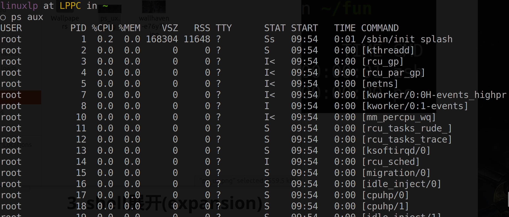
    *  UNIX
      * ps -eF
        * 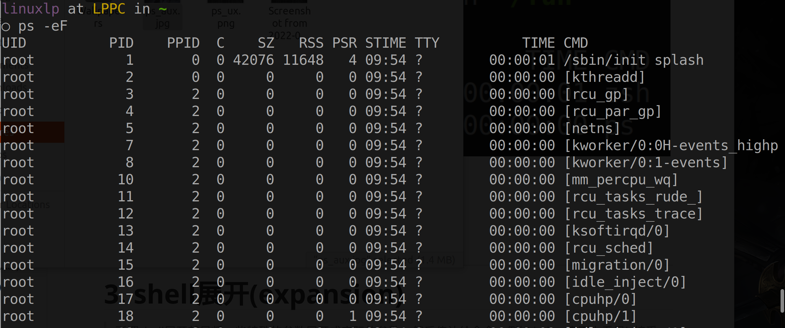

###### top

* **NAME**

  * top - display Linux processes

* **SYNOPSIS**

  * top

* **DESCRIPTION**

  > The  top program provides a dynamic real-time view of a running system.  It can display system summary information as well as a list of processes or threads  currently being  managed  by  the Linux kernel.

  * 动态显示进程信息，默认3s刷新一次，类似Windows下的task manager

  * 输入top后，h帮助，q退出。

  * top的典型作用就是快速发现占用CPU比较高的进程。

  * 分为两部分，上面是系统概况(system summary),下面是进程表，默认以CPU占用率降序排序。

  * 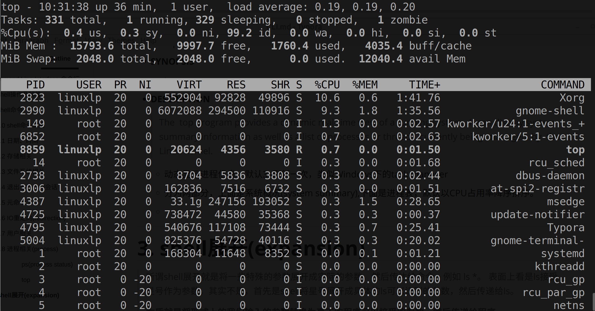

  * 系统概况部分字段:

    * | Row  | Field         | Meaning                                                      |
      | :--- | :------------ | :----------------------------------------------------------- |
      | 1    | top           | Name of the program                                          |
      |      | 10:31:38      | Current time of day.                                         |
      |      | up 36min      | This is called uptime. It is the amount of time since the machine was last booted. In this example, the system has been up for 36 minutes |
      |      | 1 user        | 登录用户数                                                   |
      |      | load average: | 平均负载指等待运行的进程数，三个数字分别表示前60s, 前5分钟，前15分钟等待运行进程数的平均值。该值小于1表示计算机比较闲。 |
      | 2    | Tasks:        | 显示所有进程数和它们的状态。                                 |
      | 3    | Cpu(s):       | 使用CPU的不同类型进程的CPU占用率                             |
      |      | 0.4 us        | user process, 0.4%的CPU时间用于用户进程(占用率0.4%)          |
      |      | 0.3 sy        | system process ，0.3%的CPU时间用于内核进程(占用率0.3%)       |
      |      | 0.0 ni        | "nice" process(low priority)低优先级进程占用率               |
      |      | 99.2 id       | idle    99.2%的CPU时间空闲                                   |
      |      | 0.0 wa        | IO-wait  cpu等待IO的时间                                     |
      |      | 0.0 hi        | hardware interrupts  CPU处理硬件中断的时间                   |
      |      | 0.0 si        | software interrupts    CPu 处理软件中断的时间                |
      |      | 0.0 st        | time stolen from this vm by the hypervisor                   |
      | 4    | Mem:          | 物理内存使用情况                                             |
      | 5    | Swap:         | 虚拟内存使用情况                                             |

  * 进程表表头

    * | FIELDS /Columns | DESCRIPTIONS of FIELDS                                       |
      | --------------- | ------------------------------------------------------------ |
      | PID             | Process Id                                                   |
      | USER            | User Name The effective user name of the task's owner.       |
      | PR              | Priority [praɪˈɔːrəti]   进程的调度优先级                    |
      | NI              | Nice Value 友好值，正数表示该进程低优先级，nice，负数表示该进程高优先级，not nice. |
      | VIRT            | **Virt**ual Memory Size   虚拟内存占用大小                   |
      | RES             | Resident Memory Size 实际物理内存占用大小，类似RSS(resident set size) |
      | SHR             | Shared Memory Size                                           |
      | S               | Process Status ，不同于ps ,top的 status只有7种:                                                 1. D = uninterruptible sleep   2. I = idle     3. R = running 4. S = sleeping                5. T = stopped by job control signal   6. t = stopped by debugger during trace   7. Z = zombie |
      | %CPU            | CPU占用率                                                    |
      | %MEM            | 内存占用率                                                   |
      | TIME+           | CPU Time, hundredths(百分之一)， 类似TIME，但是TIME+精确到百分之一秒。例如上图Xorg的 1:41.76表示占用了1分41.76秒的CPU时间 |
      | COMMAND         | Command Name or Command Line                                 |

###### pstree

* 顾名思义，显示一个进程树，可以看到进程的父子关系。

### 2.8.2 控制进程(control processer)

##### 1. Job Control(任务控制)

> 一种shell特性(shell feature)，用来控制**由当前shell启动**的进程。
>
> 由当前shell启用的进程有两种状态，前端进程(foreground)和后端进程(backgroud). 
>
> 前端进程可以响应Ctrl C, Ctrl Z等键盘输入， 后端进程免疫一切键盘输入。

###### jobs

* 显示所有由当前shell启动的进程信息(当然全是后台进程，因为有前台进程时shell无法输入命令)
  * 
    * 前面的数字是进程在job control机制中的代号，反映了启动顺序，学名jobspec
    * 后面+，-先不管
    * suspended表示暂停状态，running表示运行状态。
    * top , man ls, xlogo 。。。。表示该进程启动时的命令
* 常用参数
  * jobs -l
    * 额外显示进程的PID

###### Ctrl + C

* > In a terminal, typing Ctrl-c, **interrupts a program.** This means that we politely asked the program to terminate. 

  * 中断前端进程(**interrupt** a program )
  * 终端向进程发送INT(interrupt)信号

###### Ctrl + Z

* > Sometimes we’ll want to **stop a process** without terminating it.
  >
  > To stop a foreground process, type Ctrl-z.

  * 停止(暂停)前端进程,意味着前端进程转为后台进程并且处在暂停状态。
  * 终端向进程发送TSTP(Terminal Stop)信号

###### \&

* 输入命令时默认都是前端执行，即前端进程，如果想让命令运行于后台，在命令末尾加上&
  * &加在整条命令最后方   xray   -c  config/config.json  \&
* 加上&的命令转为后端进程，但是如果命令有内容输出，依然会输出到屏幕上。
  * 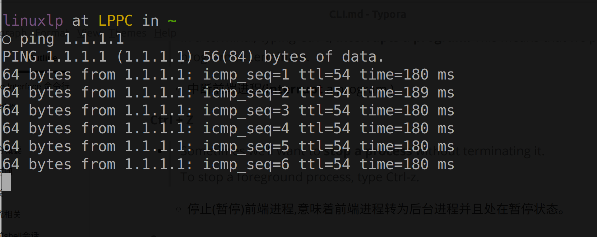
  * 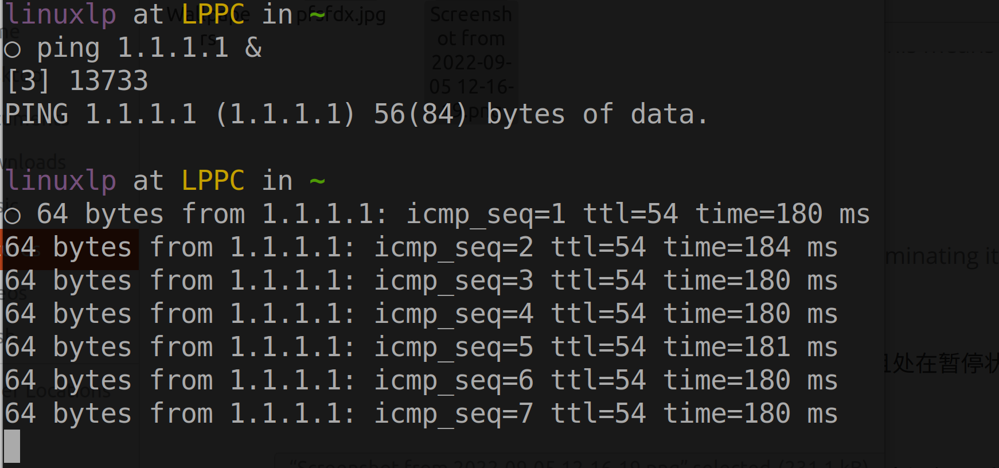

###### fg(foreground)

* fg  %jobspec    
  * 百分号加进程的那个编号
  * 省略相当于 fg %1

* 将后端进程转到前台运行
  * 如果后端进程是运行状态，转为前台运行
  * 如果后端进程是暂停状态，转为前台运行

###### bg(background)

* bg %jobspec
* 将后端暂停的进程转为后端运行状态
  * 常用于输入命令时忘了加&，此时前端运行，无法输入任何命令。
  * 此时可以Ctrl + Z暂停进程，然后bg转为后台运行状态。

##### 2 信号(signals)

> OS通过发送信号与程序沟通

###### kill

* **NAME**

  * kill - send a signal to a process

* **SNOPSIS**

  * kill [<u>options</u>]   <u>pid</u>...

* **DESCRIPTION**

  >  The default signal for kill is TERM.  Use -l or -L to list available signals.

  * 给进程发送各种信号，options指定发送何种信号，pid指示给谁发
  * 只有进程的拥有者或superuser才有权利使用kill命令给进程发送信号。

* **Common Options**

  * 每个信号有自己的名字，编号。参数可以用短横+编号、短横+信号名或短横+SIG+信号名方式指定kill发送什么信号

  * | Options              | Signals | Meaning                                                      |
    | -------------------- | ------- | ------------------------------------------------------------ |
    | -1；-HUB；-SIGHUP    | HUP     | Hangup。挂起或者说挂断信号。远古时期终端网线电话线连接远程电脑，不稳定，容易挂断，如果挂了，产生这个信号，暗示远程控制终端挂了，解释为终端会话中断，前端程序会终止。 |
    | -2；-INT；-SIGINT    | INT     | Interrupt。中断信号，直接发送给进程，进程收到信号后做好终止前清理工作,保存工作，然后正常终止。 |
    | -9；-KILL；-SIGKILL  | KILL    | Kill. 一般发给进程的信号，进程可以选择忽略或者暂缓执行或者立即执行等不同的信号处理方式。KILL信号明面上发送给进程，实际上并不会发送给进程，而是由内核直接强制终止进程。这种情况下，进程没有机会做终止前的清理、保存工作。除非进程无响应了，一般不使用该信号，这是最后的终止手段。 |
    | -15；-TREM；-SIGTERM | TERM    | Terminate.这是kill不带参数默认发送的信号，如果进程可以响应信号，那么收到该信号后终止。 |
    | -18；-CONT；-SIGCONT | CONT    | Continue. 收到STOP信号的进程收到该信号后恢复运行。           |
    | -19；-STOP；-SIGSTOP | STOP    | Stop。类似KILL信号，不直接发送给进程，由内核直接暂停进程，因此该进程不能忽略该信号。 |

    * 上表是KILL命令常发送的信号，下表列出了系统常用的一些信号

    * | Number | Name  | Meaning                                                      |
      | :----- | :---- | :----------------------------------------------------------- |
      | 3      | QUIT  | Quit                                                         |
      | 11     | SEGV  | Segmentation Violation. This signal is sent if a program makes illegal use of memory, that is, it tried to write somewhere it was not allowed to. |
      | 20     | TSTP  | Terminal Stop. This is the signal sent by the terminal when the Ctrl-z key is pressed. Unlike the STOP signal, the TSTP signal is received by the process and may be ignored. |
      | 28     | WINCH | Window Change. This is a signal sent by the system when a window changes size. Some programs , like top and less will respond to this signal by redrawing themselves to fit the new window dimensions. |

###### killall

* **NAME**
  * killall - kill processes by name
* **SYNOPSIS**
  * killall [<u>signals</u>] [-u <u>user</u>]  <u>name</u>... 
* **DESCRIPTION**
  * 删除名为name的所有的进程。如果指定了用户，只删除该用户的。
  * kill利用pid终止进程，killall利用进程名终止进程。同kill，只有进程的所有者或者superuser才能使用killall终止进程。

## 2.9 包管理系统相关

###### apt

* **NAME**

  * apt - command-line interface

* **SYNOPSIS**

  * apt [<u>OPTIONS</u>]  <u>PKG</u>...

* **DESCRIPTION**

  > apt provides **a high-level commandline interface** for the package management system. It is intended as an end user interface and enables some options better suited for interactive usage by default compared to more specialized APT tools like apt-get(8) and apt-cache(8)

  * 包管理系统提供的高层命令行接口。

* **Common Option**

  * | Option                    | Description                                                  |
    | ------------------------- | ------------------------------------------------------------ |
    | apt update                | update is used to download package information from all configured sources.(配置的源就是配置的可用包仓库的位置，一般是URL)                                                              Other commands operate on this data to e.g. perform package upgrades or search in and display details about all packages available for installation. 简单来说跟git fetch差不多，只是拉取远程包仓库的包信息，方便后续操作。(更新。 看看有啥更新。(不执行更新)) |
    | apt upgrade               | upgrade is used to install available upgrades of all packages currently installed on the system from the sources configured via sources.list(5). New packages will be installed if required to satisfy dependencies, but  existing packages will never be removed. If an upgrade for a package  requires the removal of an installed package the upgrade for this  package isn't performed.简单来说，根据apt update的更新，执行实际的升级动作 |
    | apt search name           | 搜索与名字相关的包                                           |
    | apt install <u>PKG</u>... | 如果包没安装，那么安装，如果安装了，那么升级。               |
    | apt purge <u>PKG</u>...   | 如果包已经卸载，清理包的残留配置文件(只会清理不在家目录里面的配置文件)，如果包没卸载，卸载包同时清理配置文件。 |
    | apt remove <u>PKG</u>...  | 卸载包不清理残留配置文件，想清理加--purge参数，或者执行后apt purge |
    | apt autoremove            | 卸载那些已经不需要的依赖。安装包的时候会自动下载依赖，但是卸载时并不会清除这些依赖，需要手动autoremove清理，但是慎用，可能会误清除。 |
    | apt show <u>PKG</u>       | 显示包信息。(只要该包在包仓库或者已安装那么就会显示信息)     |

###### dpkg(Debian package)

* **NAME**

  *  dpkg - package manager for Debian

* **DESCRIPTION**

  >  dpkg is a tool to install, build, remove and  manage  Debian  packages.

  * dpkg功能很强大，是包管理系统的底层命令，可以用来构建软件包，卸载，安装等等，我们只介绍几个用户常用的。

* **Common Usage**

  * PKG-file 指\.deb结尾的包文件,<u>PKG</u>指包名

  * | Usage                    | Meaning                                                      |
    | ------------------------ | ------------------------------------------------------------ |
    | dpkg -i  <u>PKG-file</u> | 安装或更新给定的包文件，如果包仓库没有我们需要的包，就需要我们去官网下载包，然后用该命令安装，如果已经有该包的旧版本，那么会自动更新包。 |
    | dpkg -r <u>PKG</u>       | remove.卸载包，残留配置文件                                  |
    | dpkg -P <u>PKG</u>       | purge.  清理包，卸载并清理残留文件。                         |
    | dpkg -l [<u>PATTERN</u>] | list. 不加参数列出所有安装的包，加参数列出匹配的已安装包。支持正则和glob通配符。 |
    | dpkg --status <u>PKG</u> | 列出已安装包的状态。                                         |

    


## 2.10 网络相关

###### ping

* **NAME**

  * ping - send ICMP ECHO_REQUEST to network hosts

* **SYNOPSIS**

  * ping [<u>OPTIONS</u>]   <u>DESTINATION</u>

* **DESCRIPTION**

  > ping uses the ICMP protocol's mandatory ECHO_REQUEST datagram to elicit an ICMP ECHO_RESPONSE from a host or gateway. ECHO_REQUEST datagrams (“pings”) have an IP and ICMP header, followed by a struct timeval and then an arbitrary number of “pad” bytes used to fill out the packet.
  >
  > mandatory  [ˈmændətɔːri] a.强制性的
  >
  > datagram		数据报(根据telegram  [ˈtelɪɡræm] 电报造的词)
  >
  > elicit    [iˈlɪsɪt] vt. 引起，诱出。
  >
  > arbitrary [ˈɑːrbɪtreri] a.任意的，随意的，武断的，专横的，专制的

  * ping没反应，两方面原因
    * 网络不同
    * 服务器防火墙屏蔽ping包或拒绝回应

###### traceroute

* **NAME**
  * raceroute - print the route packets trace to network host
* **SYNOPSIS**
* **DESCRIPTION**
  * 打印每一跳(hop)的路由信息，路由信息由路由器配置，如果不配置，那么什么也看不到，用一串星号代替。

###### netstat

> 默认没装，此工具在net-tools包中，安装这个包就行了

* **NAME**

  * netstat  -  Print network connections, routing tables, interface statistics, masquerade connections, and multicast memberships.
    * masquerade [ˌmæskəˈreɪd] n.掩藏，掩饰 vi.  伪装

* **SYNOPSIS**

  * netstat [<u>OPTONS</u>]
  * netstat  -r  [<u>OPTONS</u>]
  * netstat  -g  [<u>OPTONS</u>]
  * netstat  -i   [<u>OPTONS</u>]
  * netstat  -M [<u>OPTONS</u>]
  * netstat  -s  [<u>OPTONS</u>]

* **NOTES**

  > This  program  is mostly obsolete.  Replacement for **netstat** is ss.  Replacement for **netstat -r** is **ip route**.  Replacement for **netstat -i** is **ip -s** link.  Replacement for **netstat -g** is **ip maddr**.
  >
  > obsolete [ˌɑːbsəˈliːt]  a.淘汰的，过时的，废弃的

  * 可能就是因为netstat显示网络的一切信息，不够专一，所以设计了专门针对某个网络方面的命令来替代它吧，所以淘汰了。

* **DESCRIPTION**

  > Netstat prints information about the Linux networking subsystem.  The type of information printed is controlled by the first argument, as follows:

  * netstat是一个多功能命令，可以显示Linux网络的一切信息。所以按照第一个输入参数的不同，主要将netstat分成6类命令，分别显示网络的一个方面的内容。

    * | Aspect           |                                                              |
      | ---------------- | ------------------------------------------------------------ |
      | none(省略)       | By  default, <u>netstat</u> displays a list of open sockets.  If you don't specify any address families, then the active sockets of  all configured address families will be printed. |
      | --route, -r      | Display the kernel routing tables. See the description in <u>route</u>(8) for details.  **netstat -r** and **route -e**  produce  the  same output. |
      | --groups, -g     | Display multicast group membership information for IPv4 and IPv6. |
      | --interfaces, -i | Display a table of all network interfaces.(网络接口，可以理解为网卡，包括实际的和虚拟的) |
      | --masquerade, -M | Display a list of masqueraded connections.                   |
      | --statistics, -s | Display summary statistics for each protocol.                |

* **Common Usage**

  * -ie
    * interface extend
    * 显示所有网络接口扩展信息
      * 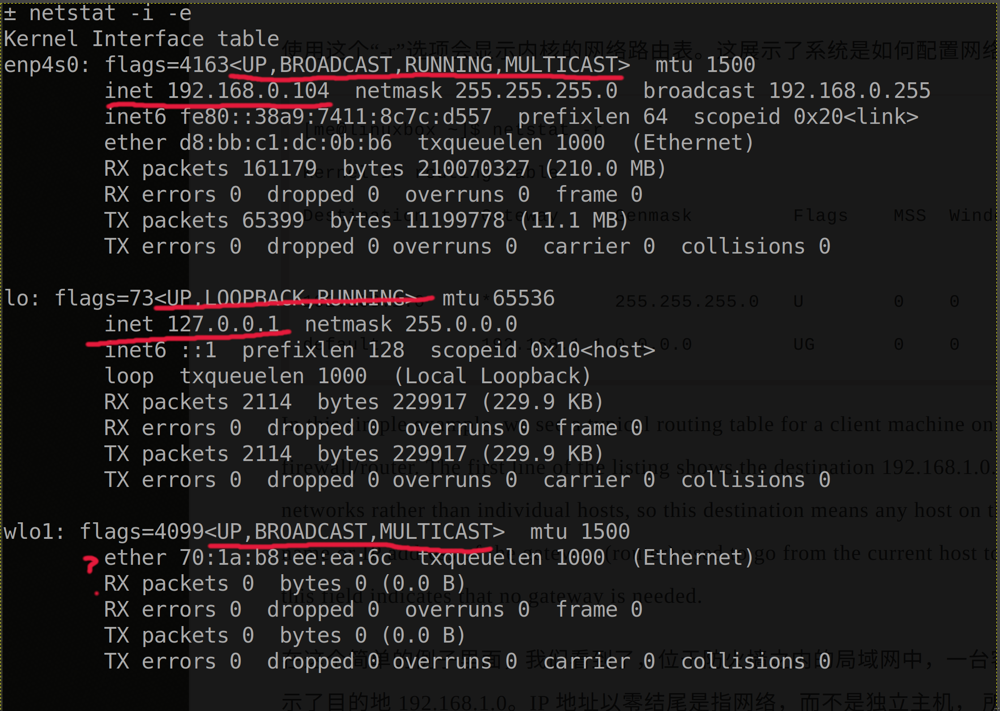
      * enp4s0 有线以太网网络接口
      * lo  本地回环网络接口
      * wlo1   无线以太网网络接口
      * UP表示接口可用，RUNNING表示正在使用中，所以有IP地址，无线网卡没用，所以没有IP地址。

###### ftp(file transfer program)

* 利用FTP(file transfer protocol)协议传输数据的程序或者说客户端。
* FTP协议不安全，从远程主机上传(upload)下载(download)时明文传输账户名密码，所以现在一般都是匿名FTP服务器，然后所有人都可以下载，用户名一般是anonymous,然后密码随意。
* lftp
  * 更好的ftp客户端，支持多种协议(http, ftp ...)，多了一些有用的特性。。。

###### wget

* **NAME**

  * Wget - The non-interactive network downloader.

* **SYNOPSIS**

  * wget [<u>option</u>]... [<u>URL</u>]...

* **DESCRIPTION**

  * > GNU Wget is a free utility for non-interactive download of files from the Web.  It supports HTTP, HTTPS, and FTP protocols, as well as retrieval through HTTP proxies.
    >
    > as well as 也，还可以，此外
    >
    > retrieve [rɪˈtriːv] vt. 检索，取回；找回；检索数据。 retrieval n. 检索

  * > Wget is non-interactive, meaning that it can work in the background, while the user is not logged on.  This allows you to start a retrieval and disconnect from the system, letting Wget finish the work.  By contrast, most of the Web browsers require constant user's presence, which can be a great hindrance when transferring a lot of data.
    >
    > hindrance [ˈhɪndrəns]  n. 妨碍，障碍，阻挠。

  * > Wget can follow links in HTML, XHTML, and CSS pages, to create local versions of remote web sites, fully recreating the directory structure of the original site.  This is sometimes referred to as "recursive downloading."  While doing that, Wget respects the Robot Exclusion Standard (/robots.txt).  Wget can be instructed to convert the links in downloaded files to point at the local files, for offline viewing

  * > Wget has been designed for robustness over slow or unstable network connections; if a download fails due to a network problem, it will keep retrying until the whole file has been retrieved.  If the server supports regetting, it will instruct the server to continue the download from where it left off.
    >
    > robust [roʊˈbʌst]  a. 强健的， 强壮的，强劲的，结实的，耐用的，坚固的
    >
    > robustness [roʊˈbʌstnəs]  n. 鲁棒性，坚固性，健壮性

###### ssh(secure shell)

* **NAME**

  * ssh — OpenSSH remote login client

* **SYNOPSIS**

  * ssh [<u>OPTIONS</u>] <u>destination</u>

* **DESCRIPTION**

  > **ssh** (SSH client) is a program for logging into a remote machine and for executing commands on a remote machine.  It is intended to provide secure encrypted communications between two untrusted hosts over an insecure network.  X11 connections, arbitrary TCP ports and UNIX-domain sockets can also be forwarded over the secure channel.
  >
  > arbitrary 任意的
  >
  >  **ssh** connects and logs into the specified <u>destination</u>, which may be specified as either **[user@]hostname** or a URI of the form **ssh://[user@]hostname[:port].**  The user must prove his/her identity to the remote machine using one of several methods (see below).

  * ssh -p 63000 VultrLinuxLP@45.32.228.178 
    * 我的服务器22端口关了，用63000端口监听，所以这里指定一下
    * 第一次连接某个远程主机会出现：
      * 
      * SSH 协议服务端会认证客户端，同理客户端也可以认证服务端，第一次连接服务端，客户端没有这个服务端的信息，所以会提示，选择yes之后，客户端就会保留这个服务端的fingerprint，相当于就认识这个服务端了。
      * 服务端fingerprint保存在\~/.ssh/known_ho
      * 下次连接同样的IP地址，如果有人中间人攻击，想将我们导向别的服务器，那么SSH就会提示我们fingerprint不匹配，即我们连接的不是我们想要连接的那个服务器。
      * 当然还有一种可能性是我们要连接的服务器重装系统或者SSH服务端了。

  ###### scp(secure copy)

  * **NAME**

    * scp — OpenSSH secure file copy

  * **SYNOPSIS**

    * scp [<u>OPTIONS</u>] <u>scource</u>...<u>targe</u>

  * **DESCRIPTION**

    > scp copies files between hosts on a network.  It uses ssh(1) for data transfer, and uses the same authentication and provides the same security as ssh(1).  scp will ask for passwords or passphrases if they are needed for authentication.
    >
    > The <u>source</u> and <u>target</u> may be specified as a local pathname, a remote host with optional path in the form [user@]host:[path], or a URI in the form scp://[user@]host\[:port][/path].  Local file names can be made explicit using absolute or relative pathnames to avoid scp treating file names containing ‘:’ as host specifiers.

    * 用法跟本地cp一样，却别就是带分号的路径是远程主机的文件。
      * scp -P 63000 VultrLinuxLP@45.32.228.178:~/xray_log/access.log   ~
        * 在本机执行这条命令，把远程主机上的access.log文件复制到本地家目录。

  ###### sftp(secure ftp)

  > 服务端不需要是FTP服务器(即运行ftp服务端的服务器)，只需要是运行SSH服务端的服务器就可以通过该命令来实现类似ftp的下载功能。

  * **NAME**

    * sftp — OpenSSH secure file transfer

  * **SYNOPSIS**

    * sftp [<u>OPTIONS</u>]  <u>destination</u>

  * **DESCRIPTION**

    > sftp is a file transfer program, similar to ftp(1), which performs all operations over an encrypted ssh(1) transport.  It may also use many features of ssh, such as public key authentication and compression.
    >
    > The destination may be specified either as [user@]host[:path] or as a URI in the form sftp://[user@]host\[:port][/path].

    * 以下是利用sftp从服务器下载access.log
      * 

  ###### 注

  * ssh, scp, sftp都是由OpenSSH包提供的实现SSH协议传输数据的客户端程序，上述这些命令仅适用于客户端程序。

## 2.30 复制

* **NAME**
* **SYNOPSIS**
* **DESCRIPTION**

# 3. shell展开(expansion)

> 所谓shell展开就是将一些特殊的参数展开成实际的参数，然后传达给命令。例如 ls *。 表面上看是ls接受星号作为参数。其实不是，首先是shell将星号展开成具体的ls可以识别的参数，然后传递给ls。
>
> **本质就是将形式上的我们输入的参数替换为真正的程序可以接受的参数，然后传递给程序**

### 3.0 一些类展开机制

> 严格来说，以下这些不算展开，不过也是一种参数替换，算广义展开吧，因为所谓展开就是一种替换罢了。

##### 3.0.1 单词分割(word-splitting)机制

* 默认情况下，shell的单词分割机制会在命令之后的文本中寻找spaces、tabs和newlines(linefeed characters换行符) 并且把它们当做分隔单词的分隔符。即将所有不在引号内的空格，制表符，换行符视为分隔符，被分割符分隔开的单词就是命令的参数。
  * 这意味着不在引号内的空白符(whitespace)不会被当做参数的一部分，仅仅是用来分隔参数而已。所以其数量多少，即输入多少个都无所谓。

##### 3.0.2 命令分隔机制

* 正常情况下，shell将按下enter之前输入的所有内容视为一条命令。
* 如果文本中出现分号(semicolon), 那么shell将其视为分隔命令的分隔符。那么就可以一次enter执行多条命令。

##### 3.0.3 管道机制

* 遇到输入内容中的竖线(vertical bar), shell将其视为管道的标志，然后将所有命令连成一个管道一起执行。

##### 3.0.4 重定向机制

* 遇到 \>,\>\>, 2\>, 2\>\>,\&>, \<  会视为重定向标志。

### 3.1 字符展开(character expansion)

* 通配符(wildcards)展开
  * 典型的字符展开就是展开通配符，一旦命令参数中出现通配符，不是说命令可以处理通配符参数，而是shell提前将通配符展开为命令可以识别的实际的参数，然后传递给命令。
  * 通配符匹配的对象就是当前工作路径的文件名(包括目录名), 即通配符展开后的结果一定是一个文件名或者路径名。
    * 假设当前目录下有文件    apple, argue, people, xxxx.txt
      *  \*  
        * \*匹配当前工作路径所有文件名
        * 输入ls *, shell将其展开成ls  apple argue people xxxx.txt, 然后执行
        * 注意 在当前目录下直接执行ls与ls \* 的区别。
          * ls  相当于执行  ls \.  , 而 ls * 是  ls  apple argue people xxxx.txt
          * 即前者只有一个参数，而后者有4个参数。
      * ？
        * 输入ls  ?????, 也就是说通配符5个问号匹配所有文件名长度为5个字符的文件
        * 所以首先展开为 ls apple  argue , 然后执行
      * 其他通配符同理，**核心就是shell先将通配符展开为相匹配的文件名，然后在执行。**
  * 为了与点开头的隐藏文件语义一致，通配符默认不匹配隐藏文件，例如  ls * ，也不会列出隐藏文件。

### 3.2 路径展开(pathname expansion)

* 通配符展开
  * 同字符展开，多用于将通配符展开，区别就是字符展开通配符对应的都是当前工作目录的所有文件名，而路径展开中的通配符对应的是对应路径中的所有文件名
    * ls   /usr/*/m??
      * 展开的所有路径结果就是这么一类文件或目录:(或者说ls实际接受的参数路径是这么一些路径名:)
        * 该文件或目录的文件名长度为3且以m开头并且其父目录位于usr下。

### 3.3 波浪号展开(tilde character expansion )

* \~
  * 波浪线后面是空白， 将展开为当前用户家目录路径
  * 波浪线后面紧跟用户名， 将展开为该用户名家目录路径

### 3.4 算术表达式展开(arithmetic expression expansion)

* \$((expression))

  * 将上面的形式展开为表达式的结果。

    * 表达式可以包含操作数、操作符号、任意空格、圆括号(指定优先级)

  * 表达式只支持整数运算，支持的运算如下表

    * | Operator | Description                                                  |
      | :------- | :----------------------------------------------------------- |
      | +        | Addition                                                     |
      | -        | Subtraction                                                  |
      | *        | Multiplication                                               |
      | /        | Division(but remember, since expansion only supports integer arithmetic, results are integers.) |
      | %        | Modulo, which simply means, "remainder".                     |
      | **       | Exponentiation                                               |

    * eg

      * echo  $((5**(1+2)+10))  等价于 echo  135
    
  * 表达式可以嵌套
  
    * echo $((2\*$((3+2))))  相当于 echo $((2\*5)) 最终展开为 echo 10
    * 诀窍，从内向外展开

### 3.5 大括号展开(brace expansion)

  * {}
    * 基本模式是花括号内包含了一个字符集合，扩展的结果就是集合中每个元素单独出现一次。
    * 字符集合的表现形式——即花括号内的常见内容
      * 逗号分开的字符串列表
        * {a,b,c} ————对应的集合是{a,b,c}
      * 点点表示的整数区间
        * {2..7}  ————对应的集合是{2,3,4,5,6,7}
      * 点点表示的字母区间
        * {a..k}  ———— 对应的集合是{a,b,d,e,f,g,h,i,j,k}
        * {A..E} ———— 对应的集合是{A,B,C,D,E}
    * 注
      * 大括号内不能有空白字符(whitespace(tab,space, \\n, \\r等不显示字符))
      * 括号内内容是有顺序的
        * echo   a{1,2,3}      展开为 echo a1 a2 a3
        * echo   a{3,2,1}      展开为 echo a3, a2, a1
        * echo   a{a..c}        展开为 echo aa ab  ac
        * echo   a{c..a}         展开为 echo ac ab aa 
      * 花括号可以嵌套
        * echo a{A{1,2},B{3,4}}b 最终展开为echo   aA1b aA2b aB3b aB4b
        * 诀窍，从外向内展开。
    
    * 用途
      * **常用于批量创建文件**
        * 例如创建12个目录，分别存放2022年对应月的日记。文件名要求yyyy-mm
          * mkdir   2022-0{1..9} 2022-{10..12}
            * 展开为 mkdir 2022-01 2022-02 2022-03 2022-04 2022-05 。。。2022-12

### 3.6 变量展开(variable expansion)

* $VAR
  * VAR指代紧跟在美元符号后面的一个单词。
  * 如果VAR是已定义的变量， 那么 $VAR 展开为变量的值， 如果VAR未定以，那么$VAR 展开为空
    * echo $SHELL   展开为echo /usr/bin/zsh    echo $USER 展开为 echo linuxlp
    * echo  $LP        展开为 echo 

### 3.7命令展开(commandd expansion)

* $(command)
  * $(command)  展开为命令的输出结果。
    * 假设当前工作目录有三个文件apple , bitch
      * echo $(ls)  展开为  echo  apple bitch 
      * echo $(ls -l)  展开为  echo  total 0 -rw-rw-r-- 1 linuxlp linuxlp 0 9月 3 19:17 apple -rw-rw-r-- 1 linuxlp linuxlp 0 9月 3 19:17 bitch 
      * file $(ls)   展开为 file  apple bitch
  * 注
    * 千万注意展开为命令的输出结果，就是等价于输入主命令，然后后面输入被展开命令的输出结果。简简单单的替换而已，千万区别于管道，那个是将上游的输出作为stdin输入到下游的命令。
      * file $(ls)     可不等于  ls | file
        * 前者相当于 file apple bitch
        * 后者直接报错，因为file不接受stdin的参数
  * 旧的形式是
    * \`command\`
    * 用反引号(back-quote)括起来，等价于 $(command)

### 3.8 历史命令展开(history expansion)

* !
  * !-1/ !!
    * 展开为上第一条历史命令，假设上一条历史命令为ls
    * echo !! 展开为  echo ls
    * !!  展开为ls相当于执行ls
  * !-n
    * 展开为上第n条历史命令
  * !n
    * 展开为历史列表中编号为n的命令
  * !<u>string</u>
    * 展开为历史列表中最近的以该字符串开头的命令
  * !?<u>string</u>
    * 展开为历史列表中最近的包含该字符串的命令
  * 历史命令还有许多展开方式，详情见man history中的history expansion 部分

### 3.8 引用(Quote)

> 前面介绍了这么多展开方式，那么如何控制shell展开，该展的让它展，不该展的不让它展哪？下面介绍这部分内容

#### 3.8.1 双引号(double quote)

* \"\"

  * 位于双引号内的大部分特殊符号会失去其特殊意义，不会被展开。

  * \$、\\(backslash 反斜杠)、`(back-quote反引号)例外，即意味着在双引号中，算数展开，命令展开，变量展开依然有效。

  * 不支持嵌套，也就是说双引号自身也是例外。

  * eg

    *  whitespace(空白符)

      * 单词分隔机制，空白符被忽略。
        * echo x               x  > test.x   会被展开为 echo x x > test.x 也就是说test.x内容中两个x之间只有一个空格。
        * echo  "x             x"  > test.x  文件两个x中间会有多个空格。
        * 假设存在文件sb file.txt  , 该文件名中间有一个空格。
          * file  sb file.txt           报错，不存在文件sb和file.txt
          * file  "sb file.txt"   正确显示信息。
      * 单词分隔机制借助空白符来分隔参数，双引号内空白不会被忽略也不会被视为参数分隔符号，**所以整个双引号内的内容整体作为程序的一个参数输入。**

    * ；(semicolon)

      * 由于命令分隔机制， 分号被视为命令分隔符号
        * echo  wdnmd;  qiezi      报错，不存在命令 qiezi
        * echo  "wdnmd; qiezi"    正确输出echo后面内容

    * |, \>等(vertical)

      * 同理由于管道机制，重定向机制，\|,\>, 2\> 等符号会被展开

        * echo | \>    报错
        * echo "| > "  正确输出 \|, \>

        

    *   \*,\?等
      * 由于符号、路径展开机制，通配符会被展开
        * echo  *       输出工作目录所有文件名
        * echo "*"     输出星号
        * echo "/*"     输出/\*
    * ~ (tilide)
      * 波浪线展开机制，~会被展开
        * echo ~     输出 /home/linuxlp
        * ehoc "~"   输出  ~
    * {} (brace)
      * echo a{1,2,3}   展开为 echo a1 a2 a3
      * echo "a{1,2,3}" 输出为a{1,2,3}

  * \\,\`,$ 无效

    * echo "\, `, $ "  报错

#### 3.8.2 单引号(single quote)

* \'
  * 位于单引号内的所有特殊符号失去特殊意义，不会被展开。
  * 但是唯一的例外就是单引号本身，即不支持嵌套。
    * echo ''x''      并不会输出'x'  而是只有x ，要想输出'x', 利用 echo " 'x' ",双引号内的单引号无特殊意义。
    * 所以尽量少嵌套引号。
  * 例子同双引号，区别就是$, \\, \`在单引号中也失去特殊意义
    * echo '\$, \\, \`'   输出\$, \\, \`

#### 3.8.3 转义字符(escapte character 逃逸符)

* \
  * 把反斜杠归类于引用下面，因为反斜杠功能类似引号，单双引号的功能相当于使范围内的特殊字符失效，而逃逸符的作用就是使紧邻它后面的特殊字符失去其特殊意义。

### 3.9 总结

* 所谓shell展开本质其实就是参数替换或者说翻译，将我们输入的内容替换翻译为真正的程序执行所接受的参数，然后调用程序传参执行。
* 所以遇到比较复杂的参数，我们可以自己按照shell的翻译规则展开一下，我们就知道命令真正接受的参数是什么了。


# 4. shell环境(environment)

> shell也是程序，许多程序启动时加载配置文件，然后运行时会保存大量数据。shell同理，启动时也会加载配置文件，并且在shell会话中保存着大量信息，这些信息称为shell environment。

### 4.1 环境中保存了什么信息

##### 4.1.1 分类

* 变量(variables)

  * 环境变量(environment variables)

  * shell变量(shell variables)

* 可编程数据(programatic data)

  * 别名(aliases)
  * shell函数(shell function也可以说是一个微小的脚本)

##### 4.1.2 常见环境变量

| ariable | Contents                                                     |
| :------ | :----------------------------------------------------------- |
| DISPLAY | The name of your display if you are running a graphical environment. Usually this is ":0", meaning the first display generated by the X server. |
| EDITOR  | The name of the program to be used for text editing.         |
| SHELL   | The name of your shell program.                              |
| HOME    | The pathname of your home directory.                         |
| LANG    | Defines the character set and collation order of your language.(字符集和编码)。例如我的Ubuntu是 en_US.UTF-8表示字符集是en_US，使用的编码是UTF-8 |
| OLD_PWD | The previous working directory.                              |
| PAGER   | The name of the program to be used for paging output. This is often set to /usr/bin/less. |
| PATH    | A colon-separated list of directories that are searched when you enter the name of a executable program.(**具有多个值的环境变量都是以冒号隔开**) |
| PS1     | Prompt String 1. shell提示行，就是包括名字，主机名，路径的哪行提示信息，可自定义。 |
| PWD     | The current working directory.                               |
| TERM    | The name of your terminal type. Unix-like systems support many terminal protocols; this variable sets the protocol to be used with your terminal emulator. |
| TZ      | Specifies your timezone. Most Unix-like systems maintain the computer's internal clock in Coordinated Universal Time (UTC) and then displays the local time by applying an offset specified by this variable. |
| USER    | Your user name.                                              |

### 4.2 查看环境

###### set

* shell 内建命令
* 不加参数显示shell环境中的所有环境变量和shell变量

###### printenv(print  environment)

* **NAME**

  * printenv - print all or part of environment

* **SYNOPSIS**

  * printenv [<u>OPTION</u>]... [<u>VARIABLE</u>]...

* **DESCRIPTION**

  > Print the values of the specified environment VARIABLE(s).  If no VARIABLE is specified, print name and value pairs for them all.

  * 显示shell环境中的所有环境变量。
  * OPTION很少几乎不用。VARIABLE也很少用，因为一般都用echo $HOME 方便。
    * 所以常用就是啥都不加，printenv。显示所有环境变量。

###### alias

* set,和printenv都不显示shell环境中可编程数据——别名和shell脚本。
* alias不加参数显示shell当前会话环境中所有别名。至于shell脚本有啥命令，不知道。

### 4.3 建立环境

> shell环境中保存了许多内容，那么shell是如何知道保存那些内容以及这些内容的值是什么的呢？很简单，跟普通程序一样，通过启动时加载配置文件来建立shell环境。

##### 4.3.1 配置文件(start files)

* shell启动时，会读取一系列称为start files的配置脚本。
  * 一类配置脚本定义了针对所有用户的shell默认环境，一般存放在/etc下面。
    * 这类配置脚本一般称为host configuration或global configuration或system-wide configuration,因为针对该主机上所有用户。
  * 一类配置脚本定义了针对特定用户的shell默认环境， 一般存放在特定用户home下。
    * 这类脚本一般称为user-wide configuration, 因为针对该主机上的特定用户。
* 一般作用域小的配置文件拓展或覆盖作用域大的配置文件。
* shell先读取哪一类配置文件取决于shell session的类型。
* shell的配置文件不同于一般程序的配置文件，与其说它是配置文件，不如说是配置脚本，因为可以运行。
  * 配置文件没那么神奇，程序启动时加载配置文件，就是程序根据配置文件执行一些程序的设置工作而已罢了。相当于每次启动自动设置一些内容。
    * 普通的配置文件只是文本文件，程序识别文本文件的内容进行相应的初始设置，就像LOL一样，启动时根据配置文件设置默认的分辨率、画质、鼠标速度等等，我们游戏中设置这些也可以，如果游戏中设置的内容不写在配置文件中，下次登录程序，这些设置就失效了。也就是说当前会话中临时设置的内容只适用于当前会话，程序退出后，下次登录就没了。所以要想永久设置，就把设置内容写在配置文件中。
    * shell的配置文件特殊在于都是配置脚本，不需要程序识别格式然后设置，配置脚本直接在shell中执行就可以了，脚本执行就是在设置程序的行为。比普通的更方便一点。
  * 简而言之，在程序执行过程中的设置内容只适用于当前会话，重启后就没了，将其写入配置文件，本质就是程序每次启动自动将设置内容跑一遍，就不用我们次次设置了。

##### 4.3.2  shell会话的类型

* login shell session
  * 提示我们输入账号密码的就是login型shell会话，比如我们登录远程主机，总要输入账号密码。
* non-login shell session
  * 不提示我们输入账号密码的就是non-login型shell会话，常见于我们使用GUI系统后，Ctrl + Alt + t唤出的终端会话。

##### 4.3.3 shell会话启动时对应的具体配置文件(start files)

* login shell session

  * | File            | Contents                                                     |
    | :-------------- | :----------------------------------------------------------- |
    | /etc/profile    | A global configuration script that applies to all users.     |
    | ~/.bash_profile | A user's personal startup file. Can be used to extend or override settings in the global configuration script. |
    | ~/.bash_login   | If ~/.bash_profile is not found, bash attempts to read this script. |
    | ~/.profile      | If neither ~/.bash_profile nor ~/.bash_login is found, bash attempts to read this file. This is the default in Debian-based distributions, such as Ubuntu |

    * 上述是指bash这个shell的情况，如果是zsh那么可能就是.zsh_profile 和 .zsh_login了，不过现在一般都没有这两个了，只有一个.profile。

* non-login shell session

  * | File             | Contents                                                     |
    | :--------------- | :----------------------------------------------------------- |
    | /etc/bash.bashrc | A global configuration script that applies to all users.     |
    | ~/.bashrc        | A user's personal startup file. Can be used to extend or override settings in the global configuration script. |

    * 同理，这是bash的情况，zsh可能不同比如我的zsh读取的配置文件就分别是/etc/zsh/zshrc和~/.zshrc。
    * 除了这两个配置脚本定义的环境，non-login shell会话会继承它们父进程的环境，通常non-login的父进程都是一个login shell session。

* 显然登录shell会话的配置脚本都带profile，非登录shell会话的配置脚本都带rc。

* 这些配置脚本中最重要的是**~/.bashrc**,  一般非登录shell会话的大部分配置内容都在这里面，同时登录shell脚本会话也通过间接的方式读取这个脚本。

  * 看一下我的Ubuntu20.04的~/.profile 文件的一部分
    * 
      *  翻译一下，如果运行bash，如果存在.bashrc配置脚本，那么执行。所以说登录shell会话也会执行.bashrc的配置脚本，只不过是间接方式。

### 4.4 修改环境

> 我们知道了start file的位置，我们就能通过修改这些配置脚本来定制我们自己的shell环境。

##### 4.4.1 好习惯

* 修改前先备份
  * **修改任何配置文件之前都先备份**。我个人的习惯是备份文件名字为原名+下划线+backup
  * 例如修改.zshrc 首先备份一下：cp .zshrc .zshrc_backup
* 修改的内容加注释。
  * 例如以下是我修改的hosts文件内容
    * 
  * 配置文件或者配置脚本的注释符号一般都是\#号

##### 4.4.2 修改.zshrc文件

* 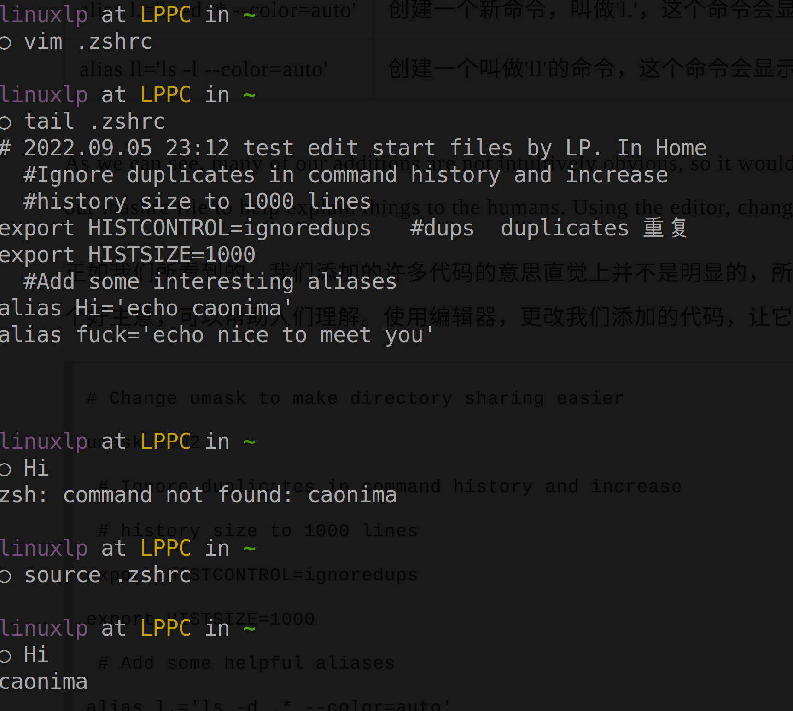
  * alias加入的别名只适用于当前会话，退出就没了，而写入配置脚本内的别名，每次会话开始时都会加载，相当于执行一下。可以永久使用。

###### export

* export设定的环境变量可以供shell的子进程使用。

###### source

* 修改.zshrc之后不会立即生效，因为只有shell会话启动时才会读取.zshrc。
* source命令强制shell重新读取.zshrc配置脚本。


