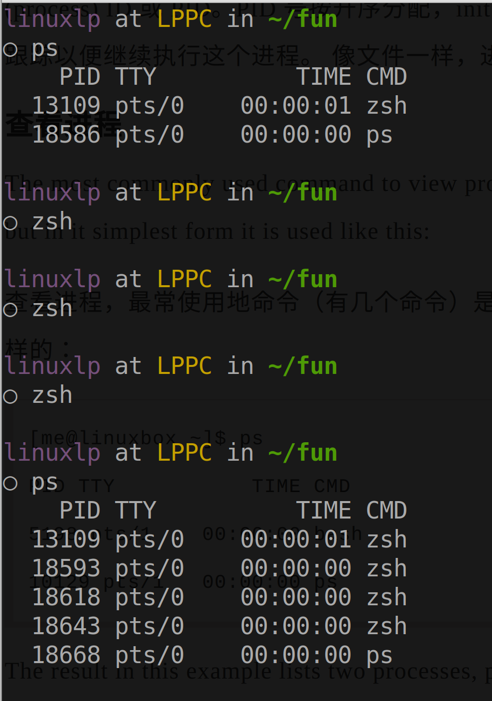
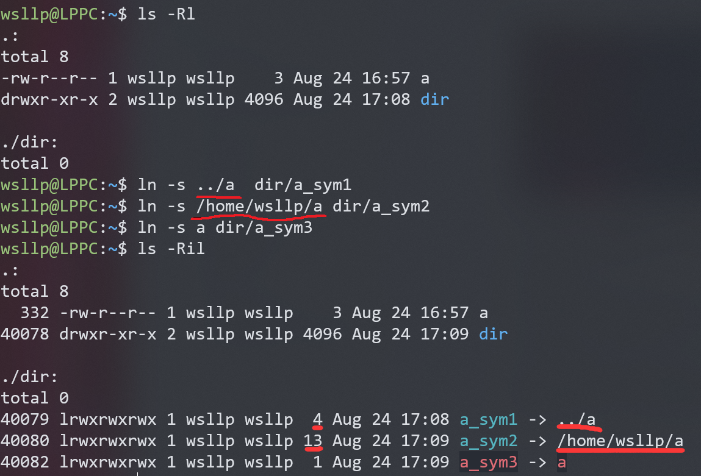
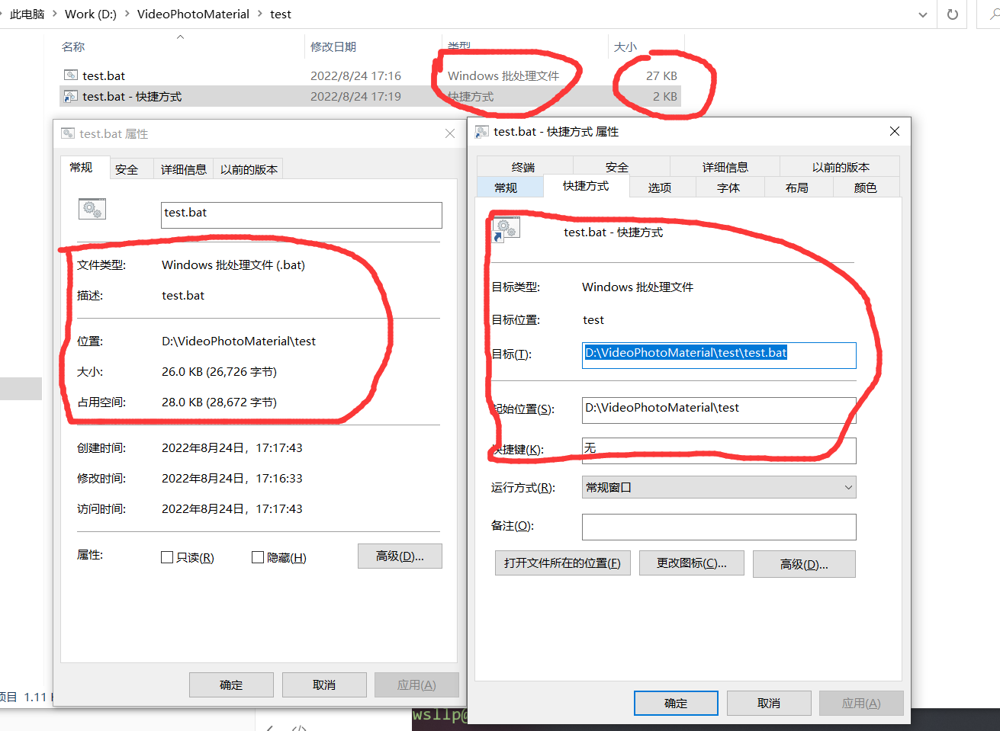
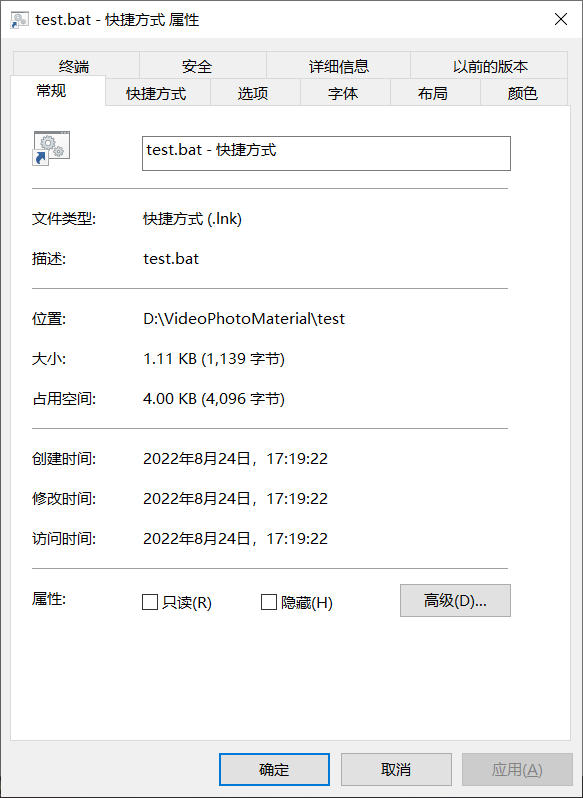
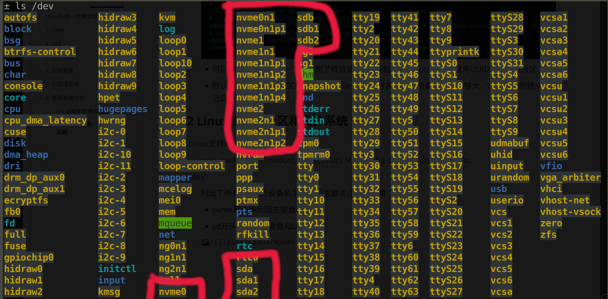

#              Linux系统一些概念知识

# 1. Shell

## 1.1 shell和terminal概念辨析

* ###### shell

  * 定义
    * shell就是一个程序，接受键盘输入的命令(本质是一个程序)， 然后把命令传递给操作系统去执行。
    * 或者理解为一个命令解释器，接受命令，然后执行。(程序执行并不一定会产生输出)
  * 注
    * 如果命令行的第一个单词不是一个内置的shell命令，那么shell就会假设这是一个可执行文件的名字，它将加载并运行这个命令。
  * shell提示符(shell prompt)
    * user@pc  + wd + #/$
      * user  当前登录用户名
      * pc  当前PC名字
      * wd ： working  directory 当前工作目录
      * \# 当前用户为管理员
      * $ 当前为普通用户

* ###### terminal(terminal emulator, console)

  * 终端
    * 以前没有命令行时只有黑乎乎的界面类似Linux的TTY(TeleTYpewriter)是真正的终端
  * 终端仿真器或叫控制台
    * 在图形界面中的一个程序，使我们可以和shell交互
  * 终端不是shell，而是帮助我们同shell交互的另一个程序
    * shell只负责接受命令，然后交给OS执行，那些诸如编码、字体、快捷键、外观等花里胡哨的功能都是终端负责的
      * 比如GNOME界面的terminal可以运行sh, bash,或者zsh
      * 比如windows terminal 可以运行cmd，windows powershell， powershell，wsl的bash

* ###### TTY(teletypewriter)

  * 即使不运行终端仿真器，Linux系统默认后台运行着几个终端，可以alt+ctrl+1~7调用，类似远古时期真正的终端。分别是6个tty和一个GUI。
  
* **一个终端可以运行多个shell**。

  * 例如Ubuntu默认运行bash，然后输入zsh，那么bash转为后台运行，终端以当前用户身份启动一个新的zsh，再输入zsh，当前zsh转入后台，启动一个新zsh，输入zsh。。。。可以运行无数zsh。类似一个栈，在当前shell运行另一个shell，当前shell压入栈。
  * 输入exit退出当前shell，栈里有shell的话弹出栈顶shell。
  * 再次强调，shell只是一个程序而已，跟普通的程序没什么不同，别想的太神秘。以下是在zsh中输入3次zsh之后的进程信息，可以看到此时一共运行着4个zsh进程
    * 

## 1.2 shell wildcards(globbing 通配符)

* glob
  * shell的所谓通配符就是一种简化了的正则表达式而已罢了。主要用来通配符展开。

* 常用通配符

  * | Wildcard      | Meaning                                                      |
    | ------------- | ------------------------------------------------------------ |
    | *             | Matches any characters(0个或者任意多个字符)                  |
    | **            | 表示匹配任意中间目录，比如 a/**/z 可以匹配 a/z 、 a/b/z 或 a/b/c/z 等 |
    | ?             | Matches any single character(任意的一个字符)                 |
    | [characters]  | Matchs any character that is a member of the set characters(匹配集合中的任意一个，所**有的方括号都是匹配对应集合中的任意一个**，下同理) |
    | [!characters] | Matchs any character that is not a member of the set characters |
    | [[:class:]]   | Matches any character that is a member of the specified class |
    
  * [characters] 中的characters 代表任意字符集合

  * [[:class:]]中的 [:class:] 代表集中已定义的字符类，见下表

* 常用字符类

  * | Character Class                 | Meaning      |
    | ------------------------------- | ------------ |
    | [:alnum:]                       | 字母和数字类 |
    | [:alpha:]                       | 字母类       |
    | [:digit:]                       | 数字类       |
    | [:lower:] == [a-z]\(建议用前者) | 小写字母类   |
    | [:upper:]== [A-Z]\(建议用前者)  | 大写字母类   |

  * 很简单 ，举例

    * [0-9] == [0123456789] == [[:digit:]]
    * [abcdefghijklmnopqrstuvwxyz] == [a-z] == [[:lower:]]

## 1.3 shell的命令(command)

#### 1.3.1 命令的四种形式	

* 可执行程序

  >  An **executable program** like all those files we saw in /usr/bin. Within this category, **programs can be compiled binaries** such as programs written in C and C++, **or programs written in scripting languages** such as the shell, perl, python, ruby, etc.

* shell内建命令(buildins)

  > A command built into the shell itself. **bash supports a number of commands internally called shell builtins.** The cd command, for example, is a shell builtin.(内建命令一般没有man手册，比如cd，type，内建命令用help)

* shell函数

  > A shell function. These are miniature shell scripts incorporated into the environment. (它们是混合在环境变量中的微小的的shell脚本)

* 命令别名(alias)

  > An alias. Commands that we can define ourselves, built from other commands

#### 1.3.3 举例

* 
  * 默认bash或者说默认shell中history是个内建命令，但是装了oh-my-zsh之后，oh-my-zsh用自己的版本替换了内建的history，此时运行的history命令就是典型的第三种命令，shell function

## 1.4. IO重定向(redirection)和管道线(pipeline)

#### 4.1 输入、执行、输出

* 所有程序的功能都是接受输入、执行、输出。
* 所以管理程序执行的核心三个方面
  * Input(输入)
  * execute(执行)
  * Output(输出)

#### 4.2 stdin, stdout, stderr

> Unix一切皆为文件，所以shell为了管理程序的IO以及执行本身，定义了三个特殊文件，标准输入(stdin),标准输出(stdout),标准错误输出(stderr)

* standard input(stdin)
  * 特殊文件，程序从这个文件中读取执行所需的输入
  * 默认链接到键盘
* standard ouput(stdout)
  * 特殊文件，程序将预期的结果输出到该文件(将预期的结果意味着程序必须正确执行才有预期的记过)
  * 默认链接到屏幕
* standard error(stderr)
  * 特殊文件，上面说到的执行本身，就反应在这个文件。程序的管理者或者说调用者，将程序执行的一些状态信息，常常是程序执行错误产生的错误信息输出到这个文件。
  * 默认链接到屏幕。

#### 4.3 重定向

> 就是改变stdin, stdout, stderr的默认链接对象。详细用法见CLI笔记

* \>
  * 重定向stdout
* 2>
  * 重定向stderr
* &>
  * 重定向stdout 和stderr
* <
  * 重定向stdin

#### 4.4 管道(pipeline)

> The ability of commands to read data from standard input and send to standard output is utilized by a shell feature called pipelines. Using the pipe operator “|” (vertical bar), the standard output of one command can be piped into the standard input of another

* command1 | command2
  * 命令1的输出到标准输出的内容将作为命令2的标准输入

# 2. GUI

#### 2.1 窗口聚焦策略（Focus policy)

* ###### 单击聚焦(click to focus)

  * 点击窗口使之成为活动窗口并使之成为前端窗口
    * 比如windows和GNOME，KDE

* ###### 跟随聚焦(focus follows mouse)

  * 鼠标在哪个窗口上，哪个窗口成为活动窗口。但是不会变为前端窗口，除非点一下
    * 比如X GUI

# 3. 文件系统

#### 3.1 文件系统树

* Linux只有一个文件系统树，根目录是/，硬盘，U盘等可以任意挂载在树的任意节点。
* Windows一个硬盘一个文件系统树，根目录是C:、D:等硬盘标识符
* **Linux中一切皆文件**

#### 3.2 Linux文件系统层级标准(Linux Filessystem Hierarchy Standard(Linux FHS))

* 详情请参见文档[Linux Filesystem Hierarchy (tldp.org)](https://tldp.org/LDP/Linux-Filesystem-Hierarchy/html/index.html)或[Filesystem Hierarchy Standard (pathname.com)](https://www.pathname.com/fhs/)

* | Directory      | Comments                                                     |
  | -------------- | ------------------------------------------------------------ |
  | /              | The root directory.Where everything begins.根目录            |
  | /bin           | Contains **binaries**(programs) that must be present for the system to boot and run.包含系统启动和运行所必须的二进制程序 |
  | /sbin          | This directory contains "**system" binariese**. These are programs that perform vital(至关重要的) system tasks that are generally reserved for the superuser. |
  | /boot          | Contains the linux kernel, intial RAM disk image(for drivers needed at boot time), and the **boot** loader.                                                             Interesting files:                                                                                            1. /boot/grub/grub.conf or menu.lst, which are used to configure the boot loader.                                                                                            2. /boot/vmlinuz, the linux kernel |
  | /dev           | This is a special directory which contains **device** nodes. "Everything is a file" also applies to devices. Here is where the kernel maintains a list of all the devices it understands. |
  | /etc           | The /etc directory contains all of the system-wide configuration files.(**系统级的配置文件**)It also contains a colletcion of shell scripts which start each of the system services at boot time.包含一系列的shell脚本，在系统启动时，这些脚本会开启每个系统服务。         Everything in this directory should be readable text.                              Interesting files: While everything in /etc is interesting, here are some of my all-time favorites:                                                                    1. /etc/crontab, a file that defines when automated jobs will run.       2. /etc/fstab, a tables of storage devices and their associated mount points.                                                                                                               3. /etc/passwd, a list of the user accounts. |
  | /home          | In normal configurations, each user is given a directory in /home. Ordinary users can only write files in their home home directors. This limitation protects the system from errant user activity. |
  | /lib           | Contains shared **library files** used by the core system programs. These are similar to DLLs in Windows. |
  | /lost+found    | Each formatted partition or device using a Linux file system, such as ext3, will have this directory. It is used in the case of a partical recovery from a file system corruption event(当文件系统损坏时，用来部分恢复它）. Unless something really bad has happened to your system, this directory will remain empty. |
  | /media         | On modern Linux systems the /media directory wil contain the mount points for removable media such USB drives, CD-ROMs, etc. that are mounted automatically at insertion. |
  | /mnt           | On older Linux systems, the /mnt directory contains **mount** points for removable devices that have been mounted manually. |
  | /opt           | The /opt directory is used to install "**optional**" software. This is mainly used to hold commercial software products that may be install on your system. |
  | /proc          | The /proc directory is special. It's not a real file system in the sense of (从。。。意义上来说)files stored on your hard drive. Rather(相反), it is a virtual file system mantained by the Linux kernel. The "files" it contains are peepholes(窥视孔) into the kernel itself. The files are readable and will give you a picture of how the kernel sees your computer. |
  | /root          | This is the home directory for the root account.             |
  | /tmp           | The /tmp directory is intended(v.打算、计划) for **storage of temporary(a.临时的), transient(短暂的) files created by various programs**.Some configurations cause this directory to be emptied each time the system is rebooted. |
  | /usr           | The /usr directory tree is likely the largest one on  a Linux system. It contains **all the programs and support files** used by **regular users**. |
  | /usr/bin       | /usr/bin contains the executable programs **installed by your Linux distribution**. It is not uncommon for this directory to hold thousands of programs. |
  | /usr/sbin      | Contains more system administrator programs.                 |
  | /usr/lib       | The shared libraries for the programs in /usr/bin            |
  | /usr/share     | /usr/share contains all the shared data used by programs in /usr/bin. This includes thing like default configuration files, icons, screen backgrounds, sound files,etc. |
  | /usr/share/doc | Most packages installed on the system will include some kind of documentation . In /usr/share/doc, we will find documentation files organized by package. |
  | /usr/local     | **The /usr/local tree is where programs that are not inlcuded with your  distribution but are intended(计划，设想) for system-wide use are installed.** Programs complied from scource code are normally installed in /usr/local/bin. On a newly installed Linux system, this tree exists, but it will be empty until the system administrator puts something in  it. |
  | /var           | <u>With the exception</u>(除了) of /tmp and /home, the directories we have looked at so far remain relatively static(我们看到的目录到目前为止保持相对静止), that is , their contents don't change. **The /var directory tree is where data that is likely to change is stored.** **Various** databases, spool files(假脱机文件), user mail, etc.are located here. |
  | /var/log       | /var/log contains **log files**, records of various system activity. These are very importat and should be monitored from time to time. The most useful one is /var/log/messages. Note that for security reasons on some systems, you must be the superuser to view log files. |

* 注

  * /etc 
    * 名字由来
      * 没错就是来自于etc(etcetera),意思是。。。(and so on,等等),远古时期的UNIX，设备有关信息放/dev,启动有关信息放/boot,库有关放/lib, 程序有关放/bin,但是还有一些杂七杂八没处放，所以放在/etc,等等文件夹中。。**当然现在/etc主要放系统层级配置文件**和一些服务启动脚本。
    * crontab  
      * cron table  自动任务表
        * Cron is a clock daemon, whose name originates from Chronos, the Greek word for time.
        * Cron是一个时钟守护进程，名字来源于希腊语中的时间一词——Chronos(也指时间之神)
    * fstab
      * file system tables  文件系统表
  * /proc
    * process
    
      > /proc is very special in that it is also a virtual filesystem. It's sometimes referred to as a process information pseudo-file(pseudo 假,伪) system. It doesn't contain 'real' files but runtime system information (e.g. system memory, devices mounted, hardware configuration, etc). For this reason it can be regarded as a control and information centre for the kernel. In fact, quite a lot of system utilities are simply calls to files in this directory. For example, 'lsmod' is the same as 'cat /proc/modules' while 'lspci' is a synonym for 'cat /proc/pci'. By altering(修改) files located in this directory you can even read/change kernel parameters (sysctl) while the system is running
  * /tmp
    
    * temp  n.v. 临时工，打临时工  temporary a. n. 临时的，临时
  * /usr
    >  /usr usually contains by far the largest share of data on a system. Hence, **this is one of the most important directories in the system as it contains all the user binaries, their documentation, libraries, header files, etc....** X and its supporting libraries can be found here. User programs like telnet, ftp, etc.... are also placed here. In the original Unix implementations, /usr was where the home directories of the users were placed (that is to say, /usr/someone was then the directory now known as /home/someone). **In current Unices, /usr is where user-land programs and data (as opposed to 'system land' programs and data) are.** The name hasn't changed, but it's meaning has narrowed and lengthened from "everything user related" to "user usable programs and data". As such, some people may now refer to this directory as meaning 'User System Resources' and not 'user' as was originally intended.(因此，一些人现在认为这个目录的意义是“用户系统资源”而不是最初“用户”的设想(一开始就是简简单单的用户的意思，类似现在的home，放与用户有关的一且，而现代的/usr名字并没有变，但是改为放用户可用的程序和数据了。所以认为现在的/usr 代表User System Resources 也未尝不可))

    * user-land program  用户级程序
    * system-land program 系统，内核级程序
  * /var
    * various  [ˈveriəs]  各种各样的;各种不同的;具有多种特征的;多姿多彩的
    * /var/log
      * log文件保存在这里，因为/var就是用来存放动态信息的。

#### 3.2 常用文件类型

* regular file                普通文件
* directory                   目录文件
* symbolic link            链接文件
* FIFO(pipe)                 管道文件
* socket                       套接字文件
* character special file      字符设备文件
  * 指按照字节流处理数据的设备，常见的是terminal和modem(调制解调器)

* block special file             块设备文件
  * 指按照数据块处理数据的设备，常见的是硬盘

#### 3.2 文件命名

* Linux 以点开头的是隐藏文件
* 文件名大小写敏感
* 文件名支持字母,数字,空格,点,减号,下划线。
  * 但是最好不要用空格
* 文件名没有扩展名的概念，想怎么命名怎么命名，如果特意命名为有扩展名形式的文件也可以，有些软件会识别这些扩展名。比如 a.cpp

#### 3.3 特殊目录

* ~ （普通用户——/home/wuyulp， root用户——/root)
  * 当前登录用户的家目录
  * 普通用户的家目录是唯一允许用户写入文件的地方
    * 解释了为啥安装软件要sudo  apt ,因为要读写其他目录
* .  
  * 当前工作目录
* .. 
  * 当前工作目录的父目录

#### 3.4 相对路径与绝对路径

* 绝对路径就是从根目录开始的路径名称
  * /home/wuyulp  , D:\GitRepo\Notes\Linux
* 相对路径就是从当前工作目录出发的路径名称
  * ./wuyulp   ../wuyulp        .\Linux   ..\Notes
  * 如果不指定路径名，则默认是./
    * 例如  rm  x   本质是相对路径  rm  ./x

#### 3.5 链接文件

##### 3.5.1 硬链接  Hard Link(物理链接Physical link)

1. 旧
   * 硬链接是UNIX传统的创建链接的方式，现在一般用软链接。

***

2. 只是别名

   * 硬链接文件不是一个文件，而是一个引用。给一个文件创建硬链接，更像是创建了一个别名，仅仅是名字而已。我们可以将一个文件分为两个部分，数据部分和名字部分。硬链接只是新增一个名字，然后指向原来文件的数据部分。

     > When we create a hard link, we create an additional directory entry for a file.

***

3. 每个数据默认都有一个名字
   * 每个文件默认状态下都有一个硬链接，指代文件名字部分指向文件数据部分。

***

4. 同性质
   * 硬链接和源文件没有高低之分，他们都是指向同一个数据部分的不同的名字而已，某种意义上，他们都是指向实际数据部分的硬链接，使用ls 命令，发现他们的大小一模一样，区分两个文件是硬链接的方法是看两个文件是否具有相同的inode 节点

***

5. **相同的inode——相同的数据部分**
   * **只要文件具有相同的inode节点，可以说他们互为硬链接，指向同一块数据内容**。

***

6. 同一块数据
   * 假设指向同一块10B数据内容的有10个名字，那么这10个文件都是硬链接文件,显示的大小都是10B，修改任何一个文件都是在修改这块数据内容，删除任意一个文件不会删除数据内容，知道10个文件都被删除，那么数据内容就会被删除。
   * **给某个文件创建硬链接，本质上是给实际的那块数据内容指定一个别名，可以通过别名来访问。**

***

7. **硬链接的限制**

   * 不能给目录创建硬链接

     > A hard link may not reference a directory.

   * 不能创建与文件不在同一个文件系统下的硬链接.(好理解，因为很难实现两个文件系统的两个文件名引用同一块数据内容)

     >  hard link cannot reference a file outside its own file system. This means a link may not reference a file that is not on the same disk partition as the link itself.
   
8. eg

* 
  * 
    * 可以看到，新创建的三个文件默认硬链接数都是1，指明指向数据内容的只有一个名字。
  * 
    * 创建一个a的硬链接文件后，a，a_hard的硬链接数都是2，**本质是指它们对应的数据部分此时有了两个名字**。第一行为文件对应的i**node节点，可以发现，两个一样，所以它们指向的是同一块数据，只是名字不同而已。**
    * 所以不管是修改a，或者是修改a_hard,修改的都是同一块数据内容。
  
##### 3.5.2 软链接 Symbolic(soft) Link

  1. 现代

     * 以前用硬链接，现在基本都用软链接

***

  2. 新文件

     * 不同于硬链接的别名，软链接则是彻彻底底的创建一个新文件，该文件的内容就是目标文件的路径。就这么简单。
     * 所以说Linux文件类型中有一种类型叫Symbolic Link文件，就是指软链接类型文件(简称为链接文件)，是一种特殊的文件类型，而不存在硬链接文件。

     ***

  3. 特殊的访问方式

     * 一般的文件，如果是可执行文件，那么点击执行本身，如果是文本文件，那么对其进行编辑，处理的是本身。
     * **一个文件如果是软链接文件，那么对其执行、编辑，处理的是其所指的目标文件**。可以这么理解，如果要系统要处理链接文件，那么首先会通过链接文件找到目标文件路径，然后处理目标文件。

     ***

  4. 不同性质

     * 目标文件和其软链接文件不同性质。处理软链接文件实际处理的是目标文件。如果删除软链接文件，对目标文件没影响。

     * 如果删除目标文件，那么软链接文件会失去目标，就没用了。

       > However when you delete a symbolic link, only the link is deleted, not the file itself. If the file is deleted before the symbolic link, the link will continue to exist, but will point to nothing. In this case, the link is said to be broken.

     ***

  5. 应用

     * **shortcut**(windows上的快捷方式)就是软链接
       * 假设一个程序test.exe位于 D:/test目录, test.exe运行所依赖的一些文件都在test目录，那么显然想运行test.exe,必须进入到test目录双击，命令行的话就是进入test，然后输入test.exe运行。
       * 如果命令行想在任意路径运行怎么办，那么就将test.exe加入环境变量，这样在任意路径输入test.exe，系统就知道去test目录运行test.exe就行了。这里加入环境变量实际就是起到的软链接作用，**通过软链接知道目标文件的路径，然后执行目标文件。**
       * 如果想在桌面双击运行test.exe行吗，直观的想法是把test.exe复制到桌面。然后双击，如果test.exe运行依赖的文件都是以绝对路径给出的，或者不依赖任何文件。那么这样可以。但是一般程序运行依赖的文件都是以相对路径给出的，以test.exe为例，一般都存在test目录里，通过.或..引用。所以简单的复制不行，除非将整个test目录复制到桌面。
         * 最简单的方案就是在桌面创建一个test.exe的快捷方式，双击，系统通过快捷方式定位到实际目标文件test.exe的位置，然后运行。
     * 维护
       * 假设我维护着/home/me/fun 文件，fun经常有版本升级，且许多其他用户都在各种各样的地方用名字/home/me/fun使用该文件。我想将版本信息加入到文件名中，比如fun_v1.1, fun_v1.2.
       * 但是如果这样的话，每个用到fun的地方都要改名，怎么办？利用软链接。例如现在是1.1版本，那么我命名为fun_v1.1,然后创建一个它的软连接叫fun，这样别人用不影响，我也好维护。当版本更新了，我改名为fun_v1.2, 然后删除链接文件，在重新创建链接文件。完美。

     ***

6. eg

   * 
     * a_sym是一个全新的文件，跟a Inode节点不同，注意其大小1B，其真正的内容就是一个字符a,也就是目标文件的路径，只有一个字符a，那么处理a_sym时，真正处理的就是./a。
     * 这里要注意的是，这个a_sym包含的目标路径是怎么来的哪，就是 ln -s a a_sym,命令中TARGET部分我们键入的a，那么a_sym存储的路径就是a。有省略，其实更清楚的写法是 ln -s ./a a_sym 。
     * 注意目标路径一定要写清楚，系统才能根据a_sym 所在的位置找到目标文件。目标路径有两种写法，相对路径(相对a_sym所在的位置)，绝对路径。

   ***

   

   * 
     * 这里a_sym1,a_sym2目标路径给的正确，所以成功创建，目标路径显示正确。注意大小，4B对应4个字符，13B对应13个字符，再次说明软链接文件真正的内容是目标路径。
     * a_sym3创建失败，因为创建时给的路径是a，于是系统按照相对路径./a 在a_sym3的同级目录找a，没找到，所以a_sym3不存在对应目标文件，是一个损坏的链接文件。

   ***

   

   * 

     * 如图是test.bat和他的快捷方式，左边是test.bat的属性信息，右边是test.bat快捷方式的属性信息。

     * 可以看到，快捷方式默认的属性框就是给出目标文件的位置，所以链接文件的最重要的信息就是目标文件的路径。其本身的信息如下图。

       

#### 3.6 归档和压缩文件

* 归档(archiving)也叫打包

  > Archiving is the process of gathering up many files and bundling them together into a single large file.

  * 简而言之，可以将一个目录树归档成一个文件便于备份或压缩，并且保留了目录树层级关系因此解包后可以完全还原文件目录原来的层级关系。

#### 3.7 格式化或排版文件

> nl, pr,fold ,fmt那些都是小打小闹，真正可用的可以精美排版的是下面这些。

* 历史
  * 所谓专门的排版程序已经对我们很陌生了。
    * 在没出现GUI之前，输出格式化文件往往需要两步:
      * 首先纯文本编辑器编辑好文本文件。
      * 然后排版程序排版。
  * 现代的GUI文本处理工具只需要一步，输入文本的同时完成排版。
    * 其本质做法就是将标记语言(markup lanuage)和文本内容一起写入文件，程序利用标记语言来排版文件。
      * 例如windows word，我们输入文本，然后通过各种菜单进行排版，本质是插入标记语言，只不过程序给我们隐藏了。生成的.docx后缀，只有word才能识别它自己插入的标记语言，从而正确展现排版。
      * Markdown同理，我们手动插入标记语言，然后支持Markdown语法的程序就能识别并自动排版。
      * 网页同理，我们插入HTML标记语言，和CSS，然后浏览器就可以识别，从而渲染出各种丰富的网页。

* 文件格式化(排版)系统(Document Formatting Systems)

  * roff(run off)家族

    > run off 复印，影印

    * nroff
    * troff

  * TeX家族

    * LaTeX

#### 3.8 打印文件

* 一些术语
  * monospaced font
    * 等宽字体
  * WYSIWYG（What You See Is What You Get）
    * 所见即所得
  * typewriter
    * 打字机
  * typersetter
    * 排字机
* PDL(page-description language)
  * 用来描述要打印的一页的内容
  * 第一个主要的PDL是来自Adobe的PostScript
* Linux管理和执行打印的系统
  * CUPS(Common Unix Printing System)
    * 提供打印驱动和打印任务管理
  * Ghostscript
    * 一个PostScription 解析器，作为RIP使用(Raster Image Processor 光栅图像处理器)

# 4. 权限管理

### 4.1 用户，组

* User, Group
  * Linux中每个文件都有其所有者(owner)——用户
  * 每个文件都有其用户组—— group owner
    * 注意文件的用户组不一定是其拥有者所在的组
* Uid, Gid
  * uid(user id)
    * 每个用户有自己唯一的id
  * gid(group id)
    * 每个组有自己唯一的id
* 常规用户与非常规用户
  * 常规用户就是人类用户，包括root
  * 非常规用户有许多系统用来管理权限的定义的花里胡哨的用户和组
* 与User相关的配置文件
  * /etc/passwd
    * 列出了所有用户和用户相关的信息
  * /etc/group
    * 列出了所有组和组相关信息
  * /etc/shadow
    * 原来密码信息也位于/etc/passwd 文件，所以命名为passwd，但是这个文件所有人都可以读，所以不安全，因此把密码信息单独冲passwd中抽离出来存在/etc/shadow中
    * 显示的密码是SHA512加密过的。
    * 不止有密码等信息，还有最后一次修改时间：最小修改时间间隔：密码有效期：密码需要变更前的警告天数等信息，用分号分隔开。

### 4.2 文件权限管理

##### 1. 读、写、执行(RWX: read、write、execution access)

* 文件的权限管理主要有RWX这三个方面，这三个权限具体允许的行为如下表

  * | Attribute | Files                                                        | Directories                                                  |
    | :-------- | :----------------------------------------------------------- | :----------------------------------------------------------- |
    | r         | Allows a file to be **opened and read.**                     | Allows a directory's contents **to be liste**d if the execute attribute is also set. |
    | w         | Allows a file **to be written to or truncated,** however this attribute does not allow files to be renamed or deleted. The ability to delete or rename files is determined by directory attributes. | Allows files within a directory **to be created, deleted, and renamed** if the execute attribute is also set. |
    | x         | Allows a file to be treated as a program and **executed**. Program files written in scripting languages must also be set as readable to be executed. | Allows a directory to be **entered**, e.g., cd directory.    |

    * truncate  [ˈtrʌŋkeɪt] 截断、截短，删节

##### 2. 所有者、组所有者、所有人(Owner、Group owner、Everybody else)

> 现代的叫法是：**Owner, Group, Others**

* 将使用文件的对象分为3类，文件的所有者、文件的组所有者、随便什么人。
  * 文件的所有者和superuser可以控制文件的一切权限。
  * 文件的组所有者也叫文件的用户组，该组拥有文件。
  * 随便什么人就是该计算机上的任意用户。也就是everybody，在unix传统上也可叫做world，例如该文件的所有者可读、用户组可读、任意人可读，那么可以称为owner-readable, group-owner-readable, world-readable.
* 文件权限与使用文件的对象相结合，诞生了最著名的Unix的权限管理机制：
  * 

##### 3. 文件模式(File Mode)

* Unix用四个八进制位来表示文件权限，第一位表示一些特殊的权限，很少用。**后三位分别表示Owner, Group, Others 的RWX权限**。这个八进制四位数的每个取值，称为该文件的一种模式(mode)。例如0111，表示该文件owner-readable, group-readable, others-readable，第一个0先不管它。

* **后三位**中的每一位的对应的二进制以及对应的文件权限如下表：

  * | Octal | Binary | File Permission |
    | ----- | ------ | --------------- |
    | 0     | 000    | ---             |
    | 1     | 001    | --x             |
    | 2     | 010    | -w-             |
    | 3     | 011    | -wx             |
    | 4     | 100    | r--             |
    | 5     | 101    | r-x             |
    | 6     | 110    | rw-             |
    | 7     | 111    | rwx             |

* 第一位表示的权限很少用了，简单介绍一下，其对应关系如下表

  * | Octal | Binary | File Permission |
    | ----- | ------ | --------------- |
    | 0     | 000    |                 |
    | 1     | 001    | sticky          |
    | 2     | 010    | setgid          |
    | 3     | 011    |                 |
    | 4     | 100    | setuid          |
    | 5     | 101    |                 |
    | 6     | 110    |                 |
    | 7     | 111    |                 |

# 5. 包管理系统

> The most important determinant of distribution quality is the packaging system and the vitality of the distribution's support community。

### 5.1 包管理技术(Packing technologies)

* 多数Linux系统基于以下两类包管理系统家族

  * | Packaging System     | Distributions (Partial Listing)                              |
    | :------------------- | :----------------------------------------------------------- |
    | Debian Style (.deb)  | Debian, Ubuntu, Xandros, Linspire                            |
    | Red Hat Style (.rpm) | Fedora, CentOS, Red Hat Enterprise Linux, OpenSUSE, Mandriva, PCLinuxOS |

* Linux系统借助包来封装程序，从而借助包管理系统简单方便的安装，升级程序。

### 5.2 包(package)和包仓库(repository)

##### 5.2.1 包

* 典型组成
  * 程序部分
    * 包含程序本体和程序需要的数据文件
  * 元数据(metadata)
    * 例如描述包内容的文本文件
  * pre-installation , post-installation scripts
    * 用于安装程序之前，之后进行配置任务的一些脚本。
* 维护者
  * 一般大多数包都有Linux发行版的发行商维护
* 来源
  * 大多数包都可以从官方包仓库获得。
  * 或者从官网等地方下载包。

##### 5.2.2 包仓库

* 顾名思义，包仓库就是一些存放了许多包的有人维护的服务器。
* 借助包仓库+包管理工具可以方便下载升级程序。
* 一般每个发行版都会有官方维护的仓库和一些第三方仓库。

### 5.3 依赖(dependency)

* 程序运行时很少独立运行，它一般会依赖于许多库。在Windows叫DLL(Dynamic link library)，在Linux叫共享库(Shared library)
* 现代包管理系统一般会自动帮忙安装程序所依赖的依赖。

### 5.4  上层和底层软件包工具

* 软件包管理系统通常由两种工具类型组成：

  * 底层工具用来处理一些类似安装和删除软件包文件的任务
  * 上层工具，完成元数据搜索和依赖解析

* 常用

  * | Distributions                            | Low-Level Tools | High-Level Tools |
    | :--------------------------------------- | :-------------- | :--------------- |
    | Debian-Style                             | dpkg            | apt              |
    | Fedora, Red Hat Enterprise Linux, CentOS | rpm             | yum              |

# 6. 管理存储介质

> Manage Storage Media

### 6.1 挂载和卸载存储设备

* 要想访问存储设备内容，必须将其挂载到Linux文件树中。
* 现代Linux系统可以自动挂载，卸载可移动存储设备
* /etc/fstab
  * 文件列出了系统启动时要挂载的设备(典型的就是硬盘分区)
  * 
    * 可以看到两个分区，一个挂载到了根目录/,一个挂载到了/boot/efi，并且用UUID名来表示分区
    * 默认应该有个swap分区挂载到/swapfile,但是当时我觉的必须要，爷内存够大，所以就没创建swap分区。

### 6.2 Linux设备、分区和文件系统

* Linux支持的文件系统
  * ext3, ext4, FAT16 (msdos), FAT32 (vfat), NTFS (ntfs), CD-ROM (iso9660), etc.
* /dev
  * 列出了所有Linux的设备名字，我们主要关注以下两类：
    * nvme开头表示固态硬盘相关
    * sd开头表示机械硬盘和U盘等
  * 
  
    * nvme
  
      * nvme0表示第一块固态的主控芯片
  
      * nvme0n1表示第一块固态的主存储器
      * nvme0n1p1  表示第一块固态硬盘的第一个分区。
      * 如图对应我的三块固态硬盘nvme0, nvme1, nvme2
      * 使用分区工具或者挂载时使用的设备名字，要用nvme0n1也就是主存储器的名字，而不是nvme0
    * sd
    
      * sda表示我的4T西数机械，sda1,sda2表示两个分区
      * sdb表示我的闪迪U盘， sdb1,sdb2表示两个分区。

# 7. 网络

### 7.1 网络协议

##### 7.1.1 应用层网络协议

> 一般对应特定传输协议，就会有同名的利用该传输协议的程序。

* telnet, ftp 。。。
  * 这些都是老协议，数据明文传输
* SSH(Secure Shell)
  * 新协议，新增两个最重要的安全特性
    * 服务器会认证(authenticate)客户端的身份
    * 加密传输数据
  * 需要SSH客户端程序和SSH服务端程序，服务端程序在TCP 22端口监听请求。
  * 一般发行版提供了OpenSSH包，包括了实现ssh传输的所有功能，分为openssh-client和openssh-server.

# 8. 正则表达式

> 注意正则表达式不同于shell中的通配符，shell中通配符glob只是简化的一种regular expression。所以使用正则表达式时要单引号括起来，防止shell将其扩展解释为通配符。
>
> 不同语言，shell能处理的正则表达式可能不太一样，不过大体相同，接下来的正则表达式以POSIX的为标准。

### 8.1 元字符和原义字符

##### 8.1.1 原义字符(literals)

* 顾名思义，就是只代表自己本身的字符，一般的26个字符都是原义字符。
  * grep apple test.txt     输出文本文件中包含apple这5个连续字符的行

##### 8.1. 元字符(metacharacters)

* 可以匹配各种字符，如果想只匹配元字符本身，需要\\转义。

* POSIX   BRE(Basic Regular Expression基本正则表达式)能识别的元字符

  * | Metacharacters                | Meaning                                                      |
    | ----------------------------- | ------------------------------------------------------------ |
    | .                             | dot, period。点匹配任意一个字符                              |
    | ^，$                          | caret,dollar sign characters。被看做锚点，意味着正则只有在文本行开头或者结尾匹配时才算匹配。^表示开头，$表示结尾。 |
    | []                            | bracket。匹配给定字符集合中任意一个。字符集合中可以有元字符，表示匹配其本义，除了两个例外^和-，前者放在第一个表示否定，后者不放在第一个表示范围。 |
    | [^abc]                        | 匹配除了给定字符集合之外的任意一个字符。^放在字符集合第一个才有特殊意义表否定，放在其他位置没有特殊意义。 |
    | [A-Z],[a-z],[0-9],[A-Cc-f4-6] | dash。短横线可以指定一个字符范围，方便给出字符集合。将短横线放在第一位时失去特殊意义，表示匹配本身。 |
    | /                             | 转义字符                                                     |
  
* POSIX  ERE(Extend Regular Expression 扩展的正则表达式)可以识别的字符

  * | Metacharacters | Meaning                                                      |
    | -------------- | ------------------------------------------------------------ |
    | \|             | Vertical bar。表示匹配给定的竖线分开的字符串(或者说就是RegExp)集合中的任意一个。方括号表示匹配给定字符集合中的任意一个，为了扩展这个功能，实现匹配给定字符串集合中的任意一个,引入了竖线,此特性名为Alternation。                                       'AAA \| BBB'表示匹配AAA或BBB，'^(aa\|bb\|cc)'表示匹配以aa，bb或cc开头的行。'^aa \| bb \|cc'  表示匹配以aa开头的行或者包含bb，cc的行 |
    | ()             | parenthese。说白了'\|'就类似'或'来组合正则表达式，所以引入圆括号指定优先级。 |
    | ？             | 放在字符或字符集合后面，表示字符匹配0~1次。'ab?' 表示包含ab,a的行。a[abc]?表示匹配a或aa,ab,ac。 |
    | *              | 放在字符或字符集合后面，表示字符匹配0~无穷次。'^A[a-zA-Z ]*\\.'表示匹配任意以A开头的，以点结尾的中间包含任意数量大写小写，空格字符的行。 |
    | +              | 放在字符或字符集合后面，表示字符匹配1~无穷次。               |
    | {n}            | 放在字符或字符集合后面，表示字符匹配n次。                    |
    | {n,m}          | 放在字符或字符集合后面，表示字符匹配n~m次。                  |
    | {n, }          | 放在字符或字符集合后面，表示字符匹配n~无穷次。               |
    | {,m}           | 放在字符或字符集合后面，表示字符匹配0~m次。                  |
    
    
  
* 常用的一些POSIX标准预定义的字符集合范围(正则表达式和shell通配符通用)

  * | 字符集     | 说明                                                         |
    | :--------- | :----------------------------------------------------------- |
    | [:alnum:]  | 字母数字字符。在 ASCII 中，等价于：[A-Za-z0-9]               |
    | [:word:]   | 与[:alnum:]相同, 但增加了下划线字符。                        |
    | [:alpha:]  | 字母字符。在 ASCII 中，等价于：[A-Za-z]                      |
    | [:blank:]  | 包含空格和 tab 字符。                                        |
    | [:cntrl:]  | ASCII 的控制码。包含了0到31，和127的 ASCII 字符。            |
    | [:digit:]  | 数字0到9                                                     |
    | [:graph:]  | 可视字符。在 ASCII 中，它包含33到126的字符。                 |
    | [:lower:]  | 小写字母。                                                   |
    | [:punct:]  | 标点符号字符。在 ASCII 中，等价于：[-!"#$%&'()*+,./:;<=>?@[\\\]_`{\|}~] |
    | [:print:]  | 可打印的字符。在[:graph:]中的所有字符，再加上空格字符。      |
    | [:space:]  | 空白字符，包括空格、tab、回车、换行、vertical tab 和 form feed.在 ASCII 中， 等价于：[ \t\r\n\v\f] |
    | [:upper:]  | 大写字母。                                                   |
    | [:xdigit:] | 用来表示十六进制数字的字符。在 ASCII 中，等价于：[0-9A-Fa-f] |
    
    * [A-Z] \[a-z]可以组合为[A-Za-z],同理[:upper:],\[:lower:]可以组合为[[:upper:]\[:lower:]]

# 9. 编译

### 9.1 编译C程序流程

* 图解
  * 
  * compile v. 编译  compiler n. 编译器
  * assemble v. 组装，聚集，汇编  assembly n. 汇编  assembler n.汇编器
* C标准头文件
  * Linux下在/usr/include
  * 这些头文件是哪儿来的，不是系统自带的，也不是所谓语言自带的，而是来自于编译器，当下载编译器时，编译器就会下载这些标准头文件，和对应的编译好的可重定位程序，到时后直接链接就行了。
  * 例如Linux下就是下载GCC时下载的。
  * 终于明白这些东西是哪儿来的了。。。以前一直以为是系统自带的或者更傻逼的是以为语言自带的。。

### 9.2 编译GNU程序

* 一般包含四个文档

  > 构建(build)程序之前好好阅读INSTALL和README

  * README
  * INSTALL
  * NEWS
    * 更新信息，即有哪些新东西(News)
  * COPYING

* 一般流程

  > ./configure
  >
  > make
  >
  > make install

  * ./configure
    * 执行configure脚本，该脚本有源码目录提供。
    * 主要工作是分析程序构建环境(analyze the build environment).
      * 因为一般程序都设计成可移植的，就是能在不同的类Unix系统之间构建，为了实现这一点，源码有时候也需要一点细微的变动，这就需要该脚本自动分析环境，然后微调。
      * 还需要该脚本检查是否安装了必要的外部工具和组件。
    * 分析完构建环境之后，会创建若干文件，其中最重要的是:
      * Makefile
        * makefile文件描述了构建最终程序的所有组件之间的关系和依赖性。
        * configure默认产生的makefile名字就是Makefile
  * make
    * make接受makefile文件作为输入(默认名都是Makefile)，然后构建最终的可执行程序。
    * 没有makefile文件，make无法执行。
    * make很智能，修改特定部分的源代码，之后重新make，它只会更新那些依赖于这些修改了的源代码的组件，而不会全部重新构建一遍。

  * make install
    * 一般打包良好的源代码，都支持该命令，执行后最终安装程序。

